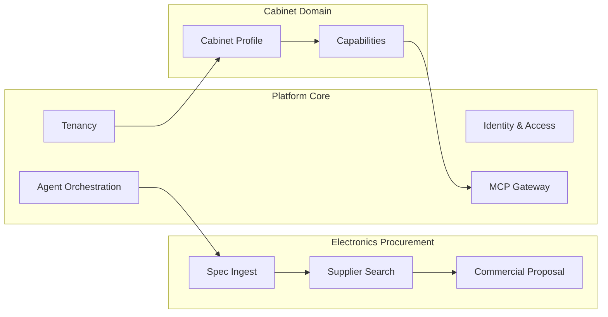
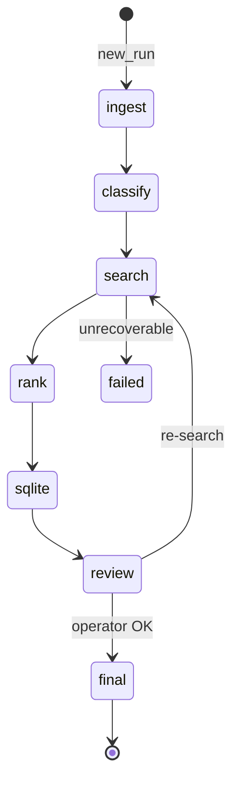
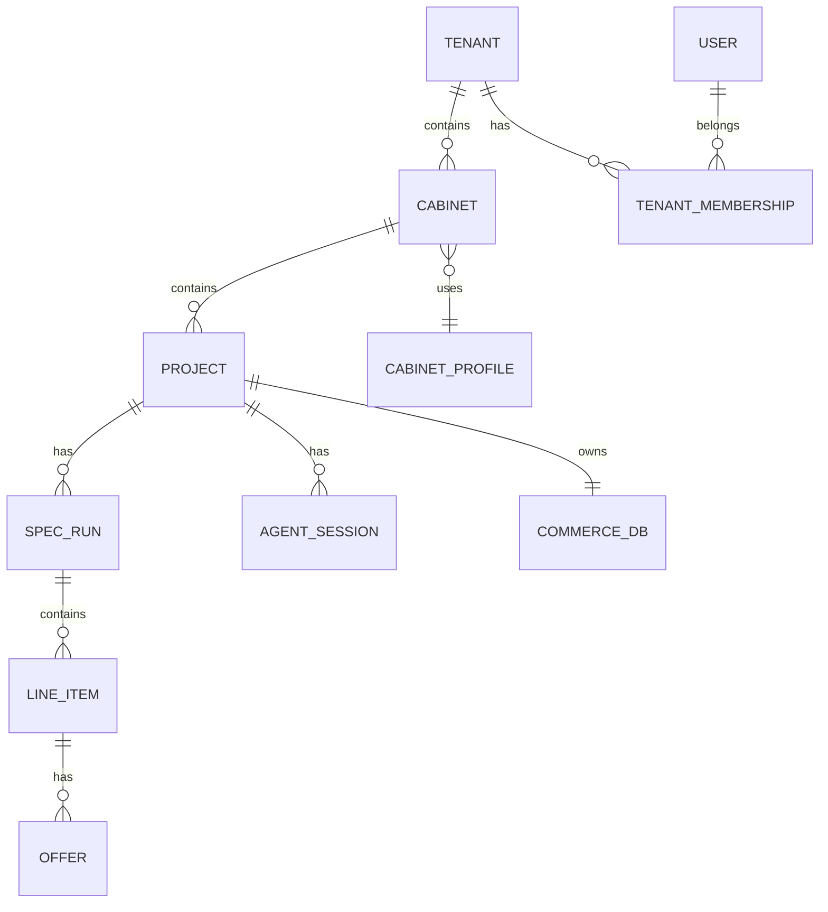

# Доменная модель Prodavan

Описание сущностей, агрегатов, инвариантов и жизненных циклов платформы Prodavan. Модель согласована с иерархией **Tenant → Cabinet → Project** и пайплайном закупок (наследие Commerce MVP).

---

## Контексты (Bounded Contexts)



| Контекст | Ответственность |
|----------|-----------------|
| **Platform Core** | Auth, tenant/cabinet/project, RLS, pods, API |
| **Cabinet Domain** | Профили, packs, UI manifest, ACL |
| **Electronics Procurement** | Domain plugin для `electronics-procurement` |

---

## Агрегаты платформы

### Tenant

**Корень агрегата.** Организация-клиент.

| Поле | Тип | Описание |
|------|-----|----------|
| `id` | UUID | PK |
| `slug` | string | Уникальный URL-slug |
| `name` | string | Отображаемое имя |
| `status` | enum | `active`, `suspended`, `deleted` |
| `plan_id` | FK | Тариф, квоты |
| `created_at` | timestamp | |

**Инварианты:**

- `slug` глобально уникален.
- При `suspended` — новые сессии агента запрещены; read-only API допустим по политике.

**События:**

- `TenantCreated`
- `TenantSuspended`
- `TenantPlanChanged`

---

### Cabinet

Рабочее пространство внутри tenant с привязкой к **cabinet profile**.

| Поле | Тип | Описание |
|------|-----|----------|
| `id` | UUID | PK |
| `tenant_id` | UUID | FK, обязателен |
| `profile_id` | string | `electronics-procurement`, … |
| `profile_version` | semver | Версия установленного pack |
| `name` | string | «Закупки 2026» |
| `status` | enum | `active`, `archived` |

**Инварианты:**

- `(tenant_id, name)` уникален среди active.
- `profile_id` должен существовать в pack registry.
- S4B credentials хранятся **на уровне cabinet** (encrypted), не tenant-wide по умолчанию.

---

### Project

Единица работы; аналог Commerce `projects/<имя>/`.

| Поле | Тип | Описание |
|------|-----|----------|
| `id` | UUID | PK |
| `tenant_id` | UUID | Денormalized для RLS |
| `cabinet_id` | UUID | FK |
| `slug` | string | Нормализованное имя папки |
| `display_name` | string | Как видит оператор |
| `status` | enum | `active`, `archived` |
| `commerce_sqlite_path` | string | Относительный путь в sandbox |

**Инварианты:**

- FS path: `tenants/{tenant_id}/cabinets/{cabinet_id}/projects/{project_id}/`.
- Все `runs/` только внутри project sandbox.
- `tenant_id` на строке совпадает с `cabinet.tenant_id`.

---

### User & Membership

| Сущность | Описание |
|----------|----------|
| **User** | Глобальная учётная запись (email, auth provider) |
| **TenantMembership** | `user_id` + `tenant_id` + role (`owner`, `admin`, `operator`, `viewer`) |
| **CabinetAccess** | Опционально: ограничение пользователя подмножеством кабинетов |

**Инварианты:**

- JWT содержит `tenant_id` и список доступных `cabinet_ids` (или `*` для tenant admin).

---

### AgentSession

Сессия работы агента в project.

| Поле | Тип | Описание |
|------|-----|----------|
| `id` | UUID | |
| `tenant_id`, `cabinet_id`, `project_id` | UUID | Контекст |
| `worker_pod_id` | string | K8s pod name |
| `status` | enum | `starting`, `running`, `idle`, `terminated`, `failed` |
| `model` | string | Идентификатор модели |
| `started_at`, `ended_at` | timestamp | |

**Инварианты:**

- Один активный `running` session на project (MVP); позже — очередь.
- Pod уничтожается при `terminated`.

---

## Домен закупок (Electronics Procurement)

Применимо только к cabinet с profile `electronics-procurement`.

### SpecRun (прогон)

| Поле | Описание |
|------|----------|
| `id` | Run ID (как Commerce `runs/<id>/`) |
| `project_id` | FK |
| `phase` | `ingest`, `classify`, `search`, `rank`, `sqlite`, `review`, `final` |
| `input_files` | Ссылки на inbox |
| `status` | `in_progress`, `needs_review`, `final`, `failed` |

**Жизненный цикл:**



### LineItem (позиция)

| Поле | Описание |
|------|----------|
| `run_id`, `line_no` | Составной ключ |
| `raw_text` | Исходная строка спеки |
| `category` | `mouse`, `monitor`, `psu`, `laptop`, `ram`, `cpu`, `other` |
| `part_number` | Как в спеке, без «улучшения» |
| `constraints` | JSON: RAM GB, ports, … |
| `confidence` | 0..1 |
| `needs_review` | bool |

### Offer

| Поле | Описание |
|------|----------|
| `line_item_id` | FK |
| `seller` | Имя / код |
| `part_number` | |
| `price`, `currency` | |
| `in_stock` | bool; **«под заказ» не используется** |
| `source` | `catalog`, `s4b`, `web` |
| `source_ref` | URL / row id |
| `role` | `primary`, `alternative` |
| `fetched_at` | timestamp |

**Инвариант:** агент не создаёт Offer без записи в `sources.log` / MCP audit.

### Variant (SQLite commerce)

Зеркало Commerce `commerce.sqlite`: варианты для КП, оценки, `best` flag. Заполняется импортом из run, не ручным xlsx от агента.

---

## Связи (ER overview)



---

## Идентификаторы и контекст запроса

Каждый mutating API- и MCP-запрос несёт:

```json
{
  "tenant_id": "550e8400-e29b-41d4-a716-446655440000",
  "cabinet_id": "6ba7b810-9dad-11d1-80b4-00c04fd430c8",
  "project_id": "6ba7b811-9dad-11d1-80b4-00c04fd430c8",
  "user_id": "...",
  "trace_id": "..."
}
```

PostgreSQL session variable `app.current_tenant_id` устанавливается из JWT middleware.

---

## Доменные правила (Policy)

| Правило | Описание |
|---------|----------|
| **P/N preservation** | Партномер из спеки не модифицируется агентом |
| **No on-order S4B** | Офферы «под заказ» отфильтровываются |
| **Trusted seller priority** | Primary = min price среди trusted при том же P/N |
| **No agent KP write** | КП только export из SQLite через API |
| **Final gate** | `status=final` только после явного подтверждения оператора |
| **S4B scope** | Поиск S4B только если cabinet profile включает `s4b` |

---

## Value Objects

| VO | Поля |
|----|------|
| **Money** | `amount: Decimal`, `currency: ISO4217` |
| **PartNumber** | `raw: string`, `normalized: string` (для поиска, не для отображения) |
| **SandboxPath** | `tenant_id`, `cabinet_id`, `project_id`, `relative` — валидация traversal |
| **CapabilityGrant** | `name: string`, `params: object` |

---

## Связанные документы

- [product-vision.md](product-vision.md)
- [../02-architecture/multi-tenancy.md](../02-architecture/multi-tenancy.md)
- [../02-architecture/cabinet-profiles.md](../02-architecture/cabinet-profiles.md)
- [../00-glossary.md](../00-glossary.md)
