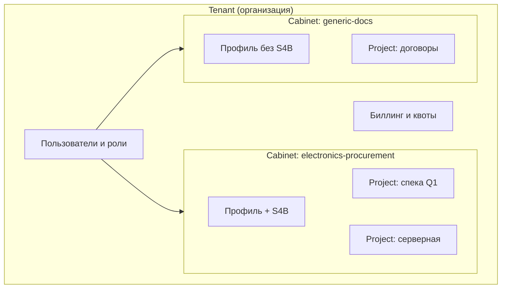
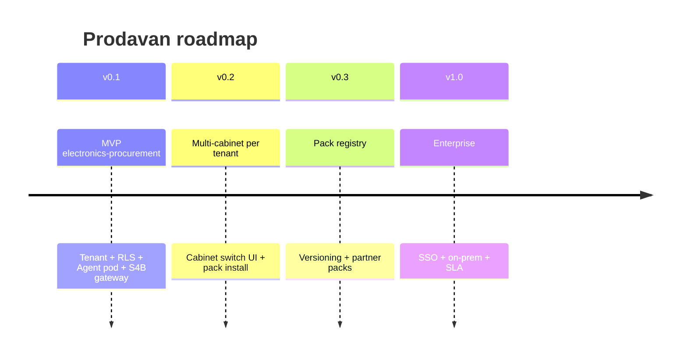

# Продуктовое видение Prodavan

**Prodavan** — SaaS-платформа для AI-ассистированных операционных процессов с **полной изоляцией арендаторов**, модульными **кабинетами** и безопасным выполнением **агентов** в Kubernetes. Первый целевой домен — закупки электроники (наследие **Commerce MVP**); платформа спроектирована так, чтобы подключать другие домены через cabinet packs без переписывания ядра.

---

## Проблема

Организации хотят автоматизировать рутину (разбор спек, поиск у поставщиков, сбор КП) с помощью LLM-агентов, но:

1. **Нельзя смешивать данные клиентов** — один инстанс, один Telegram-бот или один диск `projects/` не масштабируется на B2B SaaS.
2. **Агент опасен** — shell, файлы и сеть дают вектор escape и утечки кредов (S4B, прайсы).
3. **Разные отделы — разные процессы** — закупки электроники ≠ юридический документооборот; нужны профили, а не один UI.
4. **Commerce MVP доказал домен**, но привязан к Telegram и локальной файловой модели без tenant admin, RLS и enterprise-безопасности.

---

## Решение

Prodavan предоставляет:

| Слой | Что даёт пользователю |
|------|------------------------|
| **Flutter-клиент** | Единое приложение; экраны и меню зависят от активного кабинета |
| **FastAPI** | REST + WS/SSE; JWT с tenant/cabinet/project; OpenAPI |
| **PostgreSQL + RLS** | Данные tenant изолированы на уровне СУБД |
| **k3s + worker pods** | Один pod на сессию агента; FS sandbox; deny-by-default сеть |
| **MCP Gateway** | Контролируемый доступ к инструментам (S4B только в нужном профиле) |
| **Cabinet packs** | Версионируемые доменные модули без форка ядра |

---

## Целевая аудитория

### Первичная (MVP)

- **Компании-закупщики электроники** — отдел снабжения, тендерные группы.
- **Интеграторы / VAR** — несколько кабинетов под разных заказчиков внутри одного tenant (будущее) или несколько tenant.

### Вторичная (после MVP)

- Платформенные партнёры, публикующие **cabinet packs** для других вертикалей.
- Enterprise с требованиями on-prem k3s и break-glass audit.

---

## Иерархия: Tenant → Cabinet → Project

**Tenant** — граница биллинга и RLS.  
**Cabinet** — граница UX и capabilities (S4B только в `electronics-procurement`).  
**Project** — граница артефактов прогона и сессии агента.

---

## Отличие от Commerce MVP

| Аспект | Commerce MVP | Prodavan |
|--------|--------------|----------|
| Канал | Telegram-бот | Flutter + API |
| Изоляция | `projects/<имя>/` на общем диске | `tenants/.../cabinets/.../projects/.../` + RLS |
| Пользователи | `allowedUserIds` в конфиге | Tenant users, RBAC, tenant admin |
| S4B | MCP в сессии бота | MCP Gateway + capability `s4b.*` |
| Агент | Cursor на хосте оператора | Worker pod в k3s, sandbox |
| КП | `/кп` в боте | UI + API export |
| Расширение | `profiles/` в репо | Cabinet packs, versioning |

Commerce остаётся **референсной реализацией домена закупок**; Prodavan — **продуктовая оболочка** с multi-tenancy и enterprise-контуром.

---

## Принципы продукта

### 1. Изоляция по умолчанию

Любой доступ к данным проходит через tenant context. Ошибка конфигурации должна приводить к «нет данных», а не к чужим строкам.

### 2. Агент не источник истины для цен

Как в Commerce: цены, SKU и наличие — только из `offers.json`, MCP search и audit trail. Агент оркестрирует, не выдумывает.

### 3. Кабинет определяет возможности

S4B, веб-магазины, KP export — не глобальные флаги, а capabilities профиля. Переключение кабинета = смена ACL и UI.

### 4. Оператор в контуре

Финальный КП и сомнительные позиции — с явным ревью человека (`needs_review`, статус прогона ≠ `final` без «ок»).

### 5. Расширяемость без форка

Новый домен = новый cabinet pack (manifest + seeds + plugins), не патч ядра.

---

## MVP-граница (v0.1)

**В scope:**

- Регистрация tenant, tenant admin (users, один кабинет `electronics-procurement`)
- Project CRUD, inbox, прогон ingest → classify → search → rank
- S4B через MCP Gateway с audit
- Flutter: список проектов, чат агента (WS), позиции, export КП
- Worker pod на сессию, FS sandbox, базовый escape test catalog
- RLS на все tenant-таблицы

**Вне scope v0.1:**

- Marketplace cabinet packs
- Мульти-регион DR
- On-prem installer
- Telegram-адаптер (возможен позже как channel pack)

---

## Метрики успеха

| Метрика | Цель MVP |
|---------|----------|
| Cross-tenant data leak | 0 инцидентов; 100% RLS coverage |
| Agent escape (prod) | 0; escape tests в CI blocking |
| Time-to-first-KP | ≤ Commerce MVP на типовой спеке |
| Tenant onboarding | < 30 мин до первого проекта |
| S4B cred exposure | 0 в логах/ответах агента |

---

## Дорожная карта (укрупнённо)

---

## Связанные документы

- [domain-model.md](domain-model.md)
- [../02-architecture/overview.md](../02-architecture/overview.md)
- [../02-architecture/multi-tenancy.md](../02-architecture/multi-tenancy.md)
- [../00-glossary.md](../00-glossary.md)
