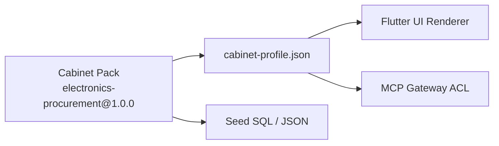
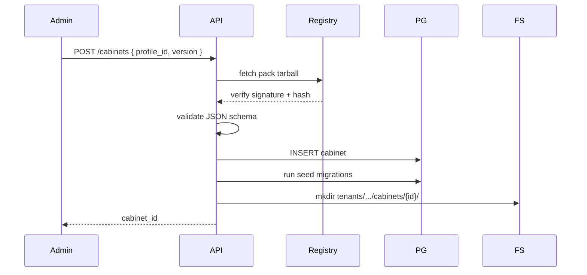

# Профили кабинетов (Cabinet Profiles)

**Cabinet profile** — декларативное описание рабочего пространства: UI, capabilities, MCP tool ACL, seed-данные. Профиль определяет, **что видит и что может делать** оператор в данном кабинете. Платформа загружает профили из **cabinet packs**; ядро остаётся agnostic к домену закупок.

---

## Роль в архитектуре



| Потребитель | Что читает из профиля |
|-------------|----------------------|
| **Flutter** | `ui.modules`, navigation, feature flags |
| **FastAPI** | capabilities для authorization |
| **MCP Gateway** | `mcp.tools_allowlist`, `mcp.filters` |
| **Installer** | `seeds`, migrations |

---

## UI manifest — JSON Schema

Файл `cabinet-profile.json` в корне pack.

### Корневая структура

```json
{
  "$schema": "https://prodavan.dev/schemas/cabinet-profile/v1.json",
  "id": "electronics-procurement",
  "version": "1.0.0",
  "displayName": "Закупки электроники",
  "description": "Спеки, поиск S4B и каталогов, КП",
  "capabilities": [],
  "ui": {},
  "mcp": {},
  "seeds": {},
  "constraints": {}
}
```

### JSON Schema (фрагмент)

```json
{
  "$id": "https://prodavan.dev/schemas/cabinet-profile/v1.json",
  "type": "object",
  "required": ["id", "version", "displayName", "capabilities", "ui", "mcp"],
  "properties": {
    "id": {
      "type": "string",
      "pattern": "^[a-z][a-z0-9-]{2,48}$"
    },
    "version": { "type": "string", "format": "semver" },
    "displayName": { "type": "string", "minLength": 1 },
    "capabilities": {
      "type": "array",
      "items": { "$ref": "#/$defs/capability" },
      "uniqueItems": true
    },
    "ui": { "$ref": "#/$defs/uiManifest" },
    "mcp": { "$ref": "#/$defs/mcpConfig" },
    "seeds": { "$ref": "#/$defs/seedConfig" },
    "constraints": { "$ref": "#/$defs/constraints" }
  },
  "$defs": {
    "capability": {
      "type": "string",
      "pattern": "^[a-z][a-z0-9]*(\\.[a-z][a-z0-9*]*)+$"
    },
    "uiManifest": {
      "type": "object",
      "required": ["navigation", "modules"],
      "properties": {
        "theme": { "enum": ["light", "dark", "system"] },
        "navigation": {
          "type": "array",
          "items": { "$ref": "#/$defs/navItem" }
        },
        "modules": {
          "type": "object",
          "additionalProperties": { "$ref": "#/$defs/uiModule" }
        },
        "projectTabs": {
          "type": "array",
          "items": { "type": "string" }
        }
      }
    },
    "navItem": {
      "type": "object",
      "required": ["id", "label", "route"],
      "properties": {
        "id": { "type": "string" },
        "label": { "type": "string" },
        "icon": { "type": "string" },
        "route": { "type": "string" },
        "capability": { "type": "string" },
        "badge": { "enum": ["needs_review", null] }
      }
    },
    "uiModule": {
      "type": "object",
      "required": ["type"],
      "properties": {
        "type": {
          "enum": [
            "project-list",
            "agent-chat",
            "line-items",
            "offers-grid",
            "kp-export",
            "spec-upload",
            "integrations",
            "equipment-cards"
          ]
        },
        "config": { "type": "object" }
      }
    },
    "mcpConfig": {
      "type": "object",
      "required": ["tools_allowlist"],
      "properties": {
        "tools_allowlist": {
          "type": "array",
          "items": { "type": "string" }
        },
        "filters": {
          "type": "object",
          "additionalProperties": { "type": "object" }
        },
        "servers": {
          "type": "array",
          "items": {
            "type": "object",
            "properties": {
              "name": { "type": "string" },
              "transport": { "enum": ["stdio", "http"] },
              "url": { "type": "string" }
            }
          }
        }
      }
    },
    "seedConfig": {
      "type": "object",
      "properties": {
        "sql": { "type": "array", "items": { "type": "string" } },
        "json": {
          "type": "object",
          "additionalProperties": { "type": "string" }
        }
      }
    },
    "constraints": {
      "type": "object",
      "properties": {
        "requiresIntegration": {
          "type": "array",
          "items": { "type": "string" }
        },
        "maxProjects": { "type": "integer" }
      }
    }
  }
}
```

---

## Профиль `electronics-procurement` (reference)

Полный пример manifest для MVP (наследие Commerce):

```json
{
  "id": "electronics-procurement",
  "version": "1.0.0",
  "displayName": "Закупки электроники",
  "description": "Обработка спек, S4B, локальные каталоги, КП",
  "capabilities": [
    "project.create",
    "project.archive",
    "spec.ingest",
    "spec.classify",
    "search.catalog",
    "search.s4b",
    "search.web",
    "rank.offers",
    "kp.export",
    "equipment.cards",
    "agent.session"
  ],
  "ui": {
    "theme": "system",
    "navigation": [
      { "id": "projects", "label": "Проекты", "icon": "folder", "route": "/projects" },
      { "id": "agent", "label": "Агент", "icon": "smart_toy", "route": "/projects/:id/agent", "capability": "agent.session" },
      { "id": "positions", "label": "Позиции", "icon": "list", "route": "/projects/:id/line-items" },
      { "id": "offers", "label": "Офферы", "icon": "store", "route": "/projects/:id/offers", "capability": "search.catalog" },
      { "id": "kp", "label": "КП", "icon": "description", "route": "/projects/:id/kp", "capability": "kp.export" },
      { "id": "integrations", "label": "S4B", "icon": "link", "route": "/settings/integrations/s4b", "capability": "search.s4b" }
    ],
    "modules": {
      "project-list": { "type": "project-list", "config": { "showStatusBadge": true } },
      "agent-chat": { "type": "agent-chat", "config": { "streaming": true, "showToolSummary": true } },
      "line-items": { "type": "line-items", "config": { "columns": ["line", "category", "partNumber", "confidence", "needsReview"] } },
      "offers-grid": { "type": "offers-grid", "config": { "groupByLine": true } },
      "kp-export": { "type": "kp-export", "config": { "templateId": "kp-template-v1" } },
      "spec-upload": { "type": "spec-upload", "config": { "accept": [".xlsx", ".xls", ".csv", ".txt"] } },
      "integrations": { "type": "integrations", "config": { "providers": ["s4b"] } },
      "equipment-cards": { "type": "equipment-cards", "config": {} }
    },
    "projectTabs": ["agent", "positions", "offers", "kp", "runs"]
  },
  "mcp": {
    "tools_allowlist": [
      "commerce-search.search_by_part_number",
      "commerce-search.query_database",
      "commerce-search.list_databases",
      "commerce-s4b.search",
      "commerce-s4b.product_details",
      "commerce-equipment.equipment_upsert",
      "commerce-equipment.equipment_search",
      "commerce-offers.import_run",
      "pipeline.parse_spec",
      "pipeline.classify_rows",
      "pipeline.search_offers",
      "pipeline.rank_offers"
    ],
    "filters": {
      "commerce-s4b.search": {
        "deny_params": ["include_on_order"],
        "post_filter": "in_stock_only"
      },
      "pipeline.search_offers": {
        "sources_order": ["catalog", "s4b", "web"]
      }
    },
    "servers": [
      { "name": "commerce-search", "transport": "http", "url": "http://mcp-internal/search" },
      { "name": "commerce-s4b", "transport": "http", "url": "http://mcp-internal/s4b" }
    ]
  },
  "seeds": {
    "sql": ["seeds/trusted_sellers.sql", "seeds/kp_template_ref.sql"],
    "json": {
      "web_shop_allowlist": "seeds/web-shop-allowlist.json",
      "task_profile": "seeds/profiles/kp/README.md"
    }
  },
  "constraints": {
    "requiresIntegration": ["s4b"],
    "maxProjects": null
  }
}
```

---

## Capabilities

### Формат

`<domain>.<action>` или `<domain>.<resource>.<action>`

Wildcard в MCP ACL: `search.s4b.*` → все tools с prefix.

### Матрица профилей (MVP)

| Capability | electronics-procurement | generic-docs (future) |
|------------|:---------------------:|:---------------------:|
| `search.s4b` | ✅ | ❌ |
| `search.catalog` | ✅ | ❌ |
| `search.web` | ✅ | ❌ |
| `kp.export` | ✅ | ❌ |
| `spec.ingest` | ✅ | ✅ (другой pipeline) |
| `agent.session` | ✅ | ✅ |

**S4B only for electronics-procurement** — enforced на трёх уровнях:

1. Capability отсутствует в manifest → UI скрывает интеграцию.
2. FastAPI `403` на `PUT .../integrations/s4b`.
3. MCP Gateway отклоняет `commerce-s4b.*` без capability.

---

## Cabinet switch (UI + API)

### Flutter

1. App shell загружает `GET /v1/tenants/{tid}/cabinets`.
2. Drawer / top bar — список `{ displayName, profileId, id }`.
3. При смене:
   - сохранить `activeCabinetId` в `SharedPreferences`;
   - очистить project-scoped routes;
   - перезагрузить `GET /v1/cabinets/{cid}/manifest` (кэш 5 min).

### Manifest endpoint

`GET /v1/cabinets/{cabinet_id}/manifest` возвращает **merged** manifest:

```json
{
  "cabinet_id": "...",
  "profile_id": "electronics-procurement",
  "profile_version": "1.0.0",
  "manifest": { /* ui + capabilities + feature flags */ },
  "integrations_status": {
    "s4b": "configured" | "missing" | "not_applicable"
  }
}
```

Flutter **dynamic module loader** мапит `ui.modules[type]` → widget registry в `lib/cabinet/modules/`.

---

## Seed packs

При `POST /cabinets` или upgrade pack version:

| Seed file | Назначение |
|-----------|------------|
| `trusted_sellers.sql` | Начальный trusted-list для rank |
| `web-shop-allowlist.json` | Allowlist веб-магазинов |
| `kp-template-v1` ref | Ссылка на blob storage template |
| `profiles/kp/*.md` | Agent task profile (копия в project AGENTS snapshot) |

Seeds выполняются **idempotent** (`ON CONFLICT DO NOTHING`) в schema с `tenant_id` + `cabinet_id`.

```sql
INSERT INTO cabinet_trusted_sellers (tenant_id, cabinet_id, seller_code, trusted)
VALUES ($1, $2, 'dns', true)
ON CONFLICT (tenant_id, cabinet_id, seller_code) DO NOTHING;
```

---

## Установка и обновление pack



Upgrade `PATCH /cabinets/{id}` `{ "profile_version": "1.1.0" }`:
- migration hooks из pack;
- **не** удаляет project data;
- bump `cabinet.profile_version`.

---

## Generic profile stub (для контраста)

```json
{
  "id": "generic-docs",
  "version": "0.1.0",
  "displayName": "Документы",
  "capabilities": ["project.create", "spec.ingest", "agent.session"],
  "ui": {
    "navigation": [
      { "id": "projects", "label": "Проекты", "route": "/projects" },
      { "id": "agent", "label": "Агент", "route": "/projects/:id/agent" }
    ],
    "modules": {
      "project-list": { "type": "project-list" },
      "agent-chat": { "type": "agent-chat" }
    }
  },
  "mcp": {
    "tools_allowlist": ["pipeline.parse_spec"]
  },
  "seeds": {}
}
```

Нет `search.s4b` → Gateway блокирует S4B даже при утечке creds в другой cabinet (creds scoped per cabinet).

---

## Связанные документы

- [multi-tenancy.md](multi-tenancy.md)
- [mcp-gateway.md](mcp-gateway.md)
- [platform-extensibility.md](platform-extensibility.md)
- [../01-vision/product-vision.md](../01-vision/product-vision.md)
