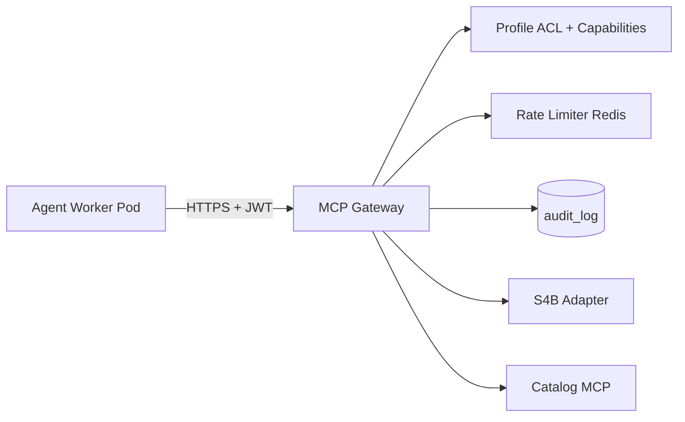
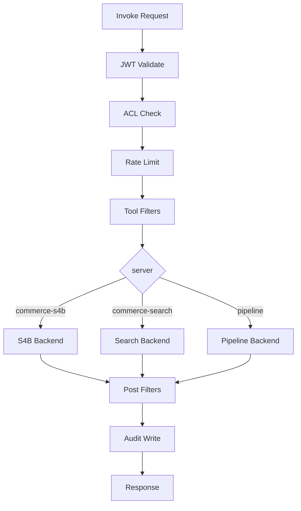

# MCP Gateway

**MCP Gateway** — единая контролируемая точка проксирования Model Context Protocol tool-вызовов от worker pods к backend MCP-серверам (commerce-search, commerce-s4b, pipeline, …). Gateway enforce **JWT context**, **tool ACL per cabinet profile**, **S4B filters**, **audit log**, **rate limits** и единый **request envelope**.

---

## Позиция в архитектуре



Worker **не** подключается к MCP-серверам напрямую. Deny-by-default NetworkPolicy блокирует обход.

---

## JWT authentication

### Issuer

FastAPI / Session Orchestrator выдаёт **session-scoped JWT** при старте AgentSession (TTL = session max duration + 5 min).

### Claims (required)

```json
{
  "iss": "prodavan-api",
  "sub": "session:{session_uuid}",
  "aud": "mcp-gateway",
  "tenant_id": "550e8400-e29b-41d4-a716-446655440000",
  "cabinet_id": "6ba7b810-9dad-11d1-80b4-00c04fd430c8",
  "project_id": "6ba7b811-9dad-11d1-80b4-00c04fd430c8",
  "user_id": "user-uuid",
  "profile_id": "electronics-procurement",
  "capabilities": ["search.s4b", "search.catalog"],
  "exp": 1735693200,
  "jti": "unique-token-id"
}
```

### Validation steps

1. Signature (RS256, gateway trusts API public key).
2. `aud == mcp-gateway`.
3. `exp` not passed; optional `jti` replay cache (Redis SET NX, TTL).
4. `tenant_id` + `cabinet_id` + `project_id` present.
5. Session status in DB = `running`.

---

## Request envelope

Каждый tool call оборачивается Gateway в канонический envelope (логируется целиком, кроме secrets).

### HTTP

`POST /v1/mcp/invoke`

```json
{
  "envelope": {
    "version": "1",
    "trace_id": "550e8400-e29b-41d4-a716-446655440099",
    "span_id": "abc123",
    "timestamp": "2026-08-20T10:15:30Z",
    "tenant_id": "...",
    "cabinet_id": "...",
    "project_id": "...",
    "session_id": "...",
    "user_id": "...",
    "profile_id": "electronics-procurement",
    "tool": {
      "server": "commerce-s4b",
      "name": "search",
      "version": "2025-01"
    }
  },
  "arguments": {
    "part_number": "ABC-123",
    "limit": 20
  }
}
```

Authorization header: `Bearer {session_jwt}`

### Response envelope

```json
{
  "envelope": {
    "trace_id": "...",
    "duration_ms": 342,
    "status": "ok"
  },
  "result": {
    "content": [/* MCP tool result */]
  }
}
```

Error:

```json
{
  "envelope": { "trace_id": "...", "status": "error" },
  "error": {
    "code": "TOOL_NOT_ALLOWED",
    "message": "Tool commerce-s4b.search not in profile ACL",
    "retryable": false
  }
}
```

---

## Tool ACL per profile

Gateway загружает ACL из `cabinet.profile_id` + version (cached):

```json
{
  "tools_allowlist": [
    "commerce-s4b.search",
    "commerce-search.search_by_part_number"
  ]
}
```

### Matching rules

| Pattern | Matches |
|---------|---------|
| Exact `server.tool` | Only that tool |
| `commerce-s4b.*` | All tools on server |
| `*` | Platform internal only (disabled for tenant sessions) |

### Deny examples

| Request | Reason |
|---------|--------|
| `commerce-s4b.search` in `generic-docs` | `TOOL_NOT_ALLOWED` |
| Unknown server | `SERVER_NOT_FOUND` |
| Capability `search.s4b` missing in JWT | `CAPABILITY_DENIED` |

ACL check order: **JWT capabilities** → **profile allowlist** → **per-tool filters**.

---

## S4B filter (electronics-procurement)

Специфичные правила для наследия Commerce:

### Pre-invoke (param denylist)

```json
"filters": {
  "commerce-s4b.search": {
    "deny_params": ["include_on_order", "listNoStock"]
  }
}
```

Gateway **удаляет** запрещённые ключи и логирует `FILTER_STRIPPED_PARAMS`.

### Post-invoke (result filter)

```python
def in_stock_only(offers: list) -> list:
    return [o for o in offers if o.get("in_stock") is True
            and not o.get("on_order")]
```

- Строки «под заказ» **не попадают** в pod / `offers.json`.
- Если после фильтра пусто — `status: ok`, `result.content: []` (не ошибка).

### Credentials injection

Gateway читает `cabinet_secrets` где `provider = s4b`, decrypts, вызывает S4B HTTP **server-side**. Pod не видит login/password.

---

## Audit log

Append-only таблица `mcp_audit_log`:

```sql
CREATE TABLE mcp_audit_log (
    id           BIGSERIAL PRIMARY KEY,
    tenant_id    UUID NOT NULL,
    cabinet_id   UUID NOT NULL,
    project_id   UUID NOT NULL,
    session_id   UUID NOT NULL,
    user_id      UUID NOT NULL,
    trace_id     UUID NOT NULL,
    tool_server  TEXT NOT NULL,
    tool_name    TEXT NOT NULL,
    arguments_hash TEXT NOT NULL,  -- SHA256 canonical JSON, no secrets
    result_count INT,
    status       TEXT NOT NULL,
    duration_ms  INT NOT NULL,
    error_code   TEXT,
    created_at   TIMESTAMPTZ NOT NULL DEFAULT now()
);
```

RLS: tenant-scoped read для admin; insert только через gateway role.

**Retention:** 90 days default; export to SIEM optional.

**Never logged:** S4B passwords, full API keys, raw PII из аргументов (redact list).

---

## Rate limits

Redis token bucket per dimensions:

| Bucket key | Limit MVP | Window |
|------------|-----------|--------|
| `tenant:{tid}:mcp:*` | 1000 calls | 1 min |
| `tenant:{tid}:mcp:s4b:*` | 60 calls | 1 min |
| `session:{sid}:mcp:*` | 120 calls | 1 min |
| `cabinet:{cid}:mcp:s4b:search` | 30 calls | 1 min |

Response on exceed:

```json
{
  "error": {
    "code": "RATE_LIMITED",
    "message": "S4B rate limit exceeded",
    "retry_after": 12
  }
}
```

HTTP `429` + header `Retry-After`.

Plan tiers увеличивают лимиты; hard cap защищает S4B upstream.

---

## Internal routing



Backends — cluster-internal Deployments или sidecars; не exposed outside cluster.

---

## Health & observability

| Endpoint | Access |
|----------|--------|
| `GET /health` | Internal only |
| `GET /metrics` | Prometheus scraper |

Metrics: `mcp_invocations_total{tool,status}`, `mcp_duration_seconds`, `mcp_rate_limited_total`.

---

## Error codes (gateway-specific)

| Code | HTTP | retryable |
|------|------|-----------|
| `UNAUTHORIZED` | 401 | false |
| `SESSION_NOT_RUNNING` | 403 | false |
| `TOOL_NOT_ALLOWED` | 403 | false |
| `CAPABILITY_DENIED` | 403 | false |
| `RATE_LIMITED` | 429 | true |
| `UPSTREAM_TIMEOUT` | 504 | true |
| `UPSTREAM_ERROR` | 502 | true |
| `FILTER_REJECTED` | 422 | false |

---

## Связь с Commerce MCP

| Commerce MCP server | Gateway backend | ACL note |
|---------------------|-----------------|----------|
| commerce-search | catalog DB + s4b-cache | `search.catalog` |
| commerce-s4b | Live S4B API | `search.s4b` only |
| commerce-equipment | equipment DB | `equipment.cards` |
| commerce-offers | sqlite import | `rank.offers` |
| pipeline | tools runners | per-tool in allowlist |

---

## Связанные документы

- [cabinet-profiles.md](cabinet-profiles.md)
- [agent-isolation.md](agent-isolation.md)
- [api-style.md](api-style.md)
- [threat-model.md](threat-model.md)
