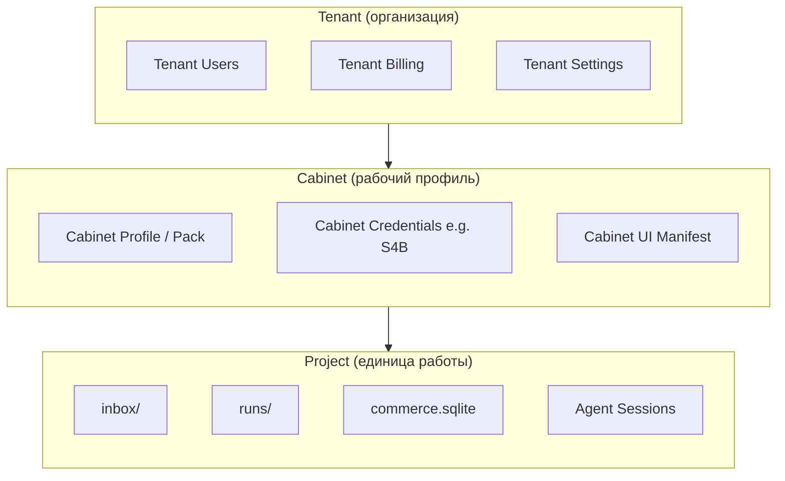
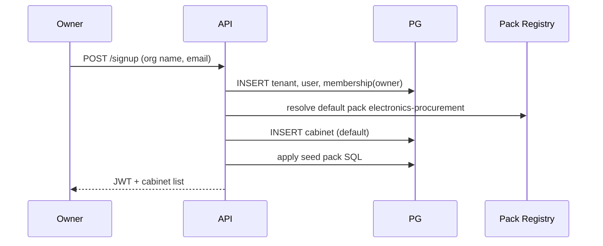
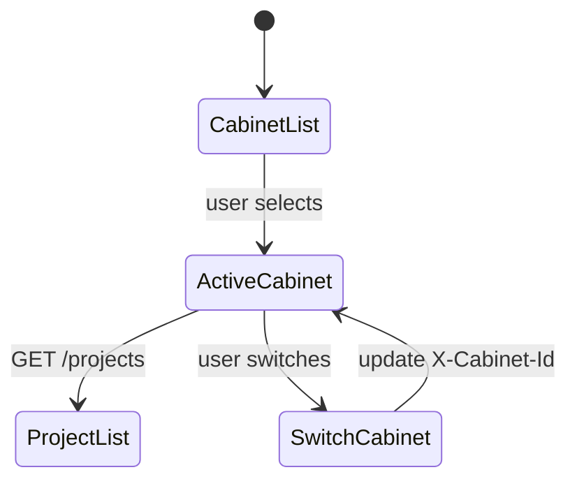

# Мультиарендность: Tenant → Cabinet → Project

Prodavan — **multi-tenant SaaS** с тремя уровнями изоляции данных и доступа. Изоляция реализована **defense in depth**: JWT + RBAC в приложении, **Row Level Security (RLS)** в PostgreSQL, раздельные FS-пути и network policies для worker pods.

---

## Иерархия



| Уровень | ID в JWT | RLS column | FS prefix |
|---------|----------|------------|-----------|
| Tenant | `tenant_id` | `tenant_id` | `tenants/{tid}/` |
| Cabinet | `cabinet_id` | `tenant_id` + `cabinet_id` | `.../cabinets/{cid}/` |
| Project | `project_id` | + `project_id` | `.../projects/{pid}/` |

---

## Модель данных (упрощённо)

```sql
-- tenants: глобальная таблица, RLS для platform admin only
CREATE TABLE tenants (
    id          UUID PRIMARY KEY DEFAULT gen_random_uuid(),
    slug        TEXT NOT NULL UNIQUE,
    name        TEXT NOT NULL,
    status      TEXT NOT NULL DEFAULT 'active',
    plan_id     UUID REFERENCES plans(id),
    created_at  TIMESTAMPTZ NOT NULL DEFAULT now()
);

CREATE TABLE cabinets (
    id              UUID PRIMARY KEY DEFAULT gen_random_uuid(),
    tenant_id       UUID NOT NULL REFERENCES tenants(id),
    profile_id      TEXT NOT NULL,
    profile_version TEXT NOT NULL,
    name            TEXT NOT NULL,
    status          TEXT NOT NULL DEFAULT 'active',
    created_at      TIMESTAMPTZ NOT NULL DEFAULT now(),
    UNIQUE (tenant_id, name)
);

CREATE TABLE projects (
    id              UUID PRIMARY KEY DEFAULT gen_random_uuid(),
    tenant_id       UUID NOT NULL,
    cabinet_id      UUID NOT NULL REFERENCES cabinets(id),
    slug            TEXT NOT NULL,
    display_name    TEXT NOT NULL,
    status          TEXT NOT NULL DEFAULT 'active',
    created_at      TIMESTAMPTZ NOT NULL DEFAULT now(),
    UNIQUE (cabinet_id, slug),
    CONSTRAINT projects_tenant_fk FOREIGN KEY (tenant_id)
        REFERENCES tenants(id),
    CONSTRAINT projects_cabinet_tenant_match CHECK (
        -- enforced also by trigger: cabinet.tenant_id = projects.tenant_id
        true
    )
);
```

**Правило:** `cabinet_id` присутствует на **всех tenant-scoped таблицах**, даже если можно вывести через JOIN. Это:

- ускоряет RLS без лишних JOIN;
- упрощает audit («какой кабинет затронут»);
- защищает от ошибок миграций.

Пример дочерней таблицы:

```sql
CREATE TABLE spec_runs (
    id          UUID PRIMARY KEY DEFAULT gen_random_uuid(),
    tenant_id   UUID NOT NULL,
    cabinet_id  UUID NOT NULL,
    project_id  UUID NOT NULL REFERENCES projects(id),
    phase       TEXT NOT NULL,
    status      TEXT NOT NULL,
    created_at  TIMESTAMPTZ NOT NULL DEFAULT now()
);

CREATE INDEX spec_runs_tenant_cabinet_idx
    ON spec_runs (tenant_id, cabinet_id, project_id);
```

---

## Row Level Security (RLS)

### Session context

FastAPI middleware после JWT validation:

```sql
SELECT set_config('app.current_tenant_id', :tenant_id, true);
SELECT set_config('app.current_cabinet_ids', :cabinet_ids_csv, true);
SELECT set_config('app.current_user_role', :role, true);
```

`:cabinet_ids_csv` — список UUID через запятую или `*` для tenant admin.

### Политики

```sql
ALTER TABLE projects ENABLE ROW LEVEL SECURITY;
ALTER TABLE projects FORCE ROW LEVEL SECURITY;

-- Tenant isolation (обязательно на всех таблицах)
CREATE POLICY projects_tenant_isolation ON projects
    FOR ALL
    USING (tenant_id = current_setting('app.current_tenant_id')::uuid);

-- Cabinet-scoped operators
CREATE POLICY projects_cabinet_access ON projects
    FOR ALL
    USING (
        current_setting('app.current_user_role', true) IN ('owner', 'admin')
        OR cabinet_id = ANY (
            string_to_array(current_setting('app.current_cabinet_ids', true), ',')::uuid[]
        )
    );
```

Аналогично для `spec_runs`, `line_items`, `offers`, `agent_sessions`, `audit_log`.

### INSERT with CHECK

```sql
CREATE POLICY spec_runs_insert ON spec_runs
    FOR INSERT
    WITH CHECK (
        tenant_id = current_setting('app.current_tenant_id')::uuid
        AND cabinet_id = ANY (
            string_to_array(current_setting('app.current_cabinet_ids', true), ',')::uuid[]
        )
        AND EXISTS (
            SELECT 1 FROM projects p
            WHERE p.id = project_id
              AND p.tenant_id = spec_runs.tenant_id
              AND p.cabinet_id = spec_runs.cabinet_id
        )
    );
```

### Platform admin

Отдельная роль БД `prodavan_platform` с policy **только** на audit/metadata tables или через security definer functions с break-glass logging — **не** blanket bypass RLS на project data.

---

## JWT claims

```json
{
  "sub": "user-uuid",
  "tenant_id": "tenant-uuid",
  "role": "operator",
  "cabinet_ids": ["cabinet-uuid-1", "cabinet-uuid-2"],
  "exp": 1735689600
}
```

| Role | Tenant scope | Cabinet scope |
|------|--------------|---------------|
| `owner` | Full | All cabinets |
| `admin` | Full | All cabinets |
| `operator` | Read settings | Assigned cabinets only |
| `viewer` | Read-only | Assigned cabinets |

---

## Tenant admin flows

### 1. Создание tenant (onboarding)



### 2. Приглашение пользователя

1. Tenant admin: `POST /tenants/{tid}/invitations` → email link.
2. Accept: user создан/привязан, `tenant_membership` + optional `cabinet_access` rows.
3. Operator без cabinet access **не видит** projects (RLS → empty set).

### 3. Создание кабинета

`POST /tenants/{tid}/cabinets`:

```json
{
  "name": "Закупки электроники",
  "profile_id": "electronics-procurement",
  "profile_version": "1.0.0"
}
```

Backend:
- проверяет plan quota (`max_cabinets`);
- устанавливает pack;
- создаёт FS prefix `tenants/{tid}/cabinets/{new_cid}/`;
- seed SQL (trusted sellers, templates).

### 4. Настройка S4B (cabinet-scoped)

`PUT /cabinets/{cid}/integrations/s4b` — только admin/owner, только если profile имеет capability `s4b`.

Credentials → `cabinet_secrets` (encrypted, tenant_id + cabinet_id), **не** в project FS.

### 5. Suspend tenant

`status = suspended`:
- RLS policy блокирует INSERT/UPDATE;
- active agent sessions → graceful terminate;
- read-only export по политике compliance.

---

## Переключение кабинета (cabinet switch)

Flutter хранит `activeCabinetId` в session state.

1. `GET /tenants/{tid}/cabinets` — список доступных.
2. User selects cabinet → все project-scoped запросы с header **`X-Cabinet-Id: {uuid}`**.
3. API middleware:
   - сверяет header с JWT `cabinet_ids` или admin role;
   - устанавливает `app.current_cabinet_ids` = один id;
   - отклоняет mismatch project.cabinet_id vs header с **404**.



---

## FS layout

```text
tenants/
  {tenant_id}/
    cabinets/
      {cabinet_id}/
        projects/
          {project_id}/
            inbox/
            runs/
              {run_id}/
                input/
                rows.json
                lineitems.json
                offers.json
                selection.json
                sources.log
            commerce.sqlite
```

PVC или object storage с **prefix isolation**. API и worker монтируют только свой prefix через CSI subpath.

---

## Инварианты (checklist)

- [ ] Каждая tenant-scoped таблица имеет `tenant_id NOT NULL`
- [ ] Каждая business-таблица ниже tenant имеет `cabinet_id NOT NULL`
- [ ] RLS ENABLE + FORCE на всех таких таблицах
- [ ] Триггер `verify_cabinet_belongs_to_tenant` на INSERT/UPDATE
- [ ] Application never queries без `set_config`
- [ ] Cross-tenant UUID в URL → 404, не 403
- [ ] Audit log append-only с tenant_id + cabinet_id

---

## Тестирование изоляции

| Тест | Ожидание |
|------|----------|
| Tenant A token → Tenant B project id | 404, 0 rows |
| Operator cabinet 1 → project cabinet 2 | 404 |
| SQL injection bypass RLS | FORCE RLS blocks |
| Missing `X-Cabinet-Id` on POST /projects | 400 |
| Replica lag read | Session stickiness or read-your-writes |

---

## Связанные документы

- [overview.md](overview.md)
- [cabinet-profiles.md](cabinet-profiles.md)
- [agent-isolation.md](agent-isolation.md)
- [threat-model.md](threat-model.md)
- [../01-vision/domain-model.md](../01-vision/domain-model.md)
