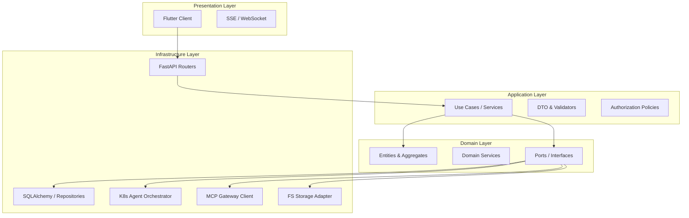
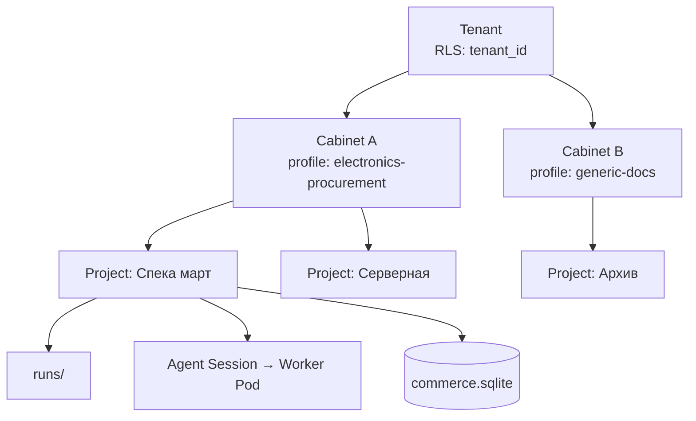
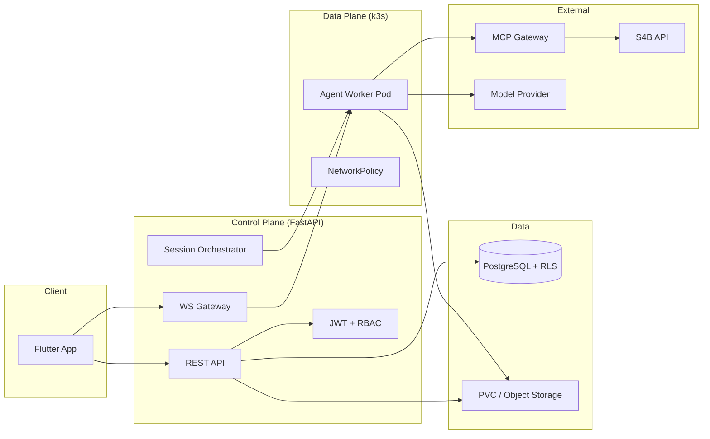
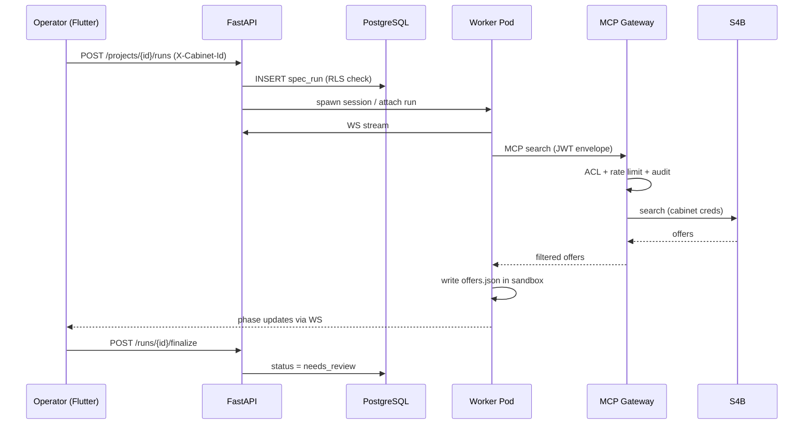
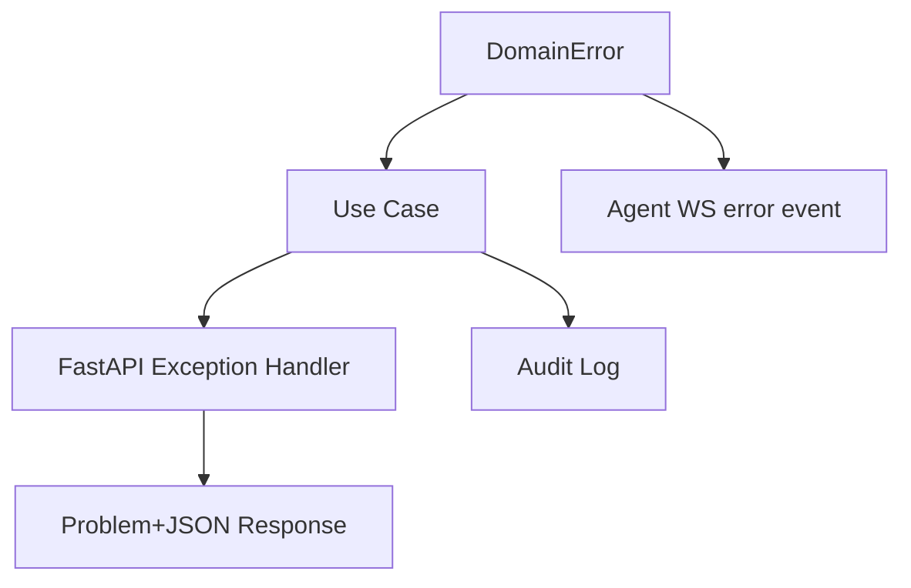

# Архитектурный обзор Prodavan

Prodavan построен по принципам **Clean Architecture** с чётким разделением слоёв, направлением зависимостей «внутрь» и сквозной изоляцией **Tenant → Cabinet → Project**. Стек: **Flutter** (presentation), **FastAPI** (application + infrastructure adapters), **PostgreSQL** (persistence + RLS), **k3s** (agent runtime).

---

## Слои Clean Architecture



| Слой | Содержимое | Зависит от |
|------|------------|------------|
| **Domain** | Tenant, Cabinet, Project, SpecRun, LineItem, Offer; инварианты; порты репозиториев | Ничего внешнего |
| **Application** | Сценарии: `CreateProject`, `StartAgentSession`, `ImportRunToSqlite`; транзакционные границы; mapping DTO ↔ domain | Domain |
| **Infrastructure** | PostgreSQL, S3/ PVC, K8s API, MCP HTTP, JWT decode, RLS session vars | Application + Domain (через порты) |
| **Presentation** | Flutter UI по cabinet manifest; REST клиент; WS stream агента | Application (через API) |

**Правило зависимостей:** код Domain **не импортирует** FastAPI, SQLAlchemy, Flutter. Infrastructure реализует интерфейсы из Domain (`ProjectRepository`, `AgentRuntime`, `McpGateway`).

---

## Иерархия Tenant → Cabinet → Project



| Уровень | Граница изоляции | Что хранит |
|---------|------------------|------------|
| **Tenant** | RLS, billing, users | Организация |
| **Cabinet** | Profile, capabilities, S4B creds | Рабочий контекст UX |
| **Project** | FS sandbox, runs, sqlite | Артефакты прогона |

Каждый запрос к API и каждый MCP-вызов **обязан** нести полный контекст `(tenant_id, cabinet_id, project_id)` где применимо.

---

## Компонентная диаграмма (runtime)



---

## Правила зависимостей между модулями

### 1. Domain не знает об инфраструктуре

```python
# domain/ports/project_repository.py — OK
class ProjectRepository(Protocol):
    async def get(self, ctx: TenantContext, project_id: UUID) -> Project: ...

# domain/entities/project.py — OK, только stdlib + domain types
```

```python
# domain/entities/project.py — ЗАПРЕЩЕНО
from sqlalchemy.orm import Session  # нарушение CA
```

### 2. Application оркеструет, не содержит SQL

Use case `StartAgentSession`:
1. Загружает Project через порт.
2. Проверяет policy (cabinet access, quotas).
3. Вызывает `AgentRuntime.spawn(ctx)`.
4. Публикует domain event / пишет audit.

### 3. Infrastructure — тонкие адаптеры

FastAPI router → вызывает один use case → возвращает DTO. Без бизнес-логики в `router.py`.

### 4. Cabinet packs расширяют Application/Domain, не Platform imports

Pack `electronics-procurement` регистрирует:
- domain handlers (classify rules),
- MCP tool filters,
- seed migrations.

Ядро загружает pack через registry, **не** через прямые import из `packs/` в domain core.

### 5. Flutter зависит только от OpenAPI + manifest

Клиент не хардкодит S4B; capability flags приходят из `GET /cabinets/{id}/manifest`.

---

## Сквозные concerns

| Concern | Где реализуется |
|---------|-----------------|
| **Authentication** | Infrastructure: JWT issue/validate |
| **Authorization** | Application: policies + PostgreSQL RLS (defense in depth) |
| **Audit** | Infrastructure: append-only `audit_log` |
| **Tracing** | `trace_id` в JWT / headers → logs → MCP envelope |
| **Idempotency** | Application: `Idempotency-Key` на create run / session |

---

## Поток данных: новый прогон спеки



---

## Распространение ошибок (Error Propagation)

Единая таксономия ошибок проходит все слои без потери контекста и без утечки внутренних деталей.

### Иерархия типов (Domain)

```text
DomainError
├── NotFoundError          # сущность не найдена в контексте tenant
├── ForbiddenError         # RBAC / capability
├── ConflictError          # duplicate slug, active session exists
├── ValidationError        # бизнес-валидация
├── QuotaExceededError     # plan limits
└── ExternalServiceError   # S4B, LLM timeout (обёртка)
```

### Mapping по слоям

| Слой | Поведение |
|------|-----------|
| **Domain** | Бросает typed `DomainError` с `code`, `message`, optional `details` |
| **Application** | Не глотает; добавляет `trace_id`; транзакционный rollback |
| **Infrastructure (DB)** | `IntegrityError` → `ConflictError`; RLS empty → `NotFoundError` (не 403, чтобы не leak existence) |
| **FastAPI** | Exception handler → RFC7807-like JSON + HTTP status |
| **Flutter** | `ApiException` → snackbar / inline field errors |

### HTTP mapping (согласовано с api-style.md)

| Domain code | HTTP | Клиентское действие |
|-------------|------|---------------------|
| `NOT_FOUND` | 404 | Скрыть ресурс / redirect |
| `FORBIDDEN` | 403 | Toast «нет доступа» |
| `VALIDATION_FAILED` | 422 | Подсветка полей |
| `CONFLICT` | 409 | Предложить refresh |
| `QUOTA_EXCEEDED` | 429 | Upsell / contact admin |
| `EXTERNAL_SERVICE` | 502 | Retry с backoff |
| `AGENT_RUNTIME` | 503 | Переподключение WS |

### WS / SSE ошибки

Агент стримит structured events:

```json
{
  "type": "error",
  "code": "MCP_RATE_LIMITED",
  "message": "Превышен лимит запросов S4B",
  "recoverable": true,
  "trace_id": "abc-123"
}
```

**Не recoverable** (`AGENT_POD_CRASHED`) → UI предлагает новую сессию; run state остаётся на диске.

### Propagation rules

1. **Never swallow** — `except Exception: pass` запрещён в use cases.
2. **No stack trace to client** — только `trace_id` для support.
3. **Cross-layer correlation** — один `trace_id` от API через pod до MCP audit.
4. **RLS denial = 404** для cross-tenant ID guessing; **403** только когда tenant совпадает, но role/capability недостаточен.
5. **MCP Gateway** возвращает pod-у `{ code, message, retry_after? }`; pod не парсит HTML S4B.



---

## Физическое размещение (k3s)

| Deployment | Роль |
|------------|------|
| `prodavan-api` | FastAPI, 2+ replicas, HPA |
| `prodavan-ws` | WebSocket gateway (или sticky session на api) |
| `mcp-gateway` | Tool proxy, отдельный deployment |
| `agent-worker` | Job/Pod per session, pre-built image |
| `postgres` | Managed или StatefulSet |
| `minio`/PVC | Tenant FS backing |

NetworkPolicy: worker → только `mcp-gateway:443`, `llm-api:443`, DNS; api → postgres, k8s API.

---

## Связь с Commerce MVP

| Commerce | Prodavan слой |
|----------|---------------|
| `AGENTS.md` rules | Domain policies + agent system prompt in pod |
| `tools/*.py` | Invoked inside worker sandbox |
| MCP servers | Behind MCP Gateway with ACL |
| `projects/` | FS sandbox path |
| Telegram bot | Заменён Flutter + WS |

---

## Связанные документы

- [multi-tenancy.md](multi-tenancy.md)
- [agent-isolation.md](agent-isolation.md)
- [mcp-gateway.md](mcp-gateway.md)
- [api-style.md](api-style.md)
- [threat-model.md](threat-model.md)
- [../01-vision/domain-model.md](../01-vision/domain-model.md)
