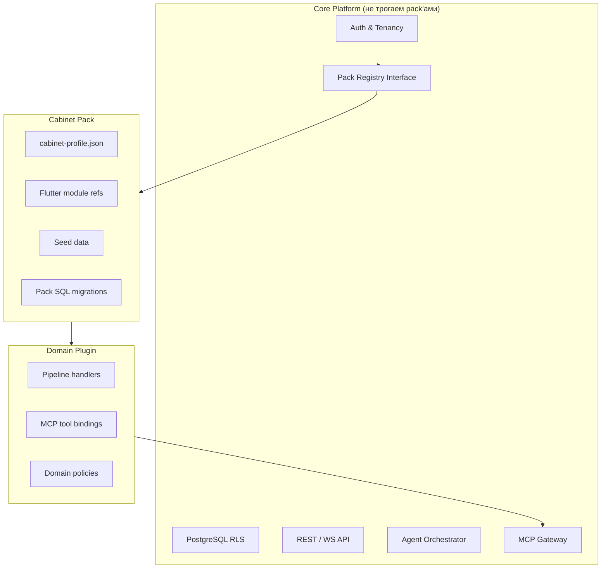
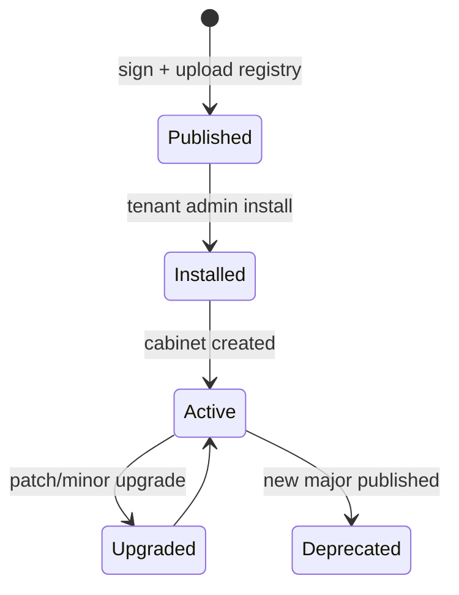

# Расширяемость платформы

Prodavan разделяет **ядро платформы (core)**, **cabinet pack** (вертикальный профиль + UI + seeds) и **domain plugin** (исполняемая доменная логика). Так достигается добавление новых бизнес-направлений без форка FastAPI и без ослабления multi-tenant изоляции.

> **Канон изоляции (2026-08):** кабинет = модуль со **своей БД** и **Cabinet SPI**. См. [ADR-001](ADR-001-platform-core-vs-cabinet-spi.md) и [cabinet-spi.md](cabinet-spi.md). Domain Plugin ниже = реализация SPI (in-process или remote).

---

## Три слоя расширения



| Слой | Владелец | Пример |
|------|----------|--------|
| **Core** | Prodavan team | JWT, RLS, pod spawn |
| **Cabinet pack** | Prodavan / partner | `electronics-procurement@1.0.0` |
| **Domain plugin** | Pack author | S4B search pipeline, KP rank rules |

---

## Core platform (frozen contract)

### Что входит

- Identity: users, tenants, memberships, invitations
- Cabinets & projects CRUD
- Agent session lifecycle + k3s integration
- MCP Gateway framework (ACL engine, audit, rate limit)
- Pack registry API (install, upgrade, verify signature)
- Flutter **shell**: navigation host, auth, cabinet switch
- OpenAPI `/v1/*` stable endpoints

### Что **не** входит

- S4B-specific filters
- KP xlsx templates
- Commerce `profiles/kp/*.md` task flows
- Классификатор «мышь vs монитор»

Доменные детали **только** через pack/plugin.

---

## Cabinet pack

### Арtefact structure

```text
electronics-procurement-1.0.0.pack/
  manifest.json              # signing metadata
  cabinet-profile.json       # UI + capabilities + MCP ACL
  seeds/
    trusted_sellers.sql
    web-shop-allowlist.json
  migrations/
    001_cabinet_equipment.sql
  flutter/
    module_manifest.json     # optional widget overrides
  plugin/
    entrypoint: prodavan_plugins.electronics:register
  checksums.sha256
  signature.sig
```

### Pack manifest

```json
{
  "pack_id": "electronics-procurement",
  "version": "1.0.0",
  "min_platform_version": "0.1.0",
  "max_platform_version": "<0.3.0",
  "author": "prodavan",
  "entrypoint": "prodavan_plugins.electronics:register",
  "cabinet_profile": "cabinet-profile.json"
}
```

### Lifecycle



---

## Domain plugin

Python entrypoint регистрирует hooks в **PluginRegistry** (in-process, isolated import path):

```python
def register(registry: PluginRegistry) -> None:
    registry.pipeline.register_stage("classify", ElectronicsClassifier())
    registry.mcp.register_filter("commerce-s4b.search", in_stock_only)
    registry.policies.register("offer_primary", trusted_min_price)
```

### Hook types (MVP)

| Hook | Purpose |
|------|---------|
| `pipeline.*` | Stages: ingest, classify, search, rank |
| `mcp.filters` | Pre/post tool invoke |
| `policies.*` | Business rules (primary offer selection) |
| `seeds.apply` | Custom seed logic |
| `agent.prompt` | Append domain rules to AGENTS snapshot |

### Isolation

- Plugins run **in API process** or **sidecar** with same tenant context — **не** in agent pod arbitrary code load (supply chain).
- Agent pod получает **frozen** `AGENTS.md` + pre-approved tools only via Gateway.
- Dynamic plugin load in pod — **запрещён** (Later: WASM sandbox).

---

## Версионирование pack

### Semver rules

| Bump | Когда |
|------|-------|
| **MAJOR** | Breaking manifest schema, removed capabilities, migration data loss risk |
| **MINOR** | New capabilities, UI modules backward compatible |
| **PATCH** | Seed fixes, filter tweaks, copy changes |

### Platform compatibility

```json
"min_platform_version": "0.1.0",
"max_platform_version": "<0.3.0"
```

Installer отклоняет pack если `platform_version` вне диапазона.

### Cabinet pinning

```sql
-- cabinets table
profile_id      TEXT NOT NULL,
profile_version TEXT NOT NULL,
pending_upgrade TEXT NULL  -- optional staged version
```

Upgrade flow:
1. Admin selects `1.1.0` → dry-run migrations.
2. `pending_upgrade` set; banner in UI.
3. Confirm → transactional migration + bump version.

### Rollback

- Keep **N-1** pack blobs in registry.
- `PATCH /cabinets/{id}/rollback` → downgrade if migrations reversible.
- Irreversible migrations require backup snapshot (tenant admin ack).

---

## Flutter extensibility

| Mechanism | Description |
|-----------|-------------|
| **Built-in module types** | `project-list`, `agent-chat`, … in core Flutter |
| **Pack module_manifest** | Maps type → config only (MVP) |
| **Future: federated modules** | Partner ships Dart AOT bundle via signed channel |

MVP: новые UI = новые `uiModule.type` в **core release**, pack только config. Later: dynamic modules.

---

## Registry & trust

| Trust level | Who can publish |
|-------------|---------------|
| **Official** | Prodavan signed keys |
| **Partner** | Partner key + review |
| **Private** | Tenant-upload (enterprise, air-gapped) |

Verification:
1. Ed25519 signature over `checksums.sha256`
2. JSON schema validate `cabinet-profile.json`
3. Virus scan tarball
4. Optional manual review for partner tier

---

## Anti-patterns

| ❌ Нельзя | ✅ Вместо |
|----------|----------|
| Import S4B client in core FastAPI | Plugin + Gateway adapter |
| Hardcode electronics UI routes | cabinet-profile navigation |
| Patch RLS in pack | Core only |
| Agent pod `pip install` pack | Pre-bake tools in worker image |
| Shared global `commerce.sqlite` | Per-project in sandbox |

---

## Roadmap extensibility

| Version | Feature |
|---------|---------|
| v0.1 | Single official pack `electronics-procurement` |
| v0.2 | Partner registry, private packs |
| v0.3 | Plugin marketplace billing |
| v1.0 | Federated Flutter modules |

---

## Связанные документы

- [cabinet-profiles.md](cabinet-profiles.md)
- [overview.md](overview.md)
- [mcp-gateway.md](mcp-gateway.md)
- [../01-vision/product-vision.md](../01-vision/product-vision.md)
