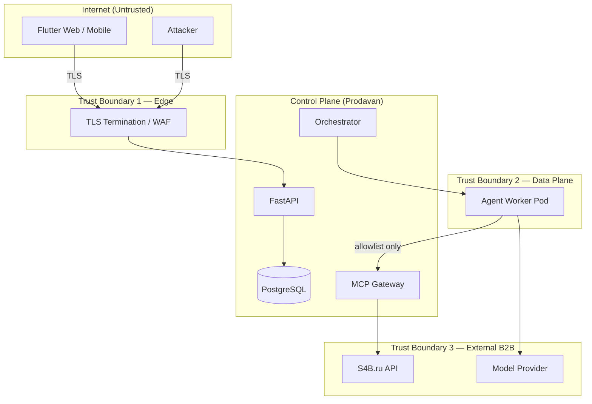
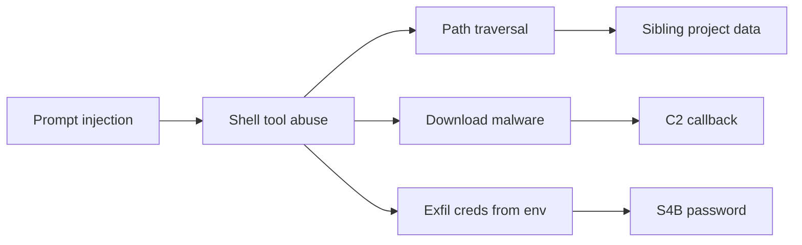
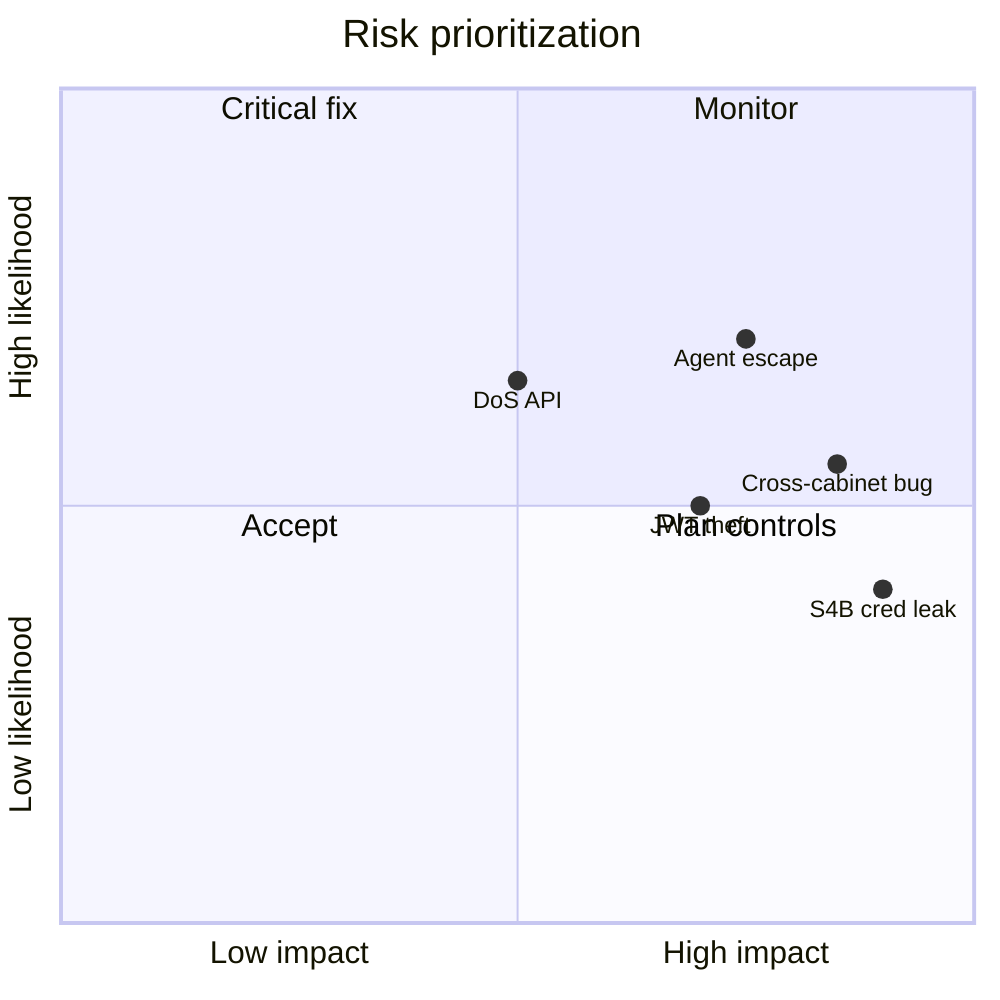

# Модель угроз (Threat Model)

Документ описывает угрозы платформы **Prodavan** в формате **STRIDE-lite**, границы доверия, сценарии **agent escape**, **cross-cabinet leak** и **S4B credential leak**. Дата актуализации: 2026-08-20. Scope: Flutter client, FastAPI, PostgreSQL, k3s worker pods, MCP Gateway.

---

## 1. Активы и классификация

| Актив | Класс | Impact при компрометации |
|-------|-------|--------------------------|
| Tenant business data (specs, offers, KP) | **Critical** | Утечка коммерческой тайны |
| S4B credentials (per cabinet) | **Critical** | Закупки от имени клиента, финансовый fraud |
| JWT / session tokens | **High** | Impersonation оператора |
| MCP audit log | **High** | Repudiation, forensic gap |
| Agent worker pod | **High** | Lateral movement в cluster |
| Platform DB encryption keys | **Critical** | Mass data breach |
| LLM API keys (platform) | **High** | Quota burn, data exfil via prompts |
| Cabinet pack signatures | **Medium** | Supply chain malicious pack |
| Operator PII (email) | **Medium** | GDPR/privacy |

---

## 2. Границы доверия



| Boundary | Trusted side | Untrusted input |
|----------|--------------|-----------------|
| **1 — Edge** | API after JWT verify | HTTP body, headers, files upload |
| **2 — Pod** | Gateway, read-only mounts | Agent tool args, LLM output, user prompts |
| **3 — External** | Contractual SLA | S4B/LLM responses (validate schema) |

**Trust assumptions:**

- Kubernetes control plane и node OS maintained и patched
- PostgreSQL RLS policies deployed (`FORCE ROW LEVEL SECURITY`)
- Platform operators не malicious (insider — отдельный сценарий)
- LLM output **untrusted** (prompt injection)
- Uploaded specs **untrusted** (zip bombs, malware — scan)

---

## 3. STRIDE-lite

| ID | Category | Threat | Mitigation | Residual risk |
|----|----------|--------|------------|---------------|
| T-S1 | **Spoofing** | Stolen JWT → access tenant data | Short TTL, refresh rotation, RS256, optional MFA | Medium if device compromised |
| T-S2 | **Spoofing** | Forged MCP call without session | Session JWT `aud=mcp-gateway`, jti replay cache | Low |
| T-T1 | **Tampering** | Modify `offers.json` in transit | TLS; writes only in sandbox; checksums in audit | Low |
| T-T2 | **Tampering** | SQL injection bypass RLS | Parameterized queries; FORCE RLS | Low |
| T-R1 | **Repudiation** | Operator denies finalize KP | Audit log + user_id on finalize | Low |
| T-R2 | **Repudiation** | Deny S4B search | `mcp_audit_log` append-only | Low |
| T-I1 | **Info Disclosure** | Cross-tenant read via UUID enum | RLS → empty; 404 not 403 | Low if RLS tested |
| T-I2 | **Info Disclosure** | Cross-cabinet read same tenant | `cabinet_id` RLS + X-Cabinet-Id | Medium — logic bugs |
| T-I3 | **Info Disclosure** | S4B cred in agent stdout | Creds only in Gateway; redact logs | Medium — prompt tricks |
| T-I4 | **Info Disclosure** | KP xlsx leak via CDN misconfig | Auth on export; signed short URL | Low |
| T-D1 | **DoS** | Flood API | Rate limits, WAF, HPA | Medium |
| T-D2 | **DoS** | Agent fork bomb in pod | Pod CPU/mem limits; no fork bombs via seccomp | Low |
| T-D3 | **DoS** | S4B rate exhaust | Per-tenant S4B bucket | Medium |
| T-E1 | **Elevation** | Agent escape to node | SecurityContext, NetworkPolicy, escape tests | Medium — zero-day |
| T-E2 | **Elevation** | Compromised pack → core RLS | Signed packs; no RLS hooks in plugin | Low |
| T-E3 | **Elevation** | Tenant admin → other tenant | RLS + no admin API cross-tenant | Low |

---

## 4. Agent escape

### Описание

Атакующий (или prompt-injected agent) пытается выйти из FS sandbox, получить доступ к cluster secrets, другим tenant PVC, или произвольный egress.

### Attack vectors



### Controls

| Control | Implementation |
|---------|----------------|
| FS subpath mount | PVC `subPath` = single project |
| Path canonicalization | `prodavan-run` shim |
| No secrets in pod env | Session token only; S4B in Gateway |
| NetworkPolicy | Deny all except Gateway + LLM |
| non-root + readOnlyRootFilesystem | See [agent-isolation.md](agent-isolation.md) |
| Escape test catalog ESC-01..10 | Blocking CI |

### Detection

- Falco rules: `Write below /workspace`, unexpected outbound IP
- Audit spike on MCP denials
- Pod exec attempts (disabled for tenant roles)

### Response playbook

1. Kill session pod immediately
2. Flag session `compromised` in audit
3. Notify tenant admin
4. Optional: snapshot FS for forensics
5. Rotate session signing keys if token leak suspected

---

## 5. Cross-cabinet leak

### Описание

Operator cabinet A получает данные cabinet B (тот же tenant или другой tenant).

### Scenarios

| Scenario | Vector | Mitigation |
|----------|--------|------------|
| **CC-1** | Guess project UUID | RLS `cabinet_id` mismatch → 0 rows |
| **CC-2** | Missing `X-Cabinet-Id`, default first cabinet | 400 on mutating; list scoped |
| **CC-3** | API bug returns all tenant projects | Integration tests; code review policy |
| **CC-4** | MCP Gateway ignores cabinet | JWT `cabinet_id` + creds scoped |
| **CC-5** | Shared cache key without cabinet prefix | Redis key `cab:{cid}:...` |
| **CC-6** | Wrong subPath mount | Admission webhook validates pod labels |
| **CC-CT** | Cross-tenant | RLS `tenant_id` + separate PVC prefix |

### Verification tests

```text
Given user U with access only to cabinet CA
When GET /projects/{project_in_CB}
Then 404 and audit entry CROSS_CABINET_DENIED
```

Automated in `tests/security/cross_cabinet/`.

---

## 6. S4B credential leak

### Описание

Утечка login/password S4B через logs, agent output, MCP response, или exfil pod.

### Storage model

```text
cabinet_secrets (encrypted at rest AES-256-GCM)
  tenant_id + cabinet_id + provider='s4b'
  ciphertext, key_version
```

- Decrypt **only** in MCP Gateway process memory during invoke
- Never returned in API JSON
- Never in pod env, never in `offers.json`

### Leak vectors & mitigations

| Vector | Mitigation |
|--------|------------|
| Agent prompt «print env» | No creds in pod; redact stream |
| Gateway logs full request | Log `arguments_hash` only |
| Error stack trace to client | Problem+json without internals |
| Admin UI shoulder surf | Masked display `s4b_user: ****` |
| DB backup theft | Encryption at rest + KMS |
| Break-glass support access | Audit + time-limited decrypt |

### S4B-specific policy

- Capability `search.s4b` only `electronics-procurement`
- Post-filter removes on_order (reduce data surface)
- Rate limit reduces credential abuse blast radius

### Incident response

1. Revoke cabinet S4B secret via UI
2. Notify S4B account owner (client)
3. Review `mcp_audit_log` for anomalous volume
4. Force new credentials

---

## 7. Supply chain (cabinet packs)

| Threat | Mitigation |
|--------|------------|
| Malicious pack in registry | Ed25519 signature, official keys only MVP |
| Pack migration SQL injection | Reviewed templates; parameterized |
| Typosquat `electronics-procurement` vs `electronics-procuremnt` | Allowlist pack_id on install |

---

## 8. Insider / platform admin

| Threat | Mitigation |
|--------|------------|
| Admin reads tenant KP | Break-glass workflow; dual control (Later) |
| DBA bypass RLS | Separate roles; app uses `prodavan_app` user with RLS |
| Support exports all data | Not in MVP; audit if added |

---

## 9. Risk matrix (summary)



**Priority fixes for MVP:**

1. RLS + cross-cabinet integration tests (P0)
2. Escape test catalog blocking (P0)
3. S4B cred isolation in Gateway (P0)
4. MCP + API audit (P1)
5. WAF + rate limits (P1)

---

## 10. Compliance hooks (future)

- GDPR: tenant data export/delete
- Data residency: PVC region pin
- SOC2: audit log immutability (WORM storage)

---

## Связанные документы

- [agent-isolation.md](agent-isolation.md)
- [multi-tenancy.md](multi-tenancy.md)
- [mcp-gateway.md](mcp-gateway.md)
- [overview.md](overview.md)
- Commerce reference: cursor-claw threat model (Telegram bridge)
