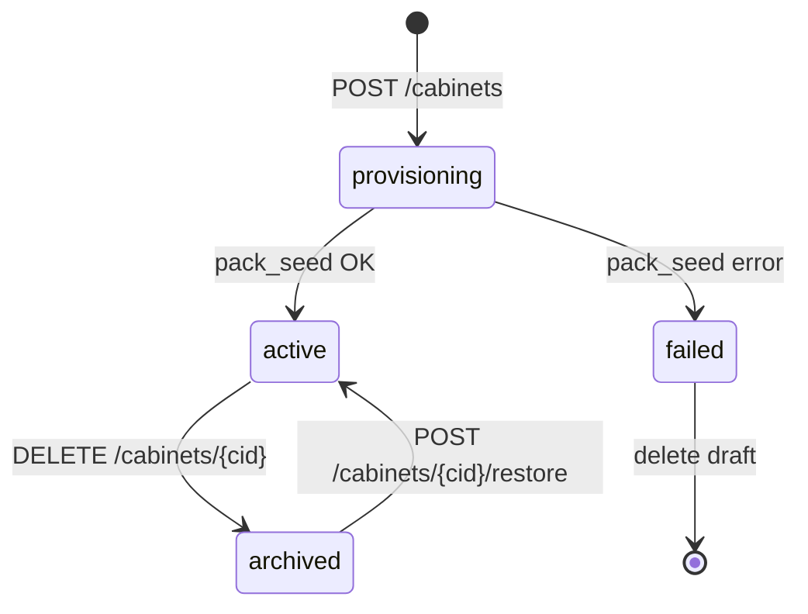

# M00 — Домен: кабинеты

## Словарь

| Термин | Определение |
| --- | --- |
| **Tenant (tid)** | Организация-владелец; верхний уровень мультитенантности |
| **Cabinet (cid)** | Изолированный рабочий контекст с фиксированным профилем задач |
| **Profile** | Именованный шаблон поведения: набор модулей, capabilities, seed-пак |
| **Capabilities** | Машиночитаемая схема «что разрешено» для данного кабинета |
| **Pack seed** | Детерминированная первичная заливка файлов и записей БД при создании |
| **Active cabinet** | Текущий `cid` в сессии оператора/агента |

## Сущности

### Cabinet

```typescript
interface Cabinet {
  id: string;              // cid, UUID v7
  tenant_id: string;       // tid
  slug: string;            // уникален в пределах tid, [a-z0-9-]{3,64}
  display_name: string;
  profile_id: string;      // immutable после create
  status: CabinetStatus;
  capabilities: Capabilities;  // snapshot на момент create + readonly overrides=null
  created_at: ISO8601;
  updated_at: ISO8601;
  archived_at?: ISO8601;
  created_by: user_id;
}

type CabinetStatus = 'active' | 'archived';
```

### CabinetProfile (реестр)

```typescript
interface CabinetProfile {
  id: string;              // например electronics-procurement
  version: string;         // semver pack version
  display_name: string;
  description: string;
  capabilities_schema: CapabilitiesSchema;
  pack_path: string;       // packages/cabinet-packs/{id}/
  deprecated: boolean;
}
```

### CapabilitiesSchema

Декларативный JSON Schema; пример для закупок электроники:

```json
{
  "modules": {
    "specs_kp": { "enabled": true, "formats": ["xlsx", "xls", "csv", "txt"] },
    "equipment_cards": { "enabled": true },
    "prompts": { "enabled": true },
    "catalogs_user": { "enabled": true },
    "catalogs_system_s4b": { "enabled": true, "requires_profile": "electronics-procurement" }
  },
  "integrations": {
    "s4b": { "enabled": true, "requires_profile": "electronics-procurement" }
  },
  "agent": {
    "default_profile_path": "profiles/kp/",
    "mcp_servers": ["commerce-search", "commerce-s4b", "commerce-offers", "commerce-equipment"]
  }
}
```

Для профиля без электроники блок `integrations.s4b` и `catalogs_system_s4b` **отсутствуют** или явно `"enabled": false` без возможности override.

### CabinetSwitchContext

```typescript
interface CabinetSwitchContext {
  previous_cid?: string;
  new_cid: string;
  workspace_key: string;   // cab:{tid}:{cid}
  session_id: string;
  switched_at: ISO8601;
  capabilities: Capabilities;
}
```

## Жизненный цикл



### Pack seed pipeline (детерминированные шаги)

1. **validate_profile** — профиль существует, не deprecated (или явный флаг `allow_deprecated`).
2. **allocate_cid** — UUID, резерв slug.
3. **insert_cabinet_row** — status=`provisioning`.
4. **materialize_storage** — `storage/cabinets/{tid}/{cid}/` из pack.
5. **seed_prompts** — вызов M03 internal: AGENTS.md, profiles/, skills snapshot.
6. **seed_catalogs_placeholder** — пустые user catalogs; system S4B stub **только** если `capabilities.s4b`.
7. **finalize** — status=`active`, emit `cabinet.created`.

Откат при ошибке на шагах 4–6: удаление storage + строки cabinet (hard delete draft).

## Инварианты домена

| ID | Инвариант |
| --- | --- |
| INV-CAB-001 | `(tid, slug)` уникален среди non-archived кабинетов |
| INV-CAB-002 | `profile_id` неизменяем после `active` |
| INV-CAB-003 | `capabilities.integrations.s4b.enabled === true` ⟺ `profile_id === 'electronics-procurement'` |
| INV-CAB-004 | Архивный кабинет не может быть active cabinet в новой сессии |
| INV-CAB-005 | Switch на `cid` другого `tid` → отказ (cross-tenant) |
| INV-CAB-006 | Все пути storage содержат `{tid}/{cid}` — без симлинков наружу |
| INV-CAB-007 | Pack seed идемпотентен по `(cid, pack_version)` — повтор не дублирует файлы |

## Cross-cabinet: что запрещено

Оператор в кабинете **A** не может:

- читать `storage/cabinets/{tid}/{cid_B}/…`;
- вызывать API с `X-Cabinet-Id: cid_B` без membership;
- получать MCP-результаты с workspace key чужого `cid`;
- подставить `cab:{tid}:{cid_B}:pid:…` в tool args — middleware вернёт `CABINET_ISOLATION_VIOLATION`.

## События домена

| Событие | Payload |
| --- | --- |
| `cabinet.created` | `{ tid, cid, profile_id }` |
| `cabinet.archived` | `{ tid, cid }` |
| `cabinet.restored` | `{ tid, cid }` |
| `cabinet.switched` | `{ tid, cid, session_id, user_id }` |
| `cabinet.seed_failed` | `{ tid, cid, step, error }` |

## Negative test IDs (cross-cabinet)

| Test ID | Сценарий | Ожидание |
| --- | --- | --- |
| NEG-CAB-001 | GET project из cid_B с токеном сессии cid_A | 403 `CABINET_MISMATCH` |
| NEG-CAB-002 | MCP `commerce-search` с workspace `cab:tid:cid_B:…` из сессии A | error isolation |
| NEG-CAB-003 | Path traversal `../../cid_B/inbox` | 400 / sandbox block |
| NEG-CAB-004 | Switch на archived cabinet | 409 `CABINET_ARCHIVED` |
| NEG-CAB-005 | Create cabinet с override `s4b: true` для non-electronics profile | 422 `CAPABILITY_FORBIDDEN` |
| NEG-CAB-006 | Duplicate slug в том же tid | 409 `SLUG_CONFLICT` |
| NEG-CAB-007 | List cabinets tid_X пользователем tenant tid_Y | 403 или пустой список |
| NEG-CAB-008 | SQL injection в slug | 400 validation |
| NEG-CAB-009 | JWT без claim `cab` при strict mode | 401 |
| NEG-CAB-010 | Parallel switch двух вкладок — last-write-wins documented | консистентный cid в audit |
