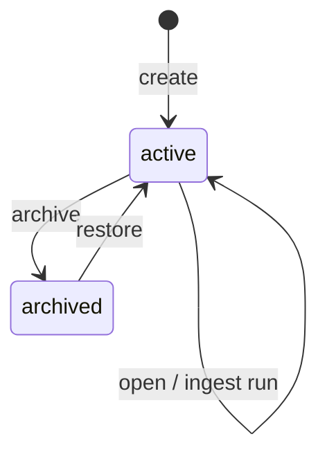

# M01 — Домен: проекты

## Сущность Project

```typescript
interface Project {
  id: string;                    // pid, prefix proj_ + ulid
  cabinet_id: string;            // cid
  tenant_id: string;             // tid (denormalized)
  slug: string;                  // unique within cabinet
  display_name: string;
  status: ProjectStatus;
  workspace_key: string;         // cab:{tid}:{cid}:{pid}
  default_profile_module?: string; // override profiles/kp/ from cabinet
  created_at: ISO8601;
  updated_at: ISO8601;
  archived_at?: ISO8601;
  last_opened_at?: ISO8601;
  created_by: user_id;
  stats: {
    runs_total: number;
    runs_active: number;
    inbox_pending: number;
  };
}

type ProjectStatus = 'active' | 'archived';
```

## Workspace key

Формат строгий:

```text
cab:{tid}:{cid}:{pid}
```

| Компонент | Правила |
| --- | --- |
| tid | slug tenant, `[a-z0-9-]+` |
| cid | UUID v7 |
| pid | `proj_[a-z0-9]{8,}` |

Парсинг: regex `^cab:([^:]+):([^:]+):(.+)$`

## Жизненный цикл



### Open project

Не меняет файлы; обновляет session binding:

- `active_pid` в JWT/session
- `last_opened_at`
- agent `cwd` → project storage root

## Инварианты

| ID | Инвариант |
| --- | --- |
| INV-PRJ-001 | `(cid, slug)` unique среди active |
| INV-PRJ-002 | `workspace_key` детерминирован из tid,cid,pid |
| INV-PRJ-003 | Project.pid принадлежит ровно одному cid |
| INV-PRJ-004 | runs/{run_id} immutable input/ после create |
| INV-PRJ-005 | inbox файл не удаляется при archive проекта |
| INV-PRJ-006 | commerce.sqlite path фиксирован в project root |
| INV-PRJ-007 | Cross-cabinet: pid из cid_A недоступен при active cid_B |

## Связь с прогонами (M02)

```text
Project
  └── Run (run_id)
        ├── input/
        ├── rows.json
        ├── lineitems.json
        ├── offers.json
        ├── selection.json
        └── status.json
```

Run всегда scoped: `workspace_key` + `run_id`.

## Negative test IDs

| Test ID | Сценарий | Ожидание |
| --- | --- | --- |
| NEG-PRJ-001 | Open pid из другого cid | 403 |
| NEG-PRJ-002 | Create project без active cabinet | 400 |
| NEG-PRJ-003 | Duplicate slug в cabinet | 409 |
| NEG-PRJ-004 | Path runs с чужим pid | isolation |
| NEG-PRJ-005 | Archive + new run | 409 PROJECT_ARCHIVED |
| NEG-PRJ-006 | workspace_key spoof in MCP | reject |
| NEG-PRJ-007 | List projects другого tid | 403 |
