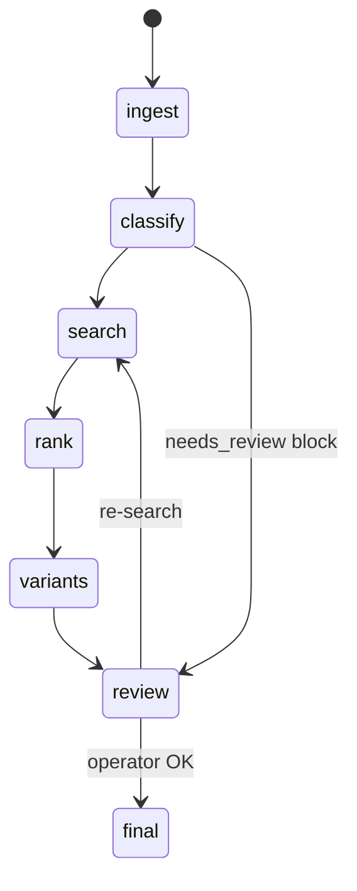

# M02 — Спеки и КП (Specs-KP)

Модуль **M02-specs-kp** реализует полный цикл обработки закупочной спеки: загрузка файлов, state machine пайплайна, поиск офферов, ранжирование, варианты в SQLite, экспорт КП и карточки оборудования (**только профиль electronics-procurement**).

## Назначение

| Задача | Описание |
| --- | --- |
| Upload | xlsx, xls, csv, txt → inbox |
| Pipeline SM | ingest → classify → search → rank → variants → review |
| KP export | xlsx из шаблона + SQLite variants |
| Equipment cards | MCP commerce-equipment, карточки в commerce.sqlite |
| State artifacts | rows.json, lineitems.json, offers.json, selection.json |

## Доступность по профилю

| Capability | electronics-procurement | другие |
| --- | --- | --- |
| Весь модуль M02 | ✓ | ✗ или урезанный* |
| equipment_cards | ✓ | ✗ |
| S4B в search | ✓ | **✗** |

*Урезанный — только ingest/classify без commerce search, если профиль явно включает `specs_kp` без electronics.

## Pipeline (кратко)



## Зависимости

```text
M01-projects (inbox, runs, commerce.sqlite)
M04-catalogs (catalog → S4B* → web)
M03-prompts (AGENTS.md, profiles/kp/)
M00 capabilities gate
```

## Документация

| Файл | Содержание |
| --- | --- |
| [domain.md](domain.md) | LineItem, Run, phases |
| [api.md](api.md) | upload, run control, KP export |
| [persistence.md](persistence.md) | status.json, SQLite |
| [storage.md](storage.md) | runs artifacts |
| [mcp-tools.md](mcp-tools.md) | commerce-* MCP |
| [ui.md](ui.md) | upload, run timeline |
| [security.md](security.md) | no hallucinated prices |
| [checklist-implementation.md](checklist-implementation.md) | |
| [checklist-review.md](checklist-review.md) | |

## Жёсткие запреты (из Commerce AGENTS)

1. Не называть цену/SKU/наличие вне offers.json / MCP output
2. Не улучшать партномер заказчика
3. Не писать kp.xlsx агентом — только API export
4. Не ставить `final` без оператора
5. «Под заказ» S4B — не включать в offers
