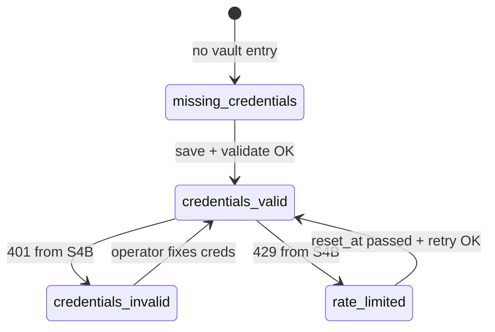

# M04 — Домен: каталоги

## UserCatalog

```typescript
interface UserCatalog {
  id: string;                  // cat_{ulid}
  cabinet_id: string;
  tenant_id: string;
  slug: string;
  display_name: string;
  format: 'sqlite' | 'xlsx' | 'csv';
  status: 'uploading' | 'indexing' | 'ready' | 'failed' | 'archived';
  schema_hint?: {
    table: string;
    columns: { pn?: string; price?: string; title?: string; stock?: string };
  };
  stats: { rows: number; last_indexed_at?: ISO8601 };
  trusted_seller: boolean;     // для rank в M02
  created_at: ISO8601;
}
```

## SystemDatabase

Платформенная БД — **non-deletable**, read-only для оператора (кроме refresh/cache).

```typescript
interface SystemDatabase {
  id: string;                  // s4b-cache
  display_name: string;
  type: 's4b_api_cache' | 'platform_reference';
  deletable: false;            // always false
  requires_capability: string; // integrations.s4b
  requires_profile: 'electronics-procurement';
  virtual: boolean;            // true for s4b-cache
}
```

### Зарегистрированные system databases

| id | Profile | Deletable | Source |
| --- | --- | --- | --- |
| `s4b-cache` | electronics-procurement only | **false** | Live S4B API + cache layer |

Другие кабинеты: system database list **пуст** (или только non-s4b platform refs без credentials).

## S4B Credential state

```typescript
type S4BCredentialState =
  | 'missing_credentials'
  | 'credentials_valid'
  | 'credentials_invalid'
  | 'rate_limited';

interface S4BCredentialStatus {
  tenant_id: string;
  state: S4BCredentialState;
  last_validated_at?: ISO8601;
  last_error?: string;
  rate_limit_reset_at?: ISO8601;
  s4b_username_hint?: string;  // masked: "user***@corp.ru"
}
```

### State transitions



### Behavior by state (M02 search)

| State | commerce-s4b | s4b-cache queries |
| --- | --- | --- |
| missing_credentials | disabled | stale cache only if any |
| credentials_valid | enabled | live + cache |
| credentials_invalid | disabled | cache read-only banner |
| rate_limited | disabled until reset | cache read-only |

## Credential vault (domain)

- Secrets **never** in catalog files or logs
- Vault key: `vault:s4b:{tenant_id}`
- Payload: encrypted username/password or token
- Rotation: operator update → re-validate → state transition

## Search policy (with M02)

1. User catalogs (trusted first)
2. s4b-cache / live S4B — **only electronics + valid creds**
3. Never merge on_order as in_stock

## Инварианты

| ID | Инвариант |
| --- | --- |
| INV-CAT-001 | System DB deletable=false always |
| INV-CAT-002 | s4b-cache visible only electronics-procurement |
| INV-CAT-003 | User catalog scoped to cabinet |
| INV-CAT-004 | Credentials tenant-level, not per cabinet |
| INV-CAT-005 | rate_limited blocks live S4B, not user catalogs |
| INV-CAT-006 | Vault decrypt only in s4b worker process |
| INV-CAT-007 | No s4b MCP on non-electronics (defense in depth) |

## Negative test IDs

| Test ID | Сценарий |
| --- | --- |
| NEG-CAT-001 | DELETE system s4b-cache |
| NEG-CAT-002 | S4B search generic cabinet |
| NEG-CAT-003 | Read vault secret via API |
| NEG-CAT-004 | User catalog cross-cabinet |
| NEG-CAT-005 | on_order in S4B results |
| NEG-CAT-006 | credentials_invalid still live search |
| NEG-CAT-007 | rate_limited bypass via direct API |
