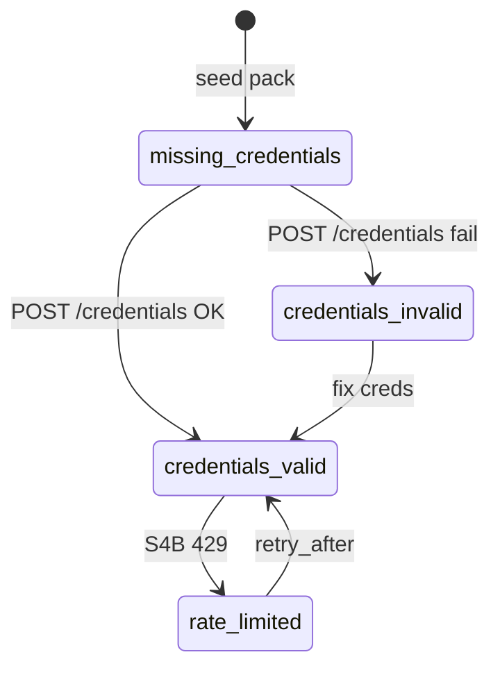

# System databases (зарезервированные БД)

Системные каталоги создаются **только** из cabinet profile pack, не вручную. Удаление через API/UI **запрещено**.

## S4B (`slug=s4b`)

| Поле | Значение |
|------|----------|
| Profile gate | `electronics-procurement` only |
| `kind` | `system_reserved` |
| `deletable` | `false` |
| `credentials_required` | `true` |

### State machine

| State | UI | MCP `s4b.*` | Cascade search |
|-------|-----|-------------|----------------|
| `missing_credentials` | row visible, icon off | disabled | skip S4B |
| `credentials_valid` | active | enabled | include S4B |
| `credentials_invalid` | error chip | disabled | skip S4B |
| `rate_limited` | limited chip | disabled until TTL | skip S4B |

### Cache

- Virtual DB `s4b-cache` (аналог Commerce `catalogs/s4b/cache.sqlite`)
- Quota: 12 full category exports / day (documented in M05)
- TTL policy: see [M05 integrations](../M05-integrations/domain.md)

### Negative tests

- `NEG-CAT-001` — DELETE catalog s4b → 403
- `NEG-CAT-002` — generic cabinet has no s4b row
- `NEG-CAT-003` — s4b.search without creds → `S4B_DISABLED`

## Future system DBs

Другие profile packs могут объявлять `system_catalogs[]` в pack manifest. **Generic packs default: empty array.**
