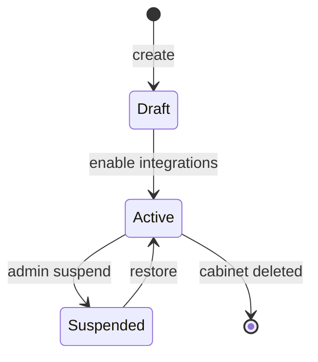

# M05 — Доменная модель

## Сущности

### CabinetIntegrationPolicy

Политика интеграций одного кабинета. Одна строка на кабинет.

```json
{
  "cabinet_id": "uuid",
  "s4b_enabled": true,
  "s4b_trusted_only": true,
  "s4b_electronics_only": true,
  "web_shops_enabled": true,
  "default_rate_limit_rpm": 60,
  "updated_at": "2026-08-20T10:00:00Z",
  "updated_by": "user_uuid"
}
```

### WebShopAllowlistEntry

Разрешённый веб-магазин для кабинета.

```json
{
  "id": "uuid",
  "cabinet_id": "uuid",
  "shop_id": "dns",
  "display_name": "DNS",
  "enabled": true,
  "priority": 10,
  "rate_limit_rpm": 30,
  "created_at": "2026-08-20T10:00:00Z"
}
```

**shop_id** — стабильный идентификатор из глобального справочника адаптеров (не tenant-specific). Справочник адаптеров — read-only конфиг платформы, не данные кабинета.

Допустимые `shop_id` (v1): `dns`, `ozon`, `aliexpress`, `citilink`, `regard`, `nix`.

### S4BTrustedSeller

Доверенный продавец S4B для кабинета.

```json
{
  "id": "uuid",
  "cabinet_id": "uuid",
  "s4b_seller_id": 12345,
  "seller_name": "ООО Пример",
  "electronics_only_override": null,
  "enabled": true,
  "added_at": "2026-08-20T10:00:00Z"
}
```

`electronics_only_override`: `null` — наследовать из политики; `true`/`false` — исключение для продавца.

### RateLimitBucket

Состояние лимитера (Redis или ephemeral).

```json
{
  "key": "cabinet:{uuid}:s4b:search",
  "window_seconds": 60,
  "max_requests": 60,
  "current_count": 12,
  "reset_at": "2026-08-20T10:01:00Z"
}
```

### IntegrationCallLog

Запись вызова (дублируется в M09 audit).

```json
{
  "id": "uuid",
  "cabinet_id": "uuid",
  "integration": "s4b",
  "operation": "search_articles",
  "status": "ok",
  "latency_ms": 340,
  "rate_limited": false,
  "created_at": "2026-08-20T10:00:00Z"
}
```

## Справочник категорий «электроника» (S4B)

Фильтр `s4b_electronics_only` применяет whitelist кодов категорий S4B:

| code | name |
| --- | --- |
| `IT` | Компьютерная техника |
| `NET` | Сетевое оборудование |
| `COMP` | Комплектующие |
| `MOB` | Мобильные устройства |
| `AV` | Аудио/видео |
| `OFFICE_IT` | Оргтехника |

Строки с категориями `FOOD`, `AUTO`, `FURNITURE` и т.п. отбрасываются с кодом `category_filtered`.

## Бизнес-правила

### Web shops

1. Агент видит только магазины с `enabled=true` в allowlist кабинета.
2. `list_web_shops` MCP возвращает пересечение глобального справочника и allowlist.
3. Поиск в магазине без записи в allowlist → `403 INTEGRATION_NOT_ALLOWED`.
4. Приоритет `priority` используется для сортировки в UI и подсказок агенту (не для автоматического выбора primary).

### S4B

1. **Только in_stock** — позиции «под заказ» не сериализуются в Offer.
2. **trusted_only** — при `true` результаты фильтруются по `S4BTrustedSeller`; иначе все in_stock.
3. **electronics_only** — фильтр категорий до маппинга в Offer.
4. Учётные данные S4B API — **на уровне кабинета** (encrypted), не глобальные.

### Rate limits

Иерархия (первый сработавший — побеждает):

```text
platform_default → cabinet_policy → integration_override → shop_entry
```

Код ответа: `429 RATE_LIMIT_EXCEEDED`, заголовки:

```http
X-RateLimit-Limit: 60
X-RateLimit-Remaining: 0
X-RateLimit-Reset: 1692520800
Retry-After: 42
```

### Ошибки домена

| code | HTTP | Описание |
| --- | --- | --- |
| `INTEGRATION_DISABLED` | 403 | S4B или web отключены в политике |
| `INTEGRATION_NOT_ALLOWED` | 403 | Магазин не в allowlist |
| `S4B_CREDENTIALS_MISSING` | 412 | Нет creds кабинета |
| `CATEGORY_FILTERED` | 200 | Пустой результат после фильтра (не ошибка) |
| `RATE_LIMIT_EXCEEDED` | 429 | Лимит исчерпан |

## Диаграмма состояний политики



## Связь с Offer (M04)

M05 не создаёт Offer. Адаптер возвращает нормализованный `RawOffer[]`; pipeline M04 добавляет `source_ref`, `trusted_seller`, `in_stock=true`.
