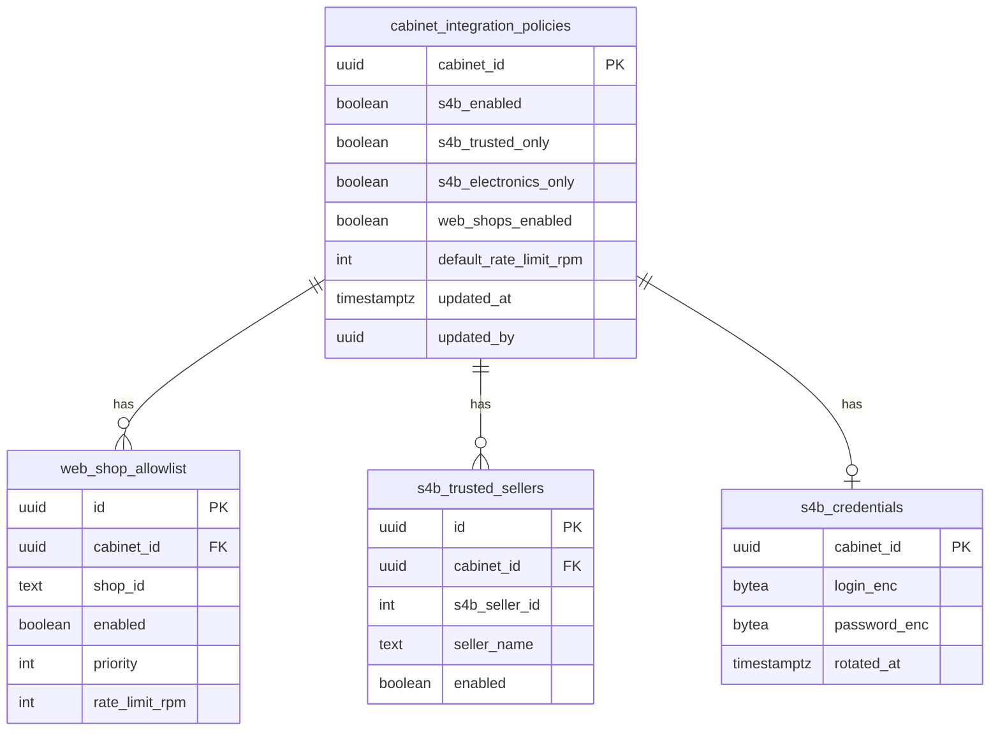

# M05 — Персистентность (PostgreSQL)

Схема: `integrations`. Все таблицы содержат `cabinet_id` — **нет строк без tenant-контекста** (M08).

## ER-диаграмма



## Таблицы

### `integrations.cabinet_integration_policies`

```sql
CREATE TABLE integrations.cabinet_integration_policies (
  cabinet_id              UUID PRIMARY KEY REFERENCES tenants.cabinets(id) ON DELETE CASCADE,
  s4b_enabled             BOOLEAN NOT NULL DEFAULT false,
  s4b_trusted_only        BOOLEAN NOT NULL DEFAULT true,
  s4b_electronics_only    BOOLEAN NOT NULL DEFAULT true,
  web_shops_enabled       BOOLEAN NOT NULL DEFAULT false,
  default_rate_limit_rpm  INT NOT NULL DEFAULT 60 CHECK (default_rate_limit_rpm BETWEEN 1 AND 10000),
  updated_at              TIMESTAMPTZ NOT NULL DEFAULT now(),
  updated_by              UUID REFERENCES tenants.users(id)
);
```

### `integrations.web_shop_allowlist`

```sql
CREATE TABLE integrations.web_shop_allowlist (
  id              UUID PRIMARY KEY DEFAULT gen_random_uuid(),
  cabinet_id      UUID NOT NULL REFERENCES tenants.cabinets(id) ON DELETE CASCADE,
  shop_id         TEXT NOT NULL,
  enabled         BOOLEAN NOT NULL DEFAULT true,
  priority        INT NOT NULL DEFAULT 100,
  rate_limit_rpm  INT CHECK (rate_limit_rpm IS NULL OR rate_limit_rpm BETWEEN 1 AND 10000),
  created_at      TIMESTAMPTZ NOT NULL DEFAULT now(),
  UNIQUE (cabinet_id, shop_id)
);

CREATE INDEX idx_web_shop_allowlist_cabinet ON integrations.web_shop_allowlist (cabinet_id, enabled);
```

### `integrations.s4b_trusted_sellers`

```sql
CREATE TABLE integrations.s4b_trusted_sellers (
  id                          UUID PRIMARY KEY DEFAULT gen_random_uuid(),
  cabinet_id                  UUID NOT NULL REFERENCES tenants.cabinets(id) ON DELETE CASCADE,
  s4b_seller_id               INT NOT NULL,
  seller_name                 TEXT NOT NULL,
  electronics_only_override   BOOLEAN,
  enabled                     BOOLEAN NOT NULL DEFAULT true,
  added_at                    TIMESTAMPTZ NOT NULL DEFAULT now(),
  UNIQUE (cabinet_id, s4b_seller_id)
);

CREATE INDEX idx_s4b_trusted_cabinet ON integrations.s4b_trusted_sellers (cabinet_id, enabled);
```

### `integrations.s4b_credentials`

```sql
CREATE TABLE integrations.s4b_credentials (
  cabinet_id      UUID PRIMARY KEY REFERENCES tenants.cabinets(id) ON DELETE CASCADE,
  login_enc       BYTEA NOT NULL,
  password_enc    BYTEA NOT NULL,
  key_version     SMALLINT NOT NULL DEFAULT 1,
  rotated_at      TIMESTAMPTZ NOT NULL DEFAULT now()
);
```

Расшифровка только в worker-процессе MCP, не в API-gateway.

### `integrations.integration_call_log`

Партиционирование по месяцу. Retention — M09.

```sql
CREATE TABLE integrations.integration_call_log (
  id              UUID NOT NULL DEFAULT gen_random_uuid(),
  cabinet_id      UUID NOT NULL,
  integration     TEXT NOT NULL,
  operation       TEXT NOT NULL,
  status          TEXT NOT NULL,
  latency_ms      INT,
  rate_limited    BOOLEAN NOT NULL DEFAULT false,
  error_code      TEXT,
  created_at      TIMESTAMPTZ NOT NULL DEFAULT now(),
  PRIMARY KEY (id, created_at)
) PARTITION BY RANGE (created_at);
```

## Миграции

| version | описание |
| --- | --- |
| `2026082001` | initial schema |
| `2026082002` | partition integration_call_log |
| `2026082003` | index s4b_trusted_sellers |

## Redis (rate limits)

Ключи:

```text
rl:{cabinet_id}:s4b:search          → sliding window 60s
rl:{cabinet_id}:web:{shop_id}:query → sliding window 60s
```

Fallback: in-memory per pod (не для prod multi-replica без Redis).

## Индексы и производительность

- Политика кабинета: PK lookup, кэш 60s в Redis `policy:{cabinet_id}`
- Trusted sellers: типично < 50 строк на кабинет — без пагинации в hot path
- Call log: append-only, не участвует в транзакциях поиска

## Изоляция

Row Level Security (RLS):

```sql
ALTER TABLE integrations.web_shop_allowlist ENABLE ROW LEVEL SECURITY;
CREATE POLICY cabinet_isolation ON integrations.web_shop_allowlist
  USING (cabinet_id = current_setting('app.cabinet_id')::uuid);
```

Приложение выставляет `SET app.cabinet_id` из JWT на каждое соединение.
