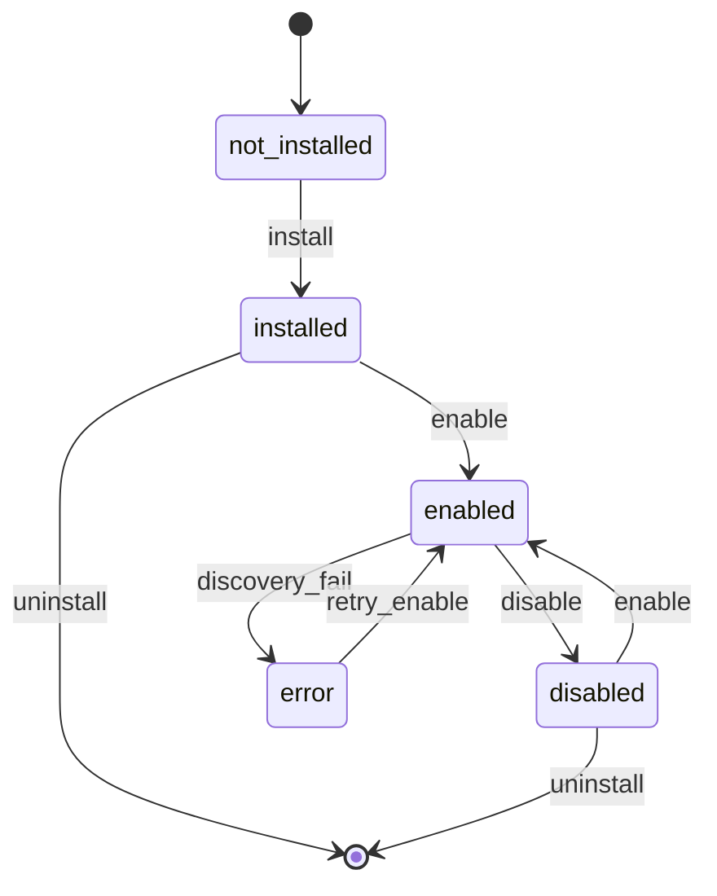

# M06 — Доменная модель

## Сущности

### McpServerDefinition (platform catalog)

Глобальный каталог **типов** MCP-серверов. Не tenant data.

```json
{
  "server_id": "prodavan-s4b",
  "display_name": "S4B Aggregator",
  "version": "1.2.0",
  "transport": "stdio",
  "entrypoint": "python -m prodavan_mcp.s4b",
  "required_env": ["CABINET_ID"],
  "optional_env": ["S4B_LOGIN", "S4B_PASSWORD"],
  "tool_namespace": "s4b",
  "category": "integrations",
  "trust_level": "official"
}
```

`trust_level`: `official` | `verified` | `community` | `custom`.

### McpInstallation (per cabinet)

Установка сервера в кабинет.

```json
{
  "id": "uuid",
  "cabinet_id": "uuid",
  "server_id": "prodavan-s4b",
  "state": "enabled",
  "config": {},
  "installed_at": "2026-08-20T10:00:00Z",
  "installed_by": "user_uuid"
}
```

**state:** `installed` | `enabled` | `disabled` | `error`

### McpToolCatalogEntry

Кэш discovery (обновляется при enable).

```json
{
  "server_id": "prodavan-s4b",
  "tool_name": "s4b.search_articles",
  "description": "Поиск по артикулам S4B",
  "input_schema": { "type": "object", "properties": {} },
  "discovered_at": "2026-08-20T10:00:00Z"
}
```

### AgentProfile

Профиль задачи — фильтр tools.

```json
{
  "profile_id": "kp",
  "display_name": "Спека → КП",
  "allowed_servers": ["prodavan-pipeline", "prodavan-catalog", "prodavan-s4b", "prodavan-offers", "prodavan-equipment", "prodavan-integrations"],
  "tool_allowlist": null,
  "tool_denylist": ["s4b.cache_purge", "pipeline.validate_run"],
  "max_tools": 40
}
```

`tool_allowlist`: если non-null — **только** перечисленные tools (whitelist mode).

### SessionMcpBinding

Привязка MCP к сессии агента (M07).

```json
{
  "session_id": "uuid",
  "cabinet_id": "uuid",
  "profile_id": "kp",
  "effective_tools": ["catalog.list_databases", "s4b.search_articles"],
  "registry_snapshot_hash": "sha256:abc..."
}
```

## Lifecycle



### Install

1. Validate `server_id` exists in platform catalog
2. Check tenant plan limits (`max_mcp_servers`)
3. Create `McpInstallation` state=`installed`
4. No process spawn yet

### Enable

1. Decrypt env / inject cabinet context
2. Spawn MCP process (stdio) or connect SSE
3. Run `tools/list`
4. Persist `McpToolCatalogEntry[]`
5. state=`enabled`

### Disable

1. Graceful shutdown MCP process
2. state=`disabled`
3. Active agent sessions: tools removed on next turn or forced `/reset`

## Profile tool filter

Алгоритм `resolveEffectiveTools(cabinet, profile, session)`:

```python
tools = []
for inst in cabinet.enabled_installations():
    if inst.server_id not in profile.allowed_servers:
        continue
    for t in inst.discovered_tools:
        fqname = f"{t.namespace}.{t.name}"
        if profile.tool_allowlist and fqname not in profile.tool_allowlist:
            continue
        if fqname in profile.tool_denylist:
            continue
        tools.append(fqname)
if profile.max_tools and len(tools) > profile.max_tools:
    raise ToolBudgetExceeded
return sorted(tools)
```

## Профили (built-in)

| profile_id | назначение | servers |
| --- | --- | --- |
| `kp` | Спека → КП | pipeline, catalog, s4b, offers, equipment, integrations |
| `catalog-only` | Только прайсы | catalog |
| `readonly-audit` | Просмотр | offers (list only), integrations.get_policy |
| `admin-debug` | Отладка | all official, denylist empty |

## Ошибки

| code | описание |
| --- | --- |
| `MCP_SERVER_UNKNOWN` | server_id не в catalog |
| `MCP_ALREADY_INSTALLED` | duplicate install |
| `MCP_DISCOVERY_FAILED` | tools/list timeout/error |
| `MCP_TOOL_BUDGET_EXCEEDED` | > max_tools |
| `MCP_COMMUNITY_NOT_APPROVED` | community server blocked |
| `MCP_PLAN_LIMIT` | превышен лимит тарифа |
