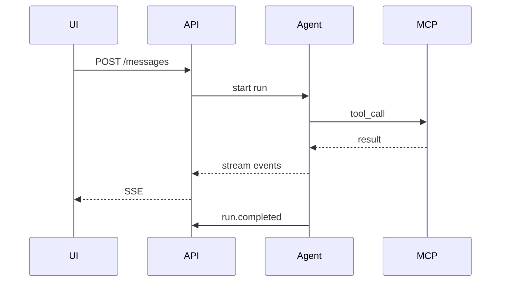

# M07 — Доменная модель

## Сущности

### Project

```json
{
  "id": "uuid",
  "cabinet_id": "uuid",
  "slug": "zakupka-2026-08",
  "display_name": "Закупка август",
  "root_path": "tenants/{tid}/cabinets/{cid}/projects/zakupka-2026-08",
  "created_at": "2026-08-20T10:00:00Z"
}
```

### AgentSession

```json
{
  "id": "uuid",
  "project_id": "uuid",
  "user_id": "uuid",
  "provider_session_id": "cursor:agent_abc123",
  "model": "claude-sonnet-4",
  "profile_id": "kp",
  "status": "active",
  "mcp_snapshot_hash": "sha256:...",
  "created_at": "2026-08-20T10:00:00Z",
  "last_activity_at": "2026-08-20T11:00:00Z"
}
```

**status:** `active` | `archived` (after reset)

### ChatMessage

```json
{
  "id": "uuid",
  "session_id": "uuid",
  "role": "user",
  "content_text": "Обработай спеку из inbox",
  "content_parts": [],
  "sequence": 42,
  "created_at": "2026-08-20T10:05:00Z"
}
```

**role:** `user` | `assistant` | `system` | `tool`

### AgentRun

Один вызов модели (может включать tool loop).

```json
{
  "id": "uuid",
  "session_id": "uuid",
  "trigger_message_id": "uuid",
  "status": "running",
  "model": "claude-sonnet-4",
  "started_at": "2026-08-20T10:05:01Z",
  "completed_at": null,
  "cancel_requested_at": null,
  "token_usage": { "input": 0, "output": 0 }
}
```

**status:** `queued` | `running` | `completed` | `cancelled` | `error`

### StreamEvent

```json
{
  "id": "uuid",
  "run_id": "uuid",
  "event_type": "assistant.delta",
  "payload": { "text": "Продолжаю" },
  "sequence": 1001,
  "created_at": "2026-08-20T10:05:02Z"
}
```

### Attachment

```json
{
  "id": "uuid",
  "project_id": "uuid",
  "uploaded_by": "uuid",
  "original_filename": "spec.xlsx",
  "storage_path": "inbox/spec.xlsx",
  "mime_type": "application/vnd.openxmlformats-officedocument.spreadsheetml.sheet",
  "size_bytes": 45000,
  "extracted_md_path": "inbox/spec.xlsx.extracted.md",
  "created_at": "2026-08-20T10:00:00Z"
}
```

## Stream event types

### Stable

| type | payload |
| --- | --- |
| `status` | `{ "phase": "thinking" \| "tool" \| "done" }` |
| `assistant.delta` | `{ "text": "..." }` |
| `assistant.done` | `{ "message_id": "uuid" }` |
| `tool_call.started` | `{ "tool": "pipeline.parse_spec", "call_id": "..." }` |
| `tool_call.completed` | `{ "call_id", "status": "ok" \| "error", "summary" }` |
| `run.completed` | `{ "run_id", "status" }` |

### Extended (feature flag)

| type | payload |
| --- | --- |
| `thinking.delta` | `{ "text" }` |
| `shell_output.delta` | `{ "stream": "stdout", "text" }` |
| `tool_call.progress` | `{ "call_id", "partial" }` |

### System

| type | payload |
| --- | --- |
| `session.reset` | `{ "new_session_id" }` |
| `model.changed` | `{ "model" }` |
| `error` | `{ "code", "message" }` |

## Commands

### reset

1. Cancel active run if any
2. Archive session (`status=archived`)
3. Create new AgentSession + provider session
4. M06 session-bind (fresh MCP)
5. Emit `session.reset`
6. Audit: `agent.session_reset`

### cancel

1. Set `cancel_requested_at` on run
2. Provider API cancel
3. Abort in-flight MCP tool calls (best-effort)
4. Run → `cancelled`
5. Emit `run.completed`

### model switch

1. Validate model in tenant allowlist
2. Update session.model
3. Next run uses new model (not mid-run unless supported)
4. Emit `model.changed`

## Concurrency

- One **active run** per session (queue subsequent messages or reject — config `queue_mode`: `reject` | `queue`)
- Multiple users per project: separate sessions OR shared session (config per cabinet, default: **separate**)

## Sequence diagram


