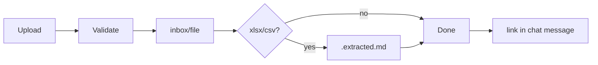

# M07 — Storage (project filesystem)

## Project layout

```text
tenants/{tenant_id}/cabinets/{cabinet_id}/projects/{slug}/
  inbox/                    # attachments land here
    spec.xlsx
    spec.xlsx.extracted.md  # auto-generated
  runs/{run_id}/            # pipeline artifacts (M04)
    input/
    rows.json
    offers.json
    status.json
  commerce.sqlite           # offers variants (M04)
  project.json              # metadata mirror
  AGENTS.md                 # snapshot instructions
  profiles/                 # profile snapshot
```

**Agent cwd** = project root. CLI:

```bash
python ../../../tools/new_run.py --input inbox/spec.xlsx --runs-dir runs
```

(paths adjusted for Prodavan monorepo layout)

## Attachments flow



### Naming

- Preserve `original_filename` where unique
- Collision: `{basename}-{short_uuid}{ext}`
- No path components in filename (`../` rejected)

## Stream event offload

If `payload` > 32 KB:

```json
{
  "event_type": "tool_call.completed",
  "payload": {
    "call_id": "tc_1",
    "summary": "ok",
    "blob_ref": "streams/{run_id}/1007.json"
  }
}
```

Blob path:

```text
tenants/.../projects/{slug}/.streams/{run_id}/{sequence}.json
```

Retention: 30 days, then delete (summary remains in PostgreSQL).

## Session archive (reset)

On reset, optional export:

```text
projects/{slug}/.archives/session-{old_id}.jsonl
```

Contains messages only, not stream_events (unless compliance flag).

## Quotas

| resource | default |
| --- | --- |
| inbox total size per project | 500 MB |
| single attachment | 25 MB |
| .streams disk | 100 MB per project |
| archived sessions | 10 per project |

## Backup

- `inbox/`, `runs/`, `commerce.sqlite` — tenant backup (M08)
- `.streams/` — optional, regenerable
- Extracted md — regenerable from xlsx

## Permissions

OS-level: storage service enforces project root prefix.  
Agent write: only under project root (not sibling projects).
