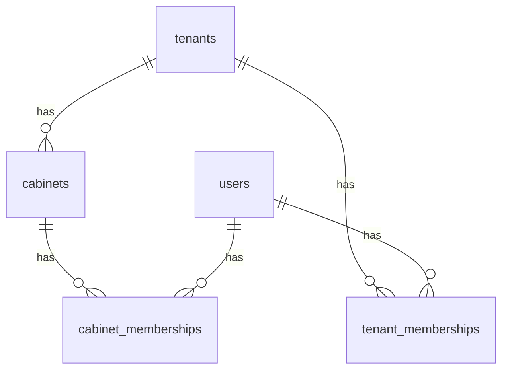

# M08 — Персистентность

Схема: `tenants`

## ER



## Таблицы

### `tenants.tenants`

```sql
CREATE TABLE tenants.tenants (
  id            UUID PRIMARY KEY DEFAULT gen_random_uuid(),
  slug          TEXT NOT NULL UNIQUE,
  display_name  TEXT NOT NULL,
  plan          TEXT NOT NULL DEFAULT 'starter',
  status        TEXT NOT NULL DEFAULT 'active',
  created_at    TIMESTAMPTZ NOT NULL DEFAULT now(),
  deleted_at    TIMESTAMPTZ
);
```

### `tenants.cabinets`

```sql
CREATE TABLE tenants.cabinets (
  id            UUID PRIMARY KEY DEFAULT gen_random_uuid(),
  tenant_id     UUID NOT NULL REFERENCES tenants.tenants(id) ON DELETE CASCADE,
  slug          TEXT NOT NULL,
  display_name  TEXT NOT NULL,
  timezone      TEXT NOT NULL DEFAULT 'UTC',
  created_at    TIMESTAMPTZ NOT NULL DEFAULT now(),
  UNIQUE (tenant_id, slug)
);
```

### `tenants.users`

```sql
CREATE TABLE tenants.users (
  id              UUID PRIMARY KEY DEFAULT gen_random_uuid(),
  email           TEXT NOT NULL UNIQUE,
  display_name    TEXT NOT NULL,
  password_hash   TEXT NOT NULL,
  mfa_secret      TEXT,
  mfa_enabled     BOOLEAN NOT NULL DEFAULT false,
  status          TEXT NOT NULL DEFAULT 'active',
  created_at      TIMESTAMPTZ NOT NULL DEFAULT now()
);
```

### `tenants.tenant_memberships`

```sql
CREATE TABLE tenants.tenant_memberships (
  id            UUID PRIMARY KEY DEFAULT gen_random_uuid(),
  tenant_id     UUID NOT NULL REFERENCES tenants.tenants(id) ON DELETE CASCADE,
  user_id       UUID NOT NULL REFERENCES tenants.users(id) ON DELETE CASCADE,
  tenant_role   TEXT NOT NULL,
  created_at    TIMESTAMPTZ NOT NULL DEFAULT now(),
  UNIQUE (tenant_id, user_id)
);
```

### `tenants.cabinet_memberships`

```sql
CREATE TABLE tenants.cabinet_memberships (
  id            UUID PRIMARY KEY DEFAULT gen_random_uuid(),
  cabinet_id    UUID NOT NULL REFERENCES tenants.cabinets(id) ON DELETE CASCADE,
  user_id       UUID NOT NULL REFERENCES tenants.users(id) ON DELETE CASCADE,
  cabinet_role  TEXT NOT NULL,
  created_at    TIMESTAMPTZ NOT NULL DEFAULT now(),
  UNIQUE (cabinet_id, user_id)
);
```

### `tenants.invites`

```sql
CREATE TABLE tenants.invites (
  id              UUID PRIMARY KEY DEFAULT gen_random_uuid(),
  tenant_id       UUID NOT NULL REFERENCES tenants.tenants(id) ON DELETE CASCADE,
  email           TEXT NOT NULL,
  tenant_role     TEXT NOT NULL,
  cabinet_id      UUID REFERENCES tenants.cabinets(id),
  cabinet_role    TEXT,
  token_hash      TEXT NOT NULL,
  expires_at      TIMESTAMPTZ NOT NULL,
  accepted_at     TIMESTAMPTZ,
  created_by      UUID NOT NULL REFERENCES tenants.users(id)
);
```

### `tenants.refresh_tokens`

```sql
CREATE TABLE tenants.refresh_tokens (
  id          UUID PRIMARY KEY DEFAULT gen_random_uuid(),
  user_id     UUID NOT NULL REFERENCES tenants.users(id) ON DELETE CASCADE,
  token_hash  TEXT NOT NULL,
  expires_at  TIMESTAMPTZ NOT NULL,
  revoked_at  TIMESTAMPTZ,
  created_at  TIMESTAMPTZ NOT NULL DEFAULT now()
);
```

## RLS bootstrap

On each request:

```sql
SELECT set_config('app.tenant_id', $1, true);
SELECT set_config('app.cabinet_id', $2, true);
SELECT set_config('app.user_id', $3, true);
```

All module schemas enable RLS policies referencing these GUCs.

## Indexes

- `users.email` UNIQUE
- `tenant_memberships (tenant_id, user_id)`
- `cabinet_memberships (cabinet_id, user_id)`
- `cabinets (tenant_id)`

## Migrations

| version | description |
| --- | --- |
| 2026080801 | initial tenants schema |
| 2026080802 | invites + refresh_tokens |
| 2026080803 | RLS policies all schemas |
