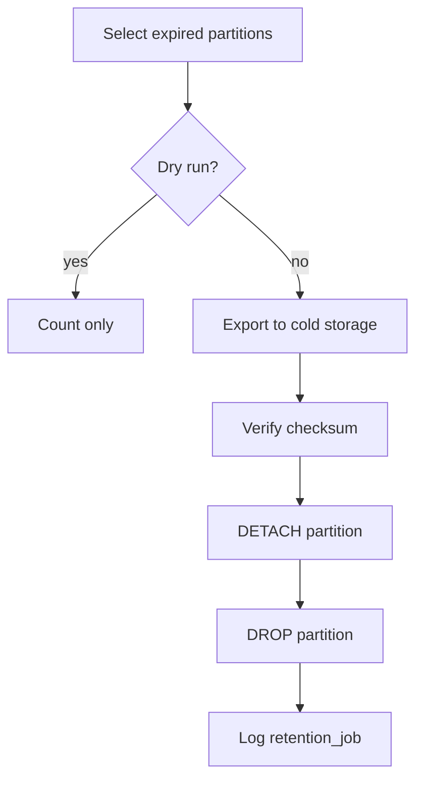

# M09 — Storage (cold archive)

## Archive layout

```text
archives/{tenant_id}/
  audit/
    2026-08.jsonl.zst
  exports/
    {export_id}.jsonl
  billing/
    2026-08-usage.csv
```

## Audit archive format (JSONL)

One line per event, same schema as DB minus internal fields.

```json
{"id":"...","event_type":"auth.login","created_at":"...","payload":{}}
```

Compression: zstd level 3.

## Export job

1. Query audit_events with cursor
2. Stream to temp file
3. Upload `archives/{tenant_id}/exports/{export_id}.jsonl`
4. Signed URL 24h
5. Audit: `operations.audit_exported`

## Retention job flow



## Stream events archive

Optional for enterprise:

```text
archives/{tenant_id}/streams/{year}/{run_id}.jsonl.zst
```

Before DELETE from `agent.stream_events` partitions.

## Metrics storage

Prometheus TSDB — not in tenant storage.  
Long-term: Thanos/VictoriaMetrics with `tenant_id` label cardinality controls.

## Quotas

| resource | limit |
| --- | --- |
| audit export size | 1 GB per request |
| concurrent exports per tenant | 2 |
| cold archive per tenant | plan-based |

## Restore

Break-glass only:

1. Download archive from S3
2. Import to staging table
3. Query via read-only API
4. Audit `platform.archive_restored`

## Lifecycle rules (S3)

```text
archives/*     → Glacier after 90 days
exports/*      → expire after 7 days
```

## Integrity

Each archive file:

```json
{
  "sha256": "...",
  "row_count": 150000,
  "tenant_id": "uuid",
  "period": "2026-08"
}
```

manifest sidecar `{filename}.manifest.json`
