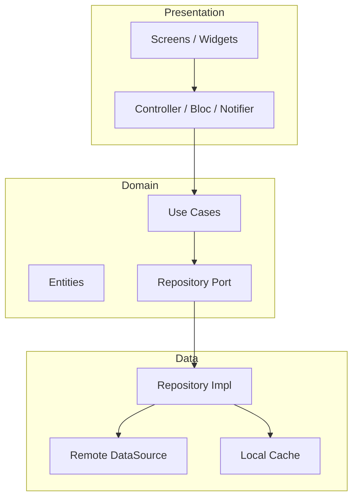

# Архитектура Flutter-клиента

Клиент Prodavan — **единое Flutter-приложение** (web, desktop, mobile) с **feature-based** организацией кода и **Clean Architecture** внутри каждой фичи. UI рендерится по **cabinet manifest** (M00): набор экранов, иконок навигации и capabilities приходит с API, а не захардкожен в клиенте.

---

## Принципы

| Принцип | Реализация |
|---------|------------|
| Feature-first | Каждый модуль M00–M09 — отдельная feature-папка |
| Clean Architecture | `domain` → `data` → `presentation` внутри feature |
| Зависимости внутрь | Presentation не импортирует SQLAlchemy, HTTP напрямую — только через repositories |
| Manifest-driven UI | Навигация и видимость экранов из `GET /cabinets/{id}/manifest` |
| Icon-only chrome | Глобальная навигация и toolbar — иконки без текстовых подсказок (см. [design-system.md](design-system.md)) |
| OpenAPI codegen | REST DTO генерируются из `openapi.yaml`; ручные модели только для WS/SSE |

---

## Дерево каталогов

```text
apps/flutter/
├── lib/
│   ├── main.dart                    # entry, env bootstrap
│   ├── app.dart                     # MaterialApp, theme, router
│   │
│   ├── core/                        # сквозные, без бизнес-логики модулей
│   │   ├── config/
│   │   │   ├── env.dart
│   │   │   └── api_config.dart
│   │   ├── di/
│   │   │   └── injection.dart       # get_it / riverpod providers
│   │   ├── routing/
│   │   │   ├── app_router.dart      # go_router
│   │   │   ├── route_guards.dart    # auth, cabinet, feature
│   │   │   └── deep_links.dart
│   │   ├── theme/
│   │   │   ├── app_theme.dart
│   │   │   ├── app_colors.dart
│   │   │   ├── app_typography.dart
│   │   │   └── app_spacing.dart     # xs–xl
│   │   ├── widgets/                 # см. widget-catalog.md
│   │   ├── network/
│   │   │   ├── api_client.dart      # dio + interceptors
│   │   │   ├── auth_interceptor.dart
│   │   │   ├── cabinet_interceptor.dart  # X-Cabinet-Id
│   │   │   └── sse_client.dart
│   │   ├── errors/
│   │   │   └── api_exception.dart
│   │   └── utils/
│   │
│   ├── shell/                       # cabinet shell, см. cabinet-shell.md
│   │   ├── cabinet_shell.dart
│   │   ├── cabinet_switcher.dart
│   │   ├── nav_gate.dart
│   │   ├── feature_gate.dart
│   │   ├── icon_nav_rail.dart
│   │   └── app_scaffold.dart
│   │
│   └── features/
│       ├── auth/
│       │   ├── domain/
│       │   │   ├── entities/
│       │   │   └── repositories/
│       │   ├── data/
│       │   │   ├── datasources/
│       │   │   ├── dto/             # openapi-generated
│       │   │   └── repositories/
│       │   └── presentation/
│       │       ├── screens/
│       │       ├── widgets/
│       │       └── controllers/
│       │
│       ├── m00_cabinets/
│       ├── m01_projects/
│       ├── m02_specs_kp/
│       ├── m03_prompts/
│       ├── m04_catalogs/
│       ├── m05_integrations/
│       ├── m06_mcp/
│       ├── m07_agent/
│       ├── m08_tenants/
│       └── m09_operations/
│
├── packages/                        # локальные pub packages (опционально)
│   ├── api_client/                  # openapi dart output
│   └── markdown_editor/             # см. md-editor.md
│
├── assets/
│   ├── icons/                       # SVG nav icons M00–M09
│   └── fonts/
│
├── test/
│   ├── unit/
│   ├── widget/
│   └── golden/
│
└── pubspec.yaml
```

---

## Слои внутри feature



### Domain

- Чистые Dart-классы: `Project`, `SpecRun`, `LineItem`, `CabinetManifest`
- Интерфейсы репозиториев: `ProjectRepository`, `AgentStreamRepository`
- Use cases: `SwitchCabinet`, `StartRun`, `SendChatMessage`
- **Запрещено:** `import 'package:dio/dio.dart'`, Flutter widgets

### Data

- Реализация портов через REST/SSE
- Mapping DTO ↔ Entity в `mappers/`
- Кэш: `shared_preferences` для `active_cabinet_id`, `hive` для offline manifest (read-only)

### Presentation

- `StateNotifier` / `Bloc` / `Riverpod` — по соглашению команды (default: Riverpod)
- Screens — composable widgets из `core/widgets`
- Локализация: `flutter gen-l10n`, default `ru`

---

## Состояние приложения

| Scope | Хранилище | Содержимое |
|-------|-----------|------------|
| Global | `AuthNotifier` | JWT, user, tenant |
| Cabinet | `CabinetScope` | active `cabinet_id`, manifest, capabilities |
| Project | `ProjectScope` | active project в рамках cabinet |
| Feature-local | per-controller | списки, формы, pagination |

При **switch cabinet** (M00):
1. `CabinetSwitcher` → POST `/v1/cabinets/{id}/switch`
2. Invalidate: projects, catalogs, agent stream, integrations
3. `NavGate` пересчитывает доступные маршруты
4. Redirect на home модуля, если текущий route недоступен

---

## Роутинг

**go_router** с nested routes:

```text
/login
/tenant/select
/cabinet/:cid/
  ├── projects/              # M01
  ├── specs/                 # M02
  ├── prompts/               # M03
  ├── catalogs/              # M04
  ├── settings/integrations  # M05
  ├── mcp/                   # M06
  ├── projects/:slug/chat    # M07
  ├── admin/users            # M08
  └── ops/                   # M09
```

Guards:
- `AuthGuard` — JWT valid
- `CabinetGuard` — `X-Cabinet-Id` в scope
- `FeatureGate` — capability из manifest

---

## Связь с backend

| Канал | Назначение |
|-------|------------|
| REST `/api/v1/*` | CRUD, settings, uploads |
| SSE `/api/v1/sessions/{id}/stream` | Стрим агента (M07) |
| WebSocket (optional) | Bidirectional chat v2 |

Interceptors:
1. `Authorization: Bearer {access_token}`
2. `X-Cabinet-Id: {active_cabinet_id}` на project-scoped endpoints
3. `X-Request-Id` / `traceparent` для support

---

## Тестирование

| Уровень | Что покрываем |
|---------|---------------|
| Unit | Use cases, mappers, `FeatureGate` logic |
| Widget | `CabinetSwitcher`, forms, empty states |
| Golden | Icon nav rail, spacing tokens |
| Integration | Auth flow + switch cabinet (mock server) |

---

## Сборка и flavors

| Flavor | API base | Назначение |
|--------|----------|------------|
| `dev` | `http://localhost:8000` | WSL/local |
| `staging` | `https://api.staging.prodavan.local` | QA |
| `prod` | `https://api.prodavan.ru` | Production |

---

## Связанные документы

- [design-system.md](design-system.md) — токены, icon-only
- [cabinet-shell.md](cabinet-shell.md) — CabinetSwitcher, NavGate, FeatureGate
- [screens-inventory.md](screens-inventory.md) — экраны M00–M09
- [responsive.md](responsive.md) — breakpoints
- [../05-backend/openapi-layout.md](../05-backend/openapi-layout.md)
