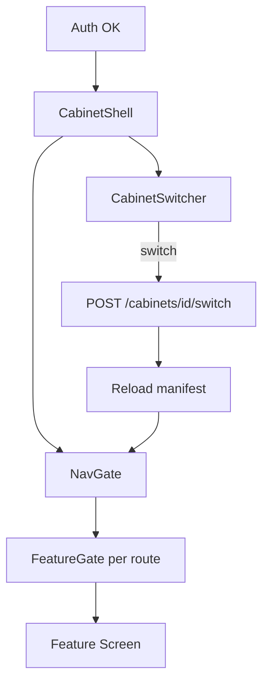

# Cabinet Shell: CabinetSwitcher, NavGate, FeatureGate

**Cabinet Shell** — оболочка приложения после аутентификации: выбор кабинета, icon-only навигация по модулям, условный рендер UI по capabilities профиля.

---

## Обзор



| Компонент | Ответственность |
|-----------|-----------------|
| `CabinetShell` | Layout: header + nav + body outlet |
| `CabinetSwitcher` | UI + логика смены active cabinet |
| `NavGate` | Фильтрация пунктов nav по manifest |
| `FeatureGate` | Показ/скрытие секций внутри экрана |

---

## CabinetSwitcher

### Расположение

Header `AppScaffold`, **слева** от breadcrumb / project selector.

### UI

- Dropdown button: icon 🗂️ + текущее `display_name` (единственное **текстовое** имя в header chrome)
- Список: active cabinets tenant
- Badge профиля: «Электроника», «Универсальный»
- Capability icons inline: ⚡ S4B — **только** `electronics-procurement`
- Footer item: «+ Новый кабинет» → wizard M00

### API flow

```text
1. User selects cabinet B
2. If M03 editor dirty → ConfirmDialog
3. POST /api/v1/cabinets/{bid}/switch
4. Response: { active_cabinet_id, manifest, capabilities }
5. Persist active_cabinet_id (secure storage)
6. Invalidate providers: projects, catalogs, integrations, agentStream
7. NavGate rebuild
8. If current route unavailable → redirect /cabinet/{bid}/projects
9. SnackBar: «Кабинет «{name}» активен»
```

### State

```dart
@riverpod
class ActiveCabinet extends _$ActiveCabinet {
  CabinetManifest? get manifest => state.manifest;
  String get cabinetId => state.cabinetId;
  Future<void> switchTo(String cabinetId) async { ... }
}
```

### Ошибки

| Code | UX |
|------|-----|
| `FORBIDDEN` | Toast «Нет доступа к кабинету» |
| `CABINET_ARCHIVED` | Remove from list, toast |
| Network | Retry button in dropdown |

---

## NavGate

### Назначение

Преобразует **полный** список модулей M00–M09 в **видимый** icon nav с учётом:
- `manifest.navigation[]` — порядок и иконки
- `capabilities.*` — boolean flags
- RBAC роли пользователя в cabinet

### Nav item model

```dart
class NavItem {
  final String moduleId;      // 'M01', 'M02', ...
  final String route;
  final IconData icon;
  final String semanticsLabel; // для a11y, НЕ tooltip
  final String? requiredCapability;
  final Set<String>? requiredRoles;
}
```

### Алгоритм фильтрации

```dart
List<NavItem> filterNavItems(
  List<NavItem> all,
  CabinetManifest manifest,
  CabinetRole role,
) {
  return all.where((item) {
    if (item.requiredCapability != null &&
        !manifest.capabilities[item.requiredCapability!]) {
      return false;
    }
    if (item.requiredRoles != null &&
        !item.requiredRoles!.contains(role.name)) {
      return false;
    }
    return manifest.navigation.contains(item.moduleId);
  }).toList();
}
```

### Default nav map (M00–M09)

| moduleId | Icon | Route | Capability | Roles |
|----------|------|-------|------------|-------|
| M00 | `Icons.domain` | `/settings/cabinets` | — | admin+ |
| M01 | `Icons.folder` | `/projects` | `projects` | all |
| M02 | `Icons.receipt_long` | `/specs` | `specs_kp` | operator+ |
| M03 | `Icons.edit_note` | `/prompts` | `prompts_edit` | admin+ |
| M04 | `Icons.storage` | `/catalogs` | `catalogs_user` | operator+ |
| M05 | `Icons.hub` | `/settings/integrations` | `integrations` | admin+ |
| M06 | `Icons.extension` | `/mcp` | `mcp_admin` | admin+ |
| M07 | `Icons.smart_toy` | `/projects/:slug/chat` | `agent_chat` | operator+ |
| M08 | `Icons.people` | `/admin/users` | `tenant_admin` | tenant.admin |
| M09 | `Icons.monitor_heart` | `/ops` | `ops_view` | admin+ |

### Deep link guard

При открытии `/cabinet/{cid}/projects/{slug}`:
1. Если `cid != active_cabinet_id` → dialog «Переключить кабинет?»
2. Если project не принадлежит cid → 404 screen

---

## FeatureGate

### Назначение

Условный рендер **внутри** экрана — секции, кнопки, tabs.

### API

```dart
class FeatureGate extends StatelessWidget {
  const FeatureGate({
    required this.capability,
    required this.child,
    this.fallback = const SizedBox.shrink(),
    super.key,
  });

  final String capability;
  final Widget child;
  final Widget fallback;
}
```

### Usage examples

```dart
// S4B tab только для electronics-procurement
FeatureGate(
  capability: 's4b',
  child: S4bSettingsTab(),
)

// Export KP button
FeatureGate(
  capability: 'kp.export',
  child: ExportKpButton(),
  fallback: TooltipDisabledExport(), // text explanation in content, not icon tooltip
)
```

### Capability source

`GET /api/v1/cabinets/{id}/manifest`:

```json
{
  "profile_id": "electronics-procurement",
  "capabilities": {
    "specs_kp": true,
    "s4b": true,
    "catalogs_system_s4b": true,
    "web_shops": true,
    "kp.export": true,
    "prompts_edit": true
  },
  "navigation": ["M01", "M02", "M03", "M04", "M05", "M07"]
}
```

### Жёсткие правила (M00)

- `s4b` и `catalogs_system_s4b` **никогда** true для профилей ≠ `electronics-procurement`
- Override через API → `CAPABILITY_FORBIDDEN`; UI не показывает toggle

---

## CabinetShell widget tree

```text
CabinetShell
├── AppHeader
│   ├── CabinetSwitcher
│   ├── BreadcrumbBar
│   └── UserMenu (M08)
├── Row
│   ├── IconNavRail ← NavGate(items)
│   └── Expanded
│       └── RouterOutlet (GoRouter child)
└── (optional) ReconnectBanner
```

---

## Keyboard shortcuts

| Shortcut | Action |
|----------|--------|
| `Alt+C` | Focus CabinetSwitcher |
| `Alt+1` … `Alt+9` | Navigate to N-th visible nav item |
| `Alt+0` | M09 Operations (if visible) |

---

## Тесты

| ID | Сценарий |
|----|----------|
| SH-001 | Switch cabinet invalidates project list |
| SH-002 | NavGate hides M02 when `specs_kp=false` |
| SH-003 | FeatureGate hides S4B tab on generic profile |
| SH-004 | Deep link foreign cid → switch dialog |
| SH-005 | M03 dirty editor blocks switch |

---

## Связанные документы

- [screens-inventory.md](screens-inventory.md)
- [design-system.md](design-system.md)
- [../03-modules/M00-cabinets/ui.md](../03-modules/M00-cabinets/ui.md)
