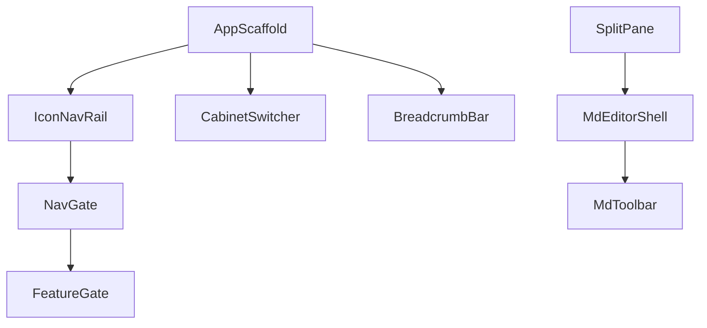

# Каталог виджетов `core/widgets`

> **LEGACY.** Канон UI (mobile-first, без модалок): [docs/target/07-ui-mobile-core/](../target/07-ui-mobile-core/). Часть строк ниже описывает несуществующие виджеты.

Переиспользуемые UI-компоненты уровня **core** — без привязки к конкретному модулю M00–M09. Feature-специфичные виджеты живут в `features/*/presentation/widgets/`.

---

## Layout

| Widget | Файл | Описание |
|--------|------|----------|
| `AppScaffold` | `app_scaffold.dart` | Shell: nav rail + header + body; props: `title`, `actions`, `body` |
| `SplitPane` | `split_pane.dart` | Master-detail (desktop): resizable divider, min width 280 px |
| `ResponsiveBuilder` | `responsive_builder.dart` | Breakpoints → `mobile` / `tablet` / `desktop` builder |
| `ScrollableScreen` | `scrollable_screen.dart` | SafeArea + scroll + consistent padding (`AppSpacing.lg/xl`) |
| `EmptyState` | `empty_state.dart` | Icon + title + subtitle + optional CTA button |
| `LoadingOverlay` | `loading_overlay.dart` | Modal barrier + spinner; blocking flag |

---

## Navigation & gates

| Widget | Файл | Описание |
|--------|------|----------|
| `IconNavRail` | `icon_nav_rail.dart` | Icon-only rail; items из manifest |
| `CabinetSwitcher` | `cabinet_switcher.dart` | Dropdown кабинетов в header |
| `NavGate` | `nav_gate.dart` | Фильтрует nav items по capabilities |
| `FeatureGate` | `feature_gate.dart` | `child` или `fallback` по capability flag |
| `BreadcrumbBar` | `breadcrumb_bar.dart` | `{Cabinet} / {Project} / …` |

---

## Data display

| Widget | Файл | Описание |
|--------|------|----------|
| `AppDataTable` | `app_data_table.dart` | Sortable, paginated, dense |
| `AppListTile` | `app_list_tile.dart` | Leading icon + title + subtitle + trailing |
| `KeyValueRow` | `key_value_row.dart` | Label / value pairs в settings |
| `StatusBadge` | `status_badge.dart` | Icon + text status |
| `PhaseStepper` | `phase_stepper.dart` | Горизонтальный stepper фаз прогона (M02) |
| `MetricGauge` | `metric_gauge.dart` | RPM / quota gauge (M05, M09) |
| `CopyableText` | `copyable_text.dart` | Monospace + copy-to-clipboard icon |

---

## Forms & input

| Widget | Файл | Описание |
|--------|------|----------|
| `AppTextField` | `app_text_field.dart` | Styled TextFormField + error display |
| `AppDropdown` | `app_dropdown.dart` | Searchable dropdown |
| `AppSwitchRow` | `app_switch_row.dart` | Label + Switch в settings list |
| `ConfirmDialog` | `confirm_dialog.dart` | Destructive action confirm |
| `SlugField` | `slug_field.dart` | Live slug validation (M01, M00) |
| `MaskedSecretField` | `masked_secret_field.dart` | Password / API key (never pre-fill) |
| `FileDropZone` | `file_drop_zone.dart` | Drag-drop upload (M01 inbox) |

---

## Actions

| Widget | Файл | Описание |
|--------|------|----------|
| `AppIconButton` | `app_icon_button.dart` | Icon-only, **no tooltip**, Semantics required |
| `AppButton` | `app_button.dart` | Text button / filled / outlined |
| `DestructiveButton` | `destructive_button.dart` | Red outline, confirm required |
| `AsyncActionButton` | `async_action_button.dart` | Loading state inline |

---

## Feedback

| Widget | Файл | Описание |
|--------|------|----------|
| `AppSnackBar` | `app_snackbar.dart` | Unified toast styling |
| `InlineErrorBanner` | `inline_error_banner.dart` | Top-of-screen API errors |
| `ReconnectBanner` | `reconnect_banner.dart` | SSE disconnect (M07) |
| `ProgressList` | `progress_list.dart` | Seed pipeline steps (M00 wizard) |

---

## Agent & chat (shared M07)

| Widget | Файл | Описание |
|--------|------|----------|
| `ChatBubble` | `chat_bubble.dart` | User / assistant markdown bubble |
| `ToolCallCard` | `tool_call_card.dart` | Collapsed tool invocation |
| `StreamingText` | `streaming_text.dart` | Typewriter append + live region |
| `ModelPicker` | `model_picker.dart` | Dropdown моделей tenant |
| `McpStatusChip` | `mcp_status_chip.dart` | Read-only «S4B ✓ \| DNS» badge |
| `ComposerBar` | `composer_bar.dart` | Text input + attach + send |

---

## Markdown (M03)

| Widget | Файл | Описание |
|--------|------|----------|
| `MdEditorShell` | `md_editor_shell.dart` | Toolbar + editor + preview split |
| `MdToolbar` | `md_toolbar.dart` | Icon-only formatting actions |
| `MdPreview` | `md_preview.dart` | Rendered markdown pane |

Подробнее: [md-editor.md](md-editor.md).

---

## Conventions

### Naming

- Prefix `App` для core primitives
- Suffix `Gate` для capability guards
- Feature widgets: `{Module}{Purpose}` — `SpecRunListTile`

### Parameters

- Required `Key? key` via super
- Callbacks: `onPressed`, `onChanged` — не `onTap` для buttons
- Async: return `Future<void>`, show loading in widget

### Testing

Каждый core widget:
- `widget_test` — render + semantics
- Golden test для visual regressions (nav rail, badges, MD toolbar)

---

## Зависимости между widgets

---

## Не в core (feature-local примеры)

| Widget | Feature | Причина |
|--------|---------|---------|
| `TrustedSellerTable` | M05 | Domain-specific columns |
| `VariantPickerSheet` | M02 | KP review UX |
| `InviteUserForm` | M08 | RBAC-specific |
| `AuditLogFilter` | M09 | Ops-specific |

---

## Связанные документы

- [design-system.md](design-system.md)
- [cabinet-shell.md](cabinet-shell.md)
- [architecture.md](architecture.md)
