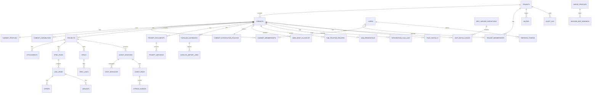

# ERD v0 — PostgreSQL (~40 таблиц)

Первичная модель данных Prodavan v0.1. Схемы разделены по модулям M00–M09. Все tenant-scoped таблицы содержат `tenant_id`; cabinet-scoped — additionally `cabinet_id`.

---

## Обзор связей

---

## Schema: `tenants` (M08) — 7 таблиц

### tenants.tenants

| Column | Type | Notes |
|--------|------|-------|
| id | UUID PK | |
| slug | TEXT UNIQUE | |
| display_name | TEXT | |
| plan | TEXT | starter / pro / enterprise |
| status | TEXT | active / suspended / deleted |
| created_at | TIMESTAMPTZ | |
| deleted_at | TIMESTAMPTZ | soft delete |

### tenants.users

| Column | Type | Notes |
|--------|------|-------|
| id | UUID PK | |
| email | TEXT UNIQUE | |
| display_name | TEXT | |
| password_hash | TEXT | |
| mfa_secret | TEXT | nullable |
| mfa_enabled | BOOLEAN | |
| status | TEXT | |
| created_at | TIMESTAMPTZ | |

### tenants.cabinets

| Column | Type | Notes |
|--------|------|-------|
| id | UUID PK | |
| tenant_id | UUID FK | |
| slug | TEXT | UNIQUE(tenant_id, slug) |
| display_name | TEXT | |
| profile_id | TEXT | immutable after create |
| profile_version | TEXT | semver |
| timezone | TEXT | default UTC |
| status | TEXT | active / archived |
| created_at | TIMESTAMPTZ | |

### tenants.tenant_memberships

| Column | Type | Notes |
|--------|------|-------|
| id | UUID PK | |
| tenant_id | UUID FK | |
| user_id | UUID FK | |
| tenant_role | TEXT | owner / admin / operator / viewer |
| created_at | TIMESTAMPTZ | |

### tenants.cabinet_memberships

| Column | Type | Notes |
|--------|------|-------|
| id | UUID PK | |
| cabinet_id | UUID FK | |
| user_id | UUID FK | |
| cabinet_role | TEXT | admin / operator / viewer |
| created_at | TIMESTAMPTZ | |

### tenants.invites

| Column | Type | Notes |
|--------|------|-------|
| id | UUID PK | |
| tenant_id | UUID FK | |
| email | TEXT | |
| tenant_role | TEXT | |
| cabinet_id | UUID FK | nullable |
| cabinet_role | TEXT | nullable |
| token_hash | TEXT | |
| expires_at | TIMESTAMPTZ | |
| accepted_at | TIMESTAMPTZ | |
| created_by | UUID FK | |

### tenants.refresh_tokens

| Column | Type | Notes |
|--------|------|-------|
| id | UUID PK | |
| user_id | UUID FK | |
| token_hash | TEXT | |
| expires_at | TIMESTAMPTZ | |
| revoked_at | TIMESTAMPTZ | |
| created_at | TIMESTAMPTZ | |

---

## Schema: `cabinets` (M00) — 3 таблицы

### cabinets.cabinet_profiles

| Column | Type | Notes |
|--------|------|-------|
| profile_id | TEXT PK | electronics-procurement |
| display_name | TEXT | |
| version | TEXT | pack semver |
| manifest_json | JSONB | UI nav, defaults |
| created_at | TIMESTAMPTZ | |

### cabinets.cabinet_capabilities

| Column | Type | Notes |
|--------|------|-------|
| cabinet_id | UUID PK FK | |
| capabilities_json | JSONB | effective capabilities |
| computed_at | TIMESTAMPTZ | |

### cabinets.pack_installs

| Column | Type | Notes |
|--------|------|-------|
| id | UUID PK | |
| cabinet_id | UUID FK | |
| pack_id | TEXT | |
| pack_version | TEXT | |
| status | TEXT | seeding / ready / failed |
| installed_at | TIMESTAMPTZ | |

---

## Schema: `projects` (M01) — 2 таблицы

### projects.projects

| Column | Type | Notes |
|--------|------|-------|
| id | UUID PK | |
| tenant_id | UUID | denormalized RLS |
| cabinet_id | UUID FK | |
| slug | TEXT | UNIQUE(cabinet_id, slug) |
| display_name | TEXT | |
| root_path | TEXT | object store prefix |
| status | TEXT | active / archived |
| created_at | TIMESTAMPTZ | |

### projects.attachments

| Column | Type | Notes |
|--------|------|-------|
| id | UUID PK | |
| tenant_id | UUID | |
| cabinet_id | UUID | |
| project_id | UUID FK | |
| uploaded_by | UUID FK | |
| original_filename | TEXT | |
| storage_path | TEXT | |
| mime_type | TEXT | |
| size_bytes | BIGINT | |
| extracted_md_path | TEXT | nullable |
| created_at | TIMESTAMPTZ | |

---

## Schema: `specs` (M02) — 7 таблиц

### specs.spec_runs

| Column | Type | Notes |
|--------|------|-------|
| id | UUID PK | |
| tenant_id | UUID | |
| cabinet_id | UUID | |
| project_id | UUID FK | |
| phase | TEXT | ingest / classify / … |
| status | TEXT | in_progress / needs_review / final |
| input_files_json | JSONB | |
| created_at | TIMESTAMPTZ | |
| finalized_at | TIMESTAMPTZ | |

### specs.line_items

| Column | Type | Notes |
|--------|------|-------|
| id | TEXT PK | stable id |
| tenant_id | UUID | |
| cabinet_id | UUID | |
| run_id | UUID FK | |
| seq | INT | |
| raw_text | TEXT | |
| qty | NUMERIC | |
| category | TEXT | |
| part_number | TEXT | |
| constraints_json | JSONB | |
| confidence | NUMERIC | |
| needs_review | BOOLEAN | |
| created_at | TIMESTAMPTZ | |

### specs.offers

| Column | Type | Notes |
|--------|------|-------|
| id | TEXT PK | |
| tenant_id | UUID | |
| cabinet_id | UUID | |
| lineitem_id | TEXT FK | |
| supplier | TEXT | |
| seller_tier | TEXT | |
| sku | TEXT | |
| part_number | TEXT | |
| title | TEXT | |
| price | NUMERIC | |
| currency | TEXT | |
| availability | TEXT | in_stock only |
| match_type | TEXT | |
| source_type | TEXT | catalog / api / web |
| source_ref | TEXT | |
| as_of | TIMESTAMPTZ | |

### specs.variants

| Column | Type | Notes |
|--------|------|-------|
| id | TEXT PK | |
| tenant_id | UUID | |
| cabinet_id | UUID | |
| project_id | UUID FK | |
| lineitem_id | TEXT FK | |
| supplier | TEXT | |
| seller | TEXT | |
| seller_tier | TEXT | |
| sku | TEXT | |
| part_number | TEXT | |
| title | TEXT | |
| price | NUMERIC | |
| relevance | NUMERIC | |
| ai_confidence | NUMERIC | |
| source_type | TEXT | |
| source_ref | TEXT | |
| is_best | BOOLEAN | |
| created_at | TIMESTAMPTZ | |

### specs.specs

| Column | Type | Notes |
|--------|------|-------|
| id | TEXT PK | |
| tenant_id | UUID | |
| cabinet_id | UUID | |
| project_id | UUID FK | |
| part_number | TEXT | |
| category | TEXT | |
| manufacturer | TEXT | |
| attrs_json | JSONB | |
| updated_at | TIMESTAMPTZ | |

### specs.spec_links

| Column | Type | Notes |
|--------|------|-------|
| id | SERIAL PK | |
| spec_id | TEXT FK | |
| part_number | TEXT | |
| variant_id | TEXT FK | |
| lineitem_id | TEXT | |

### specs.run_artifacts

| Column | Type | Notes |
|--------|------|-------|
| id | UUID PK | |
| run_id | UUID FK | |
| artifact_type | TEXT | rows.json / offers.json / … |
| storage_path | TEXT | |
| checksum | TEXT | |
| created_at | TIMESTAMPTZ | |

---

## Schema: `prompts` (M03) — 2 таблицы

### prompts.prompt_documents

| Column | Type | Notes |
|--------|------|-------|
| id | UUID PK | |
| tenant_id | UUID | |
| cabinet_id | UUID FK | |
| path | TEXT | UNIQUE(cabinet_id, path) |
| etag | TEXT | |
| updated_at | TIMESTAMPTZ | |
| updated_by | UUID | |

### prompts.prompt_versions

| Column | Type | Notes |
|--------|------|-------|
| id | UUID PK | |
| document_id | UUID FK | |
| content | TEXT | |
| created_at | TIMESTAMPTZ | |
| created_by | UUID | |

---

## Schema: `catalogs` (M04) — 2 таблицы

### catalogs.catalog_databases

| Column | Type | Notes |
|--------|------|-------|
| id | UUID PK | |
| tenant_id | UUID | |
| cabinet_id | UUID FK | |
| name | TEXT | UNIQUE(cabinet_id, name) |
| storage_path | TEXT | sqlite path |
| row_count | BIGINT | |
| imported_at | TIMESTAMPTZ | |

### catalogs.catalog_import_jobs

| Column | Type | Notes |
|--------|------|-------|
| id | UUID PK | |
| catalog_id | UUID FK | |
| status | TEXT | pending / running / done / failed |
| source_filename | TEXT | |
| error | TEXT | |
| created_at | TIMESTAMPTZ | |

---

## Schema: `integrations` (M05) — 5 таблиц

См. [../03-modules/M05-integrations/persistence.md](../03-modules/M05-integrations/persistence.md):

- `integrations.cabinet_integration_policies`
- `integrations.web_shop_allowlist`
- `integrations.s4b_trusted_sellers`
- `integrations.s4b_credentials`
- `integrations.integration_call_log` (partitioned)

---

## Schema: `mcp` (M06) — 5 таблиц

### mcp.server_definitions

| Column | Type | Notes |
|--------|------|-------|
| server_id | TEXT PK | prodavan-s4b |
| display_name | TEXT | |
| version | TEXT | |
| entrypoint | TEXT | |
| tool_namespace | TEXT | |

### mcp.installations

| Column | Type | Notes |
|--------|------|-------|
| id | UUID PK | |
| tenant_id | UUID | |
| cabinet_id | UUID FK | |
| server_id | TEXT FK | |
| state | TEXT | enabled / disabled |
| config_json | JSONB | |
| installed_at | TIMESTAMPTZ | |

### mcp.tool_catalog

| Column | Type | Notes |
|--------|------|-------|
| id | UUID PK | |
| server_id | TEXT FK | |
| tool_name | TEXT | |
| input_schema | JSONB | |
| discovered_at | TIMESTAMPTZ | |

### mcp.agent_profiles

| Column | Type | Notes |
|--------|------|-------|
| profile_id | TEXT PK | kp |
| allowed_servers_json | JSONB | |
| tool_denylist_json | JSONB | |

### mcp.session_bindings

| Column | Type | Notes |
|--------|------|-------|
| id | UUID PK | |
| session_id | UUID FK | |
| snapshot_hash | TEXT | |
| servers_json | JSONB | |
| created_at | TIMESTAMPTZ | |

---

## Schema: `agent` (M07) — 4 таблицы

### agent.sessions

| Column | Type | Notes |
|--------|------|-------|
| id | UUID PK | |
| tenant_id | UUID | |
| cabinet_id | UUID | |
| project_id | UUID FK | |
| user_id | UUID FK | |
| provider_session_id | TEXT | cursor:agent_… |
| model | TEXT | |
| status | TEXT | active / archived |
| worker_pod_id | TEXT | |
| created_at | TIMESTAMPTZ | |

### agent.messages

| Column | Type | Notes |
|--------|------|-------|
| id | UUID PK | |
| session_id | UUID FK | |
| role | TEXT | user / assistant / tool |
| content_text | TEXT | |
| content_parts_json | JSONB | |
| sequence | INT | |
| created_at | TIMESTAMPTZ | |

### agent.runs

| Column | Type | Notes |
|--------|------|-------|
| id | UUID PK | |
| session_id | UUID FK | |
| status | TEXT | queued / running / completed |
| model | TEXT | |
| token_usage_json | JSONB | |
| started_at | TIMESTAMPTZ | |
| completed_at | TIMESTAMPTZ | |

### agent.stream_events

| Column | Type | Notes |
|--------|------|-------|
| id | UUID PK | |
| run_id | UUID FK | |
| event_type | TEXT | |
| payload_json | JSONB | |
| sequence | BIGINT | |
| created_at | TIMESTAMPTZ | |

---

## Schema: `ops` (M09) — 2 таблицы

### ops.audit_log

| Column | Type | Notes |
|--------|------|-------|
| id | UUID PK | |
| tenant_id | UUID | |
| cabinet_id | UUID | nullable |
| actor_id | UUID | |
| event_type | TEXT | |
| payload_json | JSONB | |
| trace_id | TEXT | |
| created_at | TIMESTAMPTZ | |

### ops.metrics_snapshots

| Column | Type | Notes |
|--------|------|-------|
| id | UUID PK | |
| tenant_id | UUID | |
| metric_key | TEXT | |
| value | NUMERIC | |
| bucket_at | TIMESTAMPTZ | |

---

## Итого: 39 таблиц

| Schema | Count |
|--------|-------|
| tenants | 7 |
| cabinets | 3 |
| projects | 2 |
| specs | 7 |
| prompts | 2 |
| catalogs | 2 |
| integrations | 5 |
| mcp | 5 |
| agent | 4 |
| ops | 2 |
| **Total** | **39** |

+ партиции `integration_call_log` по месяцам.

---

## Индексы (ключевые)

- Все FK columns indexed
- `(tenant_id, cabinet_id)` composite на hot tables
- `(project_id, status)` на spec_runs
- `(session_id, sequence)` на stream_events
- GIN на `capabilities_json` — не нужен (PK lookup)

---

## Связанные документы

- [rls-policies.md](rls-policies.md)
- [alembic.md](alembic.md)
- [../01-vision/domain-model.md](../01-vision/domain-model.md)
