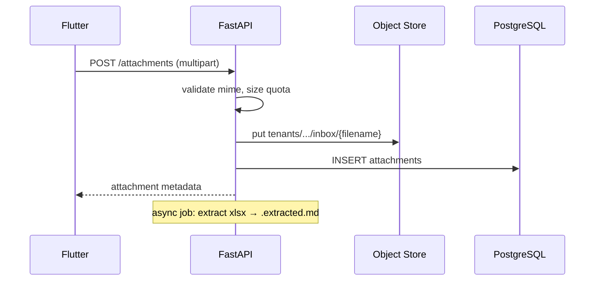

# Object Store

S3-compatible object storage для файловых артефактов Prodavan: inbox, runs, catalogs, integration caches. **Полная изоляция по prefix** `tenants/{tenant_id}/cabinets/{cabinet_id}/`.

---

## Backend options

| Environment | Implementation |
|-------------|----------------|
| dev (WSL) | MinIO single node |
| dev (docker compose) | MinIO container |
| staging/prod | Managed S3 (YC Object Storage / AWS S3 / MinIO HA) |

API: **boto3** / **aioboto3** via `StorageService` port.

---

## Layout hierarchy

```text
{bucket}/
  tenants/
    {tenant_id}/
      cabinets/
        {cabinet_id}/
          prompts/                    # M03 AGENTS.md, profiles/
            AGENTS.md
            profiles/kp/*.md
          catalogs/                   # M04
            db/
              {name}.sqlite
            imports/
              {job_id}/{filename}
          integrations/               # M05
            s4b-cache/
              YYYY-MM-DD/
                {sha256_query}.json
            web-snapshots/            # DEBUG only
              {shop_id}/{timestamp}.html
          projects/
            {project_slug}/           # M01 — slug for human debug
              inbox/
                spec.xlsx
                spec.xlsx.extracted.md
              runs/
                {run_id}/
                  input/
                    spec.xlsx
                  rows.json
                  lineitems.json
                  offers.json
                  selection.json
                  sources.log
                  status.json
              commerce.sqlite           # optional mirror; canonical in PostgreSQL v1
```

**Invariant:** все пути проходят через `SandboxPath` validator — `../` → `400 INVALID_PATH`.

---

## StorageService API

```python
class StorageService(Protocol):
    async def put(
        self, ctx: TenantContext, relative: str, data: bytes, content_type: str
    ) -> str: ...

    async def get(self, ctx: TenantContext, relative: str) -> bytes: ...

    async def delete(self, ctx: TenantContext, relative: str) -> None: ...

    async def list_prefix(
        self, ctx: TenantContext, relative: str, limit: int = 1000
    ) -> list[ObjectInfo]: ...

    async def signed_url(
        self, ctx: TenantContext, relative: str, ttl_seconds: int = 3600
    ) -> str: ...
```

Implementation prefixes automatically:

```python
def _full_key(self, ctx: TenantContext, relative: str) -> str:
    base = f"tenants/{ctx.tenant_id}/cabinets/{ctx.cabinet_id}/"
    clean = sanitize_relative_path(relative)
    if not clean.startswith(base):
        raise InvalidPathError()
    return clean
```

---

## Content types

| Path pattern | Content-Type |
|--------------|--------------|
| `*.xlsx` | application/vnd.openxmlformats-officedocument.spreadsheetml.sheet |
| `*.md` | text/markdown; charset=utf-8 |
| `*.json` | application/json |
| `*.sqlite` | application/x-sqlite3 |
| `*.log` | text/plain |

---

## Upload flow (M01 inbox)



Max upload size: **50 MB** default (tenant plan override).

---

## Run artifacts (M02)

Pipeline tools пишут в `runs/{run_id}/` inside worker sandbox mount:

- Worker pod: PVC or FUSE mount scoped to `projects/{slug}/`
- Same path mirrored in object store (sync or direct S3 mount via s3fs — infra choice)

Canonical metadata in PostgreSQL `specs.run_artifacts`:

| artifact_type | file |
|---------------|------|
| rows | rows.json |
| lineitems | lineitems.json |
| offers | offers.json |
| selection | selection.json |
| status | status.json |

---

## S4B cache (M05)

См. [../03-modules/M05-integrations/storage.md](../03-modules/M05-integrations/storage.md).

- Not backed up — regeneratable from API
- Quota: 500 MB per cabinet default
- Purge cron: delete objects older than `max_age_days`

---

## Catalog SQLite files (M04)

- Trusted price lists uploaded by cabinet admin
- Stored as immutable blob until re-import
- MCP `catalog.query_database` opens read-only SQLite from local mount (worker downloads from S3 on session start)

---

## Encryption

| Layer | Method |
|-------|--------|
| At rest | SSE-KMS (managed bucket encryption) |
| In transit | TLS 1.2+ |
| Per-tenant keys | Optional bucket prefix encryption (enterprise) |

---

## Quotas

| Resource | Default limit | Error |
|----------|---------------|-------|
| Total storage per cabinet | 10 GB | `507 STORAGE_QUOTA_EXCEEDED` |
| Single file | 50 MB | `413 PAYLOAD_TOO_LARGE` |
| Files per project inbox | 500 | `429 QUOTA_EXCEEDED` |
| s4b-cache per cabinet | 500 MB | purge LRU |

Usage meter: M09 `/ops/storage` + M00 cabinet settings.

---

## Backup & lifecycle

| Data | Backup | Retention |
|------|--------|-----------|
| inbox / runs | Daily incremental | 90 days |
| prompts | Daily | 365 days |
| catalogs sqlite | Daily | plan-dependent |
| s4b-cache | **No** | TTL 7 days |
| web-snapshots | **No** | 24h debug |

Lifecycle rule on bucket:

```xml
<Rule>
  <Prefix>tenants/*/cabinets/*/integrations/s4b-cache/</Prefix>
  <Expiration><Days>14</Days></Expiration>
</Rule>
```

---

## Worker sandbox mount

K8s pod spec:

```yaml
volumeMounts:
  - name: project-sandbox
    mountPath: /workspace
    subPath: tenants/{tid}/cabinets/{cid}/projects/{slug}
    readOnly: false  # only this subPath writable
```

NetworkPolicy + path policy = agent cannot escape to sibling projects.

---

## Migration from Commerce

| Commerce | Prodavan object store |
|----------|----------------------|
| `projects/<name>/inbox/` | `.../projects/{slug}/inbox/` |
| `projects/<name>/runs/<id>/` | `.../runs/{run_id}/` |
| `projects/<name>/commerce.sqlite` | PostgreSQL variants + optional sqlite mirror |
| Global `catalogs/` | `.../catalogs/db/` per cabinet |
| Global `catalogs/s4b/` | `.../integrations/s4b-cache/` per cabinet |

См. [../08-migration/commerce-boundary.md](../08-migration/commerce-boundary.md).

---

## Связанные документы

- [secrets.md](secrets.md)
- [structure.md](structure.md)
- [../03-modules/M05-integrations/storage.md](../03-modules/M05-integrations/storage.md)
