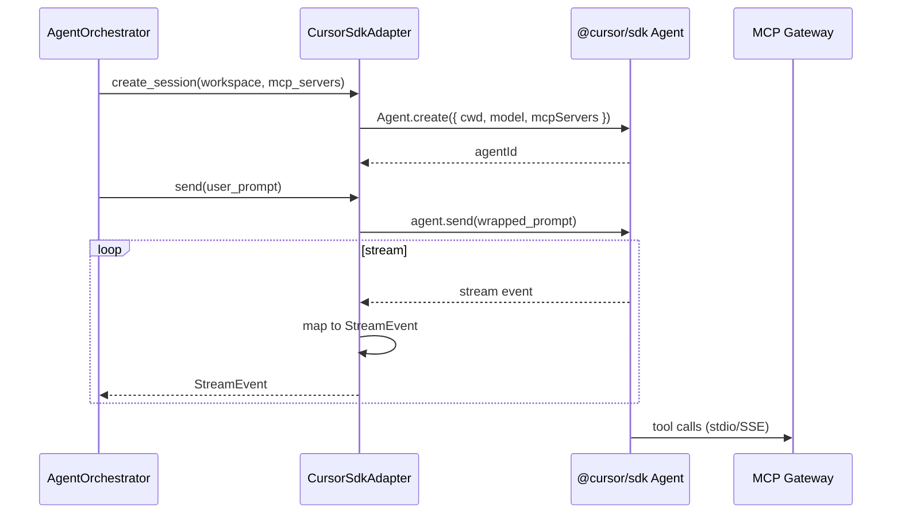

# Cursor SDK Adapter

Production-адаптер `AgentProviderPort` для **Cursor SDK** (`@cursor/sdk` / `cursor-sdk`). Основан на реализации Commerce `CursorSdkRuntime`.

---

## Architecture



---

## Implementation location

```text
apps/api/src/prodavan/infrastructure/agent/
├── cursor_sdk_adapter.py      # AgentProviderPort impl
├── cursor_event_mapper.py     # SDK events → StreamEvent
└── cursor_process_pool.py     # optional Node bridge
```

**Bridge options:**

| Option | Pros | Cons |
|--------|------|------|
| Python `cursor-sdk` | Single process | SDK maturity |
| Node subprocess bridge | Parity with Commerce TS | IPC overhead |
| Sidecar container | Isolation | Complexity |

**MVP:** Node bridge — reuse proven Commerce mapping.

---

## Create session

```python
class CursorSdkAdapter:
    async def create_session(
        self,
        ctx: TenantContext,
        *,
        workspace_path: str,
        model: str,
        mcp_servers: dict[str, object],
        system_prompt: str,
        sandbox_options: SandboxOptions | None = None,
    ) -> CursorProviderSession:
        opts = {
            "cwd": workspace_path,
            "model": {"id": model},
            "mcpServers": mcp_servers,
            "settingSources": ["project"],  # read AGENTS.md from workspace
        }
        if sandbox_options:
            opts["sandboxOptions"] = {"enabled": sandbox_options.enabled}

        agent = await self._bridge.create_agent(opts)
        return CursorProviderSession(agent, self._bridge)
```

Commerce reference:

```typescript
// bot/src/core/orchestrator/cursorSdkRuntime.ts
Agent.create({
  cwd: opts.cwd,
  model: opts.model,
  mcpServers: opts.mcpServers,
  sandboxOptions: opts.sandboxOptions,
});
```

---

## MCP server injection

MCP config built by M06 session-bind:

```python
mcp_servers = {
    "prodavan-pipeline": {
        "command": "python",
        "args": ["-m", "prodavan_mcp.pipeline"],
        "env": {
            "CABINET_ID": str(ctx.cabinet_id),
            "PROJECT_ID": str(ctx.project_id),
            "MCP_GATEWAY_URL": settings.mcp_gateway_url,
            "SESSION_JWT": session_token,
        },
    },
    # ... catalog, s4b, offers, equipment, integrations
}
```

Conditional: `prodavan-s4b` only if `capabilities.s4b == true`.

Commerce reference: `bot/src/config/commerceMcp.ts`.

---

## Stream event mapping

| Cursor SDK event | Prodavan StreamEvent |
|------------------|----------------------|
| `assistant.message.delta` | `assistant.delta` |
| `thinking.delta` | `thinking.delta` (feature flag) |
| `tool_call.start` | `tool_call.started` |
| `tool_call.end` | `tool_call.completed` |
| `run.status` | `status` |
| `error` | `error` |

Mapper strips unstable SDK fields — only orchestrator-needed data.

---

## Send + prompt envelope

User text wrapped before SDK send — см. [prompt-envelope.md](prompt-envelope.md):

```python
wrapped = wrap_user_prompt(raw_text, locale=ctx.locale)
run = await agent.send(wrapped)
```

Commerce: `wrapUserPrompt()` in `promptEnvelope.ts`.

---

## Resume session

```python
async def resume_session(
    self,
    ctx: TenantContext,
    provider_session_id: str,
    *,
    workspace_path: str,
    mcp_servers: dict[str, object],
) -> CursorProviderSession:
    agent = await self._bridge.resume_agent(
        provider_session_id,
        {"cwd": workspace_path, "mcpServers": mcp_servers},
    )
    return CursorProviderSession(agent, self._bridge)
```

Used when: pod restart with persisted `provider_session_id` (v2) or Commerce-style pool reuse within same worker.

---

## Cancel & dispose

```python
async def cancel(self) -> None:
    await self._agent.cancel_run()

async def dispose(self) -> None:
    await self._agent.dispose()
```

Orchestrator calls `dispose` on:
- `/reset` session
- Pod SIGTERM (grace period 30s)
- Idle timeout

---

## Sandbox

Two layers:

1. **K8s pod** — FS mount, NetworkPolicy (always) — [worker-isolation.md](worker-isolation.md)
2. **Cursor SDK sandbox** — `sandboxOptions.enabled: true` + `.cursor/sandbox.json` in workspace

Default prod config:

```yaml
AGENT_CURSOR_SANDBOX_ENABLED: "true"
```

Commerce prod had `sandboxOptions.enabled: false` — Prodavan **enforces** sandbox.

---

## Rate limiting

Mirror Commerce `RateLimiter` on `Agent.create`:

- Token bucket per tenant plan
- `QUOTA_EXCEEDED` before SDK call
- Metrics → M09

---

## Configuration

| Env | Description |
|-----|-------------|
| `CURSOR_API_KEY` | Platform API key |
| `CURSOR_MODEL_DEFAULT` | Default model id |
| `CURSOR_SDK_BRIDGE_URL` | Node bridge HTTP (if used) |
| `AGENT_CURSOR_SANDBOX_ENABLED` | bool |

---

## Failure modes

| Symptom | Handling |
|---------|----------|
| SDK auth 401 | `PROVIDER_AUTH_FAILED`, alert ops |
| SDK timeout | Retry once, then `PROVIDER_UNAVAILABLE` |
| MCP tool error | Pass through as `tool_call.completed` status=error |
| Pod OOM | K8s restart, session → `failed`, user prompt new session |

---

## Testing

- Unit: mock bridge, event mapper
- Integration: `tests/manual/sdk_smoke.py` (from Commerce pattern)
- Staging: daily smoke against real Cursor API

---

## Связанные документы

- [provider-port.md](provider-port.md)
- [providers.md](providers.md)
- [prompt-envelope.md](prompt-envelope.md)
- [worker-isolation.md](worker-isolation.md)
