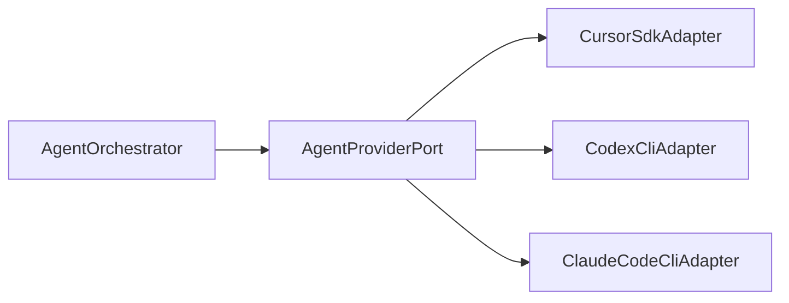

# AgentProviderPort

Абстрактный порт доменного слоя для взаимодействия с LLM-провайдерами. Аналог Commerce `IAgentRuntime`, расширенный для multi-provider и K8s worker lifecycle.

---

## Motivation

Orchestrator (M07) **не зависит** от Cursor SDK, Codex или Claude CLI напрямую. Infrastructure предоставляет адаптеры, реализующие единый контракт.



---

## Interface (Python)

```python
# domain/ports/agent_provider.py
from typing import AsyncIterator, Protocol
from uuid import UUID

from prodavan.domain.value_objects import TenantContext, StreamEvent


class AgentProviderPort(Protocol):
    async def create_session(
        self,
        ctx: TenantContext,
        *,
        workspace_path: str,
        model: str,
        mcp_servers: dict[str, object],
        system_prompt: str,
        sandbox_options: SandboxOptions | None = None,
    ) -> ProviderSession: ...

    async def resume_session(
        self,
        ctx: TenantContext,
        provider_session_id: str,
        *,
        workspace_path: str,
        mcp_servers: dict[str, object],
    ) -> ProviderSession: ...


class ProviderSession(Protocol):
    @property
    def provider_session_id(self) -> str: ...

    async def send(
        self,
        text: str,
        *,
        images: list[ImagePart] | None = None,
        force: bool = False,
    ) -> ProviderRun: ...

    async def dispose(self) -> None: ...


class ProviderRun(Protocol):
    @property
    def status(self) -> RunStatus: ...

    def stream(self) -> AsyncIterator[StreamEvent]: ...

    async def wait(self) -> RunResult: ...

    async def cancel(self) -> None: ...
```

---

## Types

### SandboxOptions

```python
@dataclass
class SandboxOptions:
    enabled: bool = True
    # Cursor SDK: rules from .cursor/sandbox.json in workspace
    # K8s: additional pod-level isolation (always on)
```

### StreamEvent

Neutral events (mapped from provider-specific):

```python
StreamEvent = (
    AssistantDeltaEvent
    | ThinkingDeltaEvent
    | ToolCallStartedEvent
    | ToolCallCompletedEvent
    | StatusEvent
    | ErrorEvent
)
```

Mapping from Commerce `RuntimeStreamEvent`:

| Commerce | Prodavan |
|----------|----------|
| `assistant` | `AssistantDeltaEvent` |
| `thinking` | `ThinkingDeltaEvent` |
| `tool_call` | `ToolCallStarted/Completed` |
| `status` | `StatusEvent` |

### RunStatus

```python
class RunStatus(str, Enum):
    RUNNING = "running"
    FINISHED = "finished"
    ERROR = "error"
    CANCELLED = "cancelled"
```

---

## CreateAgentOptions mapping

Commerce → Prodavan:

| Commerce `CreateAgentOptions` | Prodavan |
|------------------------------|----------|
| `cwd` | `workspace_path` |
| `model.id` | `model` |
| `mcpServers` | `mcp_servers` |
| `sandboxOptions` | `sandbox_options` |
| `settingSources` | provider-specific (Cursor only) |
| `agentId` | returned as `provider_session_id` |

---

## Orchestrator usage

```python
class AgentOrchestrator:
    def __init__(self, provider: AgentProviderPort, ...): ...

    async def handle_user_message(
        self, ctx: TenantContext, session: AgentSession, text: str
    ) -> AsyncIterator[StreamEvent]:
        run = await session.provider.send(text)
        async for event in run.stream():
            await self.persist_event(session, event)
            yield event
        result = await run.wait()
        await self.finalize_run(session, result)
```

---

## Provider registry

```python
# infrastructure/agent/provider_registry.py
PROVIDERS: dict[str, Callable[[Settings], AgentProviderPort]] = {
    "cursor-sdk": lambda s: CursorSdkAdapter(s.cursor_api_key),
    "codex-cli": lambda s: CodexCliAdapter(s.openai_api_key),
    "claude-code-cli": lambda s: ClaudeCodeCliAdapter(s.claude_cli_path),
}

def get_provider(name: str, settings: Settings) -> AgentProviderPort:
    factory = PROVIDERS.get(name)
    if not factory:
        raise ConfigurationError(f"Unknown provider: {name}")
    return factory(settings)
```

---

## Error handling

Providers raise `AgentProviderError` (subclass of `DomainError`):

| Code | Meaning |
|------|---------|
| `PROVIDER_UNAVAILABLE` | SDK/CLI not reachable |
| `PROVIDER_AUTH_FAILED` | Invalid API key |
| `PROVIDER_RATE_LIMITED` | Upstream 429 |
| `PROVIDER_SESSION_LOST` | Resume failed — create new |
| `PROVIDER_RUN_CANCELLED` | User cancel |

Orchestrator maps to WS/SSE error events — см. M07.

---

## Testing

### StubProvider (unit tests)

```python
class StubProvider:
    async def create_session(...) -> ProviderSession:
        return StubSession(canned_events=[...])
```

Commerce equivalent: `StubRuntime` in orchestrator tests.

### Contract tests

Each adapter must pass shared test suite:
- create → send → stream → wait
- cancel mid-run
- dispose cleans resources
- MCP servers passed to underlying SDK

---

## Lifecycle

```text
1. StartAgentSession use case
2. provider.create_session(workspace, mcp, prompts)
3. Store provider_session_id in agent.sessions
4. User messages → provider.send → stream to SSE
5. /reset → dispose old, create_session new
6. Pod terminate → dispose + audit
```

---

## Связанные документы

- [providers.md](providers.md)
- [cursor-sdk-adapter.md](cursor-sdk-adapter.md)
- [worker-isolation.md](worker-isolation.md)
- [prompt-envelope.md](prompt-envelope.md)
