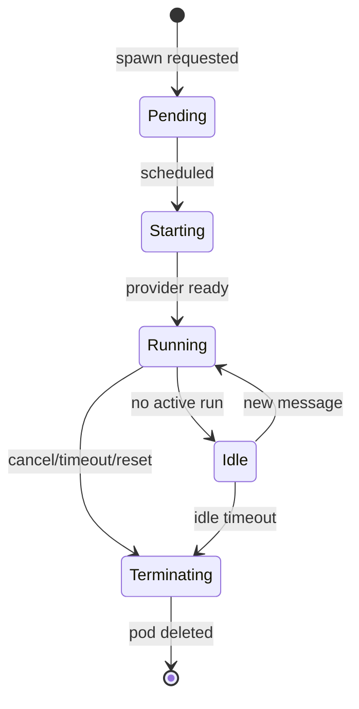

# Worker isolation

Изоляция **agent worker pods** в k3s — ключевой security control Prodavan. Один pod = одна agent session; deny-by-default network; FS sandbox scoped to project path.

---

## Threat model

| Threat | Mitigation |
|--------|------------|
| Cross-tenant data read | FS mount subPath + path policy |
| Cross-project write | SandboxPath validator |
| SSRF / internal scan | NetworkPolicy egress allowlist |
| Credential exfiltration | No DB access; secrets in tmpfs |
| Privilege escalation | non-root, dropped caps, seccomp |
| Resource exhaustion | limits, quotas, idle timeout |

Escape test catalog — automated regression suite.

---

## Pod lifecycle



| Parameter | Default |
|-----------|---------|
| `activeDeadlineSeconds` | 8 hours |
| Idle timeout | 30 minutes |
| Grace period SIGTERM | 30 seconds |
| Max concurrent pods per tenant | plan quota |

---

## Pod spec (essential)

```yaml
apiVersion: v1
kind: Pod
metadata:
  name: agent-{session_id}
  namespace: prodavan-workers
  labels:
    app: agent-worker
    tenant_id: "{tid}"
    cabinet_id: "{cid}"
    project_id: "{pid}"
spec:
  restartPolicy: Never
  serviceAccountName: agent-worker
  securityContext:
    runAsNonRoot: true
    runAsUser: 10001
    fsGroup: 10001
    seccompProfile:
      type: RuntimeDefault
  containers:
    - name: worker
      image: prodavan/agent-worker:1.0.0
      securityContext:
        allowPrivilegeEscalation: false
        readOnlyRootFilesystem: true
        capabilities:
          drop: ["ALL"]
      resources:
        requests:
          cpu: "500m"
          memory: "1Gi"
        limits:
          cpu: "2"
          memory: "4Gi"
      volumeMounts:
        - name: workspace
          mountPath: /workspace
          subPath: tenants/{tid}/cabinets/{cid}/projects/{slug}
        - name: tmp
          mountPath: /tmp
        - name: prompts-ro
          mountPath: /workspace/prompts
          subPath: tenants/{tid}/cabinets/{cid}/prompts
          readOnly: true
      envFrom:
        - secretRef:
            name: agent-session-{session_id}  # ephemeral
  volumes:
    - name: workspace
      persistentVolumeClaim:
        claimName: tenant-{tid}-storage
    - name: tmp
      emptyDir:
        medium: Memory
        sizeLimit: 256Mi
    - name: prompts-ro
      persistentVolumeClaim:
        claimName: tenant-{tid}-storage
```

---

## FS sandbox rules

### Writable

```text
/workspace/               # project root (= projects/{slug}/)
  inbox/
  runs/
  commerce.sqlite         # if used
  .cursor/                # sandbox.json
```

### Read-only mounts

```text
/workspace/prompts/       # cabinet prompts (AGENTS.md)
/opt/tools/               # pipeline Python tools (read-only image layer)
```

### Forbidden

- `/tenants/{other_tid}/`
- `/etc`, `/var/run/secrets` except injected env
- Host path mounts
- `hostPath` volumes — **banned**

### Path policy (code)

```python
def assert_sandbox_path(base: Path, target: Path) -> None:
    resolved = target.resolve()
    if not str(resolved).startswith(str(base.resolve())):
        raise SandboxEscapeError()
```

Commerce analog: `bot/src/core/workspace/pathPolicy.ts`.

---

## NetworkPolicy

```yaml
apiVersion: networking.k8s.io/v1
kind: NetworkPolicy
metadata:
  name: agent-worker-egress
  namespace: prodavan-workers
spec:
  podSelector:
    matchLabels:
      app: agent-worker
  policyTypes: [Egress]
  egress:
    - to:
        - namespaceSelector:
            matchLabels:
              name: prodavan
          podSelector:
            matchLabels:
              app: mcp-gateway
      ports:
        - protocol: TCP
          port: 8080
    - to:
        - namespaceSelector: {}
      ports:
        - protocol: TCP
          port: 443   # Cursor API, model providers
    - to:
        - namespaceSelector:
            matchLabels:
              kube-system: "true"
      ports:
        - protocol: UDP
          port: 53    # DNS
```

**Deny all other egress** (default deny in namespace).

No direct S4B / web shop access from pod — only via MCP Gateway.

---

## Commerce vs Prodavan

| Aspect | Commerce MVP | Prodavan |
|--------|--------------|----------|
| Isolation | Docker compose shared volumes | Pod per session |
| Network | Host network default | NetworkPolicy |
| Sandbox | `sandboxOptions.enabled: false` | **Enforced true** |
| FS | Whole `projects/` mount | subPath per project |
| Multi-tenant | N/A | tenant_id labels + RLS elsewhere |

---

## MCP Gateway trust boundary

```text
Worker Pod → (JWT session token) → MCP Gateway
  Gateway → ACL check capabilities
  Gateway → rate limit
  Gateway → S4B / catalog / web adapters
  Gateway → audit log (M09)
```

Worker **never** holds decrypted S4B creds in env long-term — gateway injects per call (M05).

---

## Escape test catalog

| Test ID | Attack | Expected |
|---------|--------|----------|
| ESC-001 | Read `../../other-project/inbox/secret.xlsx` | Denied |
| ESC-002 | curl internal postgres IP | NetworkPolicy drop |
| ESC-003 | Write to `/etc/passwd` | Read-only root FS |
| ESC-004 | Run as root | runAsNonRoot prevents |
| ESC-005 | Access k8s API from pod | RBAC deny |
| ESC-006 | Exhaust node memory | limits kill pod |
| ESC-007 | Symlink escape | path resolve check |

Run in CI on kind/k3d cluster before release.

---

## Observability

- Pod logs → Loki with labels `tenant_id`, `session_id`
- Metrics: pod start latency, OOM count, idle kills
- Traces: OpenTelemetry from orchestrator → worker → gateway

---

## Incident response

Pod compromise suspicion:
1. Delete pod immediately
2. Revoke session JWT
3. Audit MCP calls for session_id
4. Rotate ephemeral secrets
5. No cross-tenant blast radius if policies correct

---

## Связанные документы

- [providers.md](providers.md)
- [cursor-sdk-adapter.md](cursor-sdk-adapter.md)
- [prompt-envelope.md](prompt-envelope.md)
- [../02-architecture/overview.md](../02-architecture/overview.md)
- [../07-infrastructure/k3s-services.md](../07-infrastructure/k3s-services.md)
