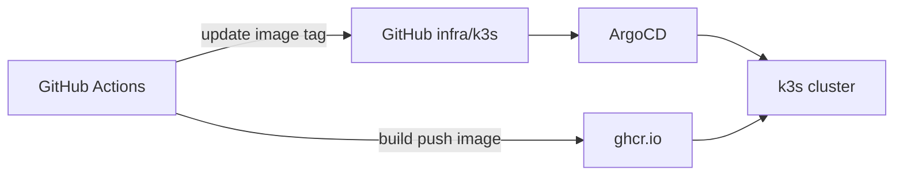

# ArgoCD GitOps

> **As-built (2026-08-24):** живой Application — `infra/argocd/apps/prodavan-dev.yaml`
> (`path: infra/k3s/overlays/dev`, `targetRevision: main`, automated prune+selfHeal,
> Job Sync hooks, `ignoreDifferences` for Job/Deployment/StatefulSet status).
> Install: `infra/scripts/ensure_argocd.sh` (не `bootstrap/install.yaml` как единственный путь).
> Ниже — целевой дизайн (App-of-Apps / staging/prod); то, чего ещё нет в дереве, помечено aspirational.

Деплой Prodavan в k3s через **ArgoCD** — declarative sync из git repo `infra/k3s/`.

---

## Architecture



---

## Repository structure

```text
infra/argocd/
├── bootstrap/
│   ├── install.yaml          # argocd namespace + helm
│   └── root-app.yaml         # App of Apps
├── apps/
│   ├── prodavan-api.yaml
│   ├── prodavan-ws.yaml
│   ├── mcp-gateway.yaml
│   ├── redis.yaml
│   ├── ingress.yaml
│   └── workers-rbac.yaml
└── projects/
    └── prodavan-project.yaml
```

---

## App of Apps

```yaml
# infra/argocd/bootstrap/root-app.yaml
apiVersion: argoproj.io/v1alpha1
kind: Application
metadata:
  name: prodavan-root
  namespace: argocd
spec:
  project: prodavan
  source:
    repoURL: https://github.com/org/prodavan.git
    targetRevision: main
    path: infra/k3s/overlays/prod
  destination:
    server: https://kubernetes.default.svc
    namespace: prodavan
  syncPolicy:
    automated:
      prune: true
      selfHeal: true
    syncOptions:
      - CreateNamespace=true
```

---

## Environment overlays

| Overlay | Branch | Auto-sync | Approval |
|---------|--------|-----------|----------|
| dev | `develop` | yes | no |
| staging | `main` | yes | no |
| prod | `release/*` | manual | required |

Prod Application:

```yaml
syncPolicy:
  automated: null  # manual sync only
```

---

## Image updates

GitHub Actions after successful build:

```bash
# Update kustomize image tag
cd infra/k3s/overlays/staging
kustomize edit set image ghcr.io/org/prodavan-api=${{ github.sha }}
git commit -am "deploy(staging): api ${{ github.sha }}"
git push
# ArgoCD detects drift → sync
```

Alternative: ArgoCD Image Updater (v2).

---

## Secrets management

**Never commit secrets to git.**

Options:
1. **Sealed Secrets** — encrypt in git, decrypt in cluster
2. **External Secrets Operator** — sync from cloud KMS/Vault
3. **Manual** kubectl create secret (bootstrap only)

```yaml
# external-secret example
apiVersion: external-secrets.io/v1beta1
kind: ExternalSecret
metadata:
  name: prodavan-api-secrets
spec:
  refreshInterval: 1h
  secretStoreRef:
    name: yandex-lockbox
  target:
    name: prodavan-api-secrets
  data:
    - secretKey: DATABASE_URL
      remoteRef:
        key: prodavan/staging/database_url
```

---

## Sync hooks (migrations)

PreSync Job — Alembic migrate:

```yaml
apiVersion: batch/v1
kind: Job
metadata:
  name: alembic-migrate
  annotations:
    argocd.argoproj.io/hook: PreSync
    argocd.argoproj.io/hook-delete-policy: HookSucceeded
spec:
  template:
    spec:
      containers:
        - name: migrate
          image: ghcr.io/org/prodavan-api:${TAG}
          command: ["alembic", "upgrade", "head"]
          envFrom:
            - secretRef:
                name: prodavan-api-secrets
      restartPolicy: Never
```

---

## Health checks

ArgoCD custom health for Deployment — default sufficient.

Worker pods (Job/Pod) — excluded from app sync; created dynamically by api.

---

## Rollback

```bash
argocd app rollback prodavan-api <revision>
# or git revert + sync
```

Database: forward-fix migrations only — no ArgoCD rollback of PreSync Job.

---

## Access control

| Role | Permissions |
|------|-------------|
| platform-admin | all apps sync/delete |
| developer | read-only ArgoCD UI |
| CI service account | push git tags only |

ArgoCD SSO via OIDC (M08 tenant IdP optional for internal team).

---

## Monitoring

- ArgoCD notifications → Slack on sync failed
- Metrics: sync status, reconciliation duration
- Alert: prod app OutOfSync > 15 min

---

## Bootstrap procedure

```bash
kubectl create namespace argocd
kubectl apply -k infra/argocd/bootstrap/
kubectl apply -f infra/argocd/bootstrap/root-app.yaml
# Configure repo credentials for private GitHub
```

---

## Связанные документы

- [k3s-services.md](k3s-services.md)
- [github-actions.md](github-actions.md)
- [terraform.md](terraform.md)
- [../05-backend/alembic.md](../05-backend/alembic.md)
