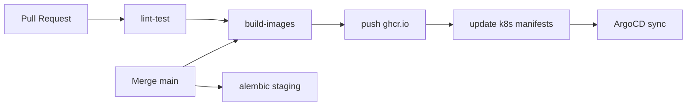

# GitHub Actions CI/CD

Pipeline непрерывной интеграции и доставки Prodavan. Workflows: `.github/workflows/`.

---

## Workflow overview



---

## Local-dev deploy (active)

`deploy-dev-k3s.yml` — после успешного **CI Images** на `main` (или `workflow_dispatch`): self-hosted runner поднимает/проверяет k3d через Terraform `environments/local`, ждёт Argo Application `prodavan-dev` (fallback `kubectl apply -k`), smoke на `http://127.0.0.1:8088` с `Host: prodavan.local`.

Runbook: [local-cluster-e2e.md](local-cluster-e2e.md).

---

## Workflows

### `ci.yml` — on every PR

```yaml
name: CI
on:
  pull_request:
    branches: [main, develop]

jobs:
  api-lint-test:
    runs-on: ubuntu-latest
    steps:
      - uses: actions/checkout@v4
      - uses: actions/setup-python@v5
        with:
          python-version: "3.12"
      - run: pip install -e "apps/api[dev]"
      - run: ruff check apps/api
      - run: pytest apps/api/tests -q

  flutter-analyze:
    runs-on: ubuntu-latest
    steps:
      - uses: actions/checkout@v4
      - uses: subosito/flutter-action@v2
      - run: cd apps/flutter && flutter analyze && flutter test

  openapi-validate:
    runs-on: ubuntu-latest
    steps:
      - run: npx @redocly/cli lint apps/api/openapi/openapi.yaml
```

---

### `build.yml` — on push main / tags

```yaml
name: Build & Push
on:
  push:
    branches: [main]
    tags: ["v*"]

jobs:
  build-api:
    runs-on: ubuntu-latest
    permissions:
      packages: write
    steps:
      - uses: actions/checkout@v4
      - uses: docker/login-action@v3
        with:
          registry: ghcr.io
          username: ${{ github.actor }}
          password: ${{ secrets.GITHUB_TOKEN }}
      - uses: docker/build-push-action@v5
        with:
          context: apps/api
          push: true
          tags: |
            ghcr.io/${{ github.repository }}/prodavan-api:${{ github.sha }}
            ghcr.io/${{ github.repository }}/prodavan-api:latest

  build-mcp-gateway:
    # similar

  build-agent-worker:
    # includes Node bridge + Python tools
```

---

### `deploy-staging.yml` — after build

```yaml
name: Deploy Staging
on:
  workflow_run:
    workflows: [Build & Push]
    types: [completed]
    branches: [main]

jobs:
  deploy:
    runs-on: [self-hosted, linux, staging]  # OUTSIDE k3s — see github-runner-local.md
    steps:
      - uses: actions/checkout@v4
      - name: Update image tags
        run: |
          cd infra/k3s/overlays/staging
          kustomize edit set image ghcr.io/org/prodavan-api=${{ github.sha }}
      - name: Commit manifest bump
        run: |
          git config user.name "github-actions"
          git commit -am "deploy(staging): ${{ github.sha }}"
          git push
      - name: Wait for ArgoCD
        run: argocd app wait prodavan-api --timeout 300
```

---

### `deploy-prod.yml` — manual

```yaml
name: Deploy Production
on:
  workflow_dispatch:
    inputs:
      tag:
        description: "Image tag (git sha or semver)"
        required: true

jobs:
  deploy:
    runs-on: [self-hosted, linux, prod]
    environment: production  # requires approval
    steps:
      # same as staging, overlay prod
```

---

### `db-migrate-staging.yml`

```yaml
name: DB Migrate Staging
on:
  workflow_run:
    workflows: [Deploy Staging]
jobs:
  migrate:
    runs-on: ubuntu-latest
    steps:
      - run: alembic upgrade head
        env:
          DATABASE_URL: ${{ secrets.STAGING_DATABASE_URL }}
        working-directory: apps/api
```

Prod migrations: ArgoCD PreSync hook — см. [argocd.md](argocd.md).

---

## Secrets (GitHub)

| Secret | Used in |
|--------|---------|
| `STAGING_DATABASE_URL` | db migrate |
| `KUBECONFIG_STAGING` | optional kubectl debug |
| `ARGOCD_AUTH_TOKEN` | deploy wait |
| `CURSOR_API_KEY` | optional integration job |

**Not in GHA:** production DB URL — only on self-hosted runner or External Secrets.

---

## Integration tests (nightly)

```yaml
name: Nightly Integration
on:
  schedule:
    - cron: "0 2 * * *"
jobs:
  agent-smoke:
    runs-on: [self-hosted, linux, staging]
    steps:
      - run: pytest tests/integration/agent_session_test.py
        env:
          STAGING_API_URL: https://api.staging.prodavan.local
```

---

## Branch protection

`main`:
- Required: CI pass
- Required: 1 review
- No direct push

`release/*`:
- Tag from main only
- Prod deploy manual

---

## Caching

- pip: `actions/cache` keyed on `pyproject.toml` hash
- Docker: GitHub Actions cache / buildkit
- Flutter: pub cache

---

## Связанные документы

- [github-runner-local.md](github-runner-local.md)
- [argocd.md](argocd.md)
- [env-matrix.md](env-matrix.md)
