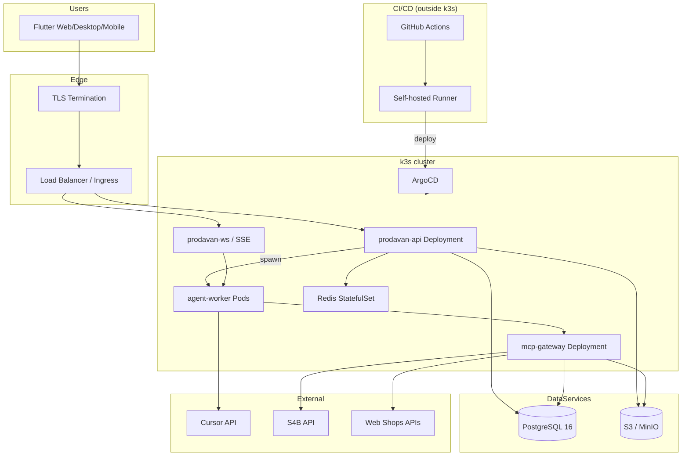

# Topology инфраструктуры

Физическая и логическая топология Prodavan: от Flutter-клиента до worker pods в k3s.

---

## High-level diagram



---

## Network zones

| Zone | Components | Exposure |
|------|------------|----------|
| **Public** | Ingress, Flutter clients | Internet |
| **DMZ** | TLS LB, WAF (optional) | 443 from internet |
| **App** | api, ws, mcp-gateway | Internal + ingress |
| **Worker** | agent-worker namespace | Egress allowlist only |
| **Data** | PostgreSQL, Redis, MinIO | Private subnet, no internet |
| **CI** | GitHub Runner host | Outbound to git + k3s API |

---

## Traffic flows

### REST API

```text
Client → Ingress (443) → prodavan-api:8000 → PostgreSQL / Redis / S3
Headers: Authorization, X-Cabinet-Id, X-Request-Id
```

### Agent SSE stream

```text
Client → Ingress (443, long-lived) → prodavan-api or prodavan-ws
  → proxy to worker pod :8081/stream
Events: assistant.delta, tool_call.*, run.completed
```

Sticky sessions optional if ws separated from api.

### MCP tool call

```text
worker pod → mcp-gateway:8080 (internal DNS)
  → ACL + rate limit + audit
  → adapter (s4b / catalog / web)
  → external API
```

Worker **never** calls S4B directly.

---

## Namespaces (k3s)

| Namespace | Workloads |
|-----------|-----------|
| `prodavan` | api, ws, mcp-gateway, redis |
| `prodavan-workers` | agent-worker pods (dynamic) |
| `prodavan-data` | postgres, minio (if in-cluster) |
| `argocd` | ArgoCD components |
| `ingress-nginx` | Ingress controller |

---

## Storage topology

| Data | Location | Access |
|------|----------|--------|
| Relational | Managed PostgreSQL or CNPG | api, mcp-gateway |
| Files | S3 bucket `prodavan-prod` | api, workers (PVC mount) |
| Cache | Redis cluster | api, mcp-gateway |
| Secrets | K8s Secrets + KMS | api, workers (ephemeral) |

---

## Environments

| Env | Cluster | Domain | Data |
|-----|---------|--------|------|
| dev | local **k3s + Argo** (GitOps) | localhost:8088 | in-cluster PVC |
| staging | k3s single node | staging.prodavan.local | Managed PG staging |
| prod | k3s HA (3 control + N workers) | api.prodavan.ru | Managed PG + S3 |

См. [env-matrix.md](env-matrix.md).

---

## HA & scaling

| Component | Replicas | HPA metric |
|-----------|----------|------------|
| prodavan-api | 2–10 | CPU 70%, RPS |
| mcp-gateway | 2–8 | CPU, request queue |
| prodavan-ws | 2–6 | active SSE connections |
| agent-worker | 0–N | queue depth per tenant |
| redis | 3 (sentinel) | — |
| postgres | managed HA | — |

---

## Disaster recovery

| RPO | RTO | Scope |
|-----|-----|-------|
| 1h | 4h | PostgreSQL PITR |
| 24h | 8h | Full region (cold standby) |

S3: cross-region replication (prod).
s4b-cache: not backed up — regeneratable.

---

## Commerce MVP comparison

| Commerce | Prodavan |
|----------|----------|
| Single Docker container | k3s multi-deployment |
| docker-compose volumes | S3 + PVC per tenant |
| Telegram polling | HTTPS + SSE |
| Local MCP stdio | MCP Gateway service |
| No RLS | PostgreSQL RLS |

---

## Связанные документы

- [terraform.md](terraform.md)
- [k3s-services.md](k3s-services.md)
- [argocd.md](argocd.md)
- [github-actions.md](github-actions.md)
- [wsl-dev.md](wsl-dev.md)
