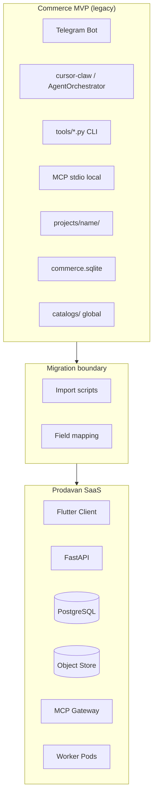

# Граница Commerce → Prodavan

Документ фиксирует **границу систем** между legacy MVP **Commerce** (`c:\Users\qwerty\git\Commerce`) и целевой SaaS-платформой **Prodavan**. Определяет, что мигрирует, что заменяется, что остаётся reference-only.

---

## Executive summary

| | Commerce MVP | Prodavan |
|---|--------------|----------|
| **Product** | Telegram-бот для закупок электроники | Multi-tenant SaaS web/desktop/mobile |
| **Users** | Solo operator + Telegram | Tenant → Cabinet → Project + RBAC |
| **Agent UI** | Telegram HTML stream | Flutter + SSE |
| **Data** | Local FS + SQLite per project | PostgreSQL RLS + S3 object store |
| **Integrations** | Global `.env` S4B, global catalogs | Per-cabinet credentials + allowlists |
| **Agent runtime** | Docker compose, shared volumes | k3s pod per session, FS sandbox |
| **MCP** | Local stdio servers | MCP Gateway + ACL |
| **KP export** | Telegram `/кп` | Flutter UI + API |

**Commerce не удаляется сразу** — остаётся reference implementation и migration source до parity M02/M05/M07.

---

## System boundary diagram



---

## Component mapping

### Replaced (no direct port)

| Commerce | Prodavan replacement |
|----------|---------------------|
| Telegram bot (`bot/`) | Flutter M01–M07 |
| `TelegramMessenger` stream | SSE `StreamEvent` |
| `/проект`, `/кп`, `/позиции` commands | REST + UI screens |
| Global `inbox/` | Per-project `inbox/` in object store |
| `SessionStore` per Telegram user | JWT + `agent.sessions` |
| `RateLimiter` per chat | Per-tenant/cabinet Redis limits |

### Adapted (logic preserved, new shell)

| Commerce | Prodavan |
|----------|----------|
| `tools/new_run.py` … `rank_offers.py` | MCP `pipeline.*` in worker |
| `tools/commerce_db.py` | PostgreSQL `specs.variants` + import |
| `tools/kp_export.py` | API `POST /specs/kp/export` |
| `AGENTS.md` + `profiles/kp/` | M03 prompts per cabinet |
| `CursorSdkRuntime` | `CursorSdkAdapter` |
| `wrapUserPrompt` | `prompt_envelope.py` |
| MCP servers (`mcp/servers/`) | `prodavan-mcp-*` behind gateway |
| JSON schemas (`schemas/`) | Same semantics, PG storage |

### Retained in Commerce only

| Asset | Reason |
|-------|--------|
| Telegram integration code | Legacy ops until cutover |
| `docker-compose.yml` single-container | Local MVP demo |
| Global `catalogs/` price files | Import source for migration |
| Bot tests | Regression reference |

---

## Data boundary

### Filesystem

| Commerce path | Prodavan path |
|---------------|---------------|
| `projects/{name}/` | `tenants/{tid}/cabinets/{cid}/projects/{slug}/` |
| `projects/{name}/inbox/*` | `.../inbox/*` |
| `projects/{name}/runs/{id}/` | `.../runs/{id}/` |
| `projects/{name}/commerce.sqlite` | PG `specs.*` + optional sqlite mirror |
| `catalogs/db/*.sqlite` | `.../catalogs/db/{name}.sqlite` |
| `catalogs/s4b/` | `.../integrations/s4b-cache/` |
| `profiles/` | `.../prompts/profiles/` |
| `AGENTS.md` (root) | `.../prompts/AGENTS.md` |

### Database

| Commerce SQLite | Prodavan PostgreSQL |
|-----------------|---------------------|
| `lineitems` | `specs.line_items` |
| `variants` | `specs.variants` |
| `specs` | `specs.specs` |
| `spec_links` | `specs.spec_links` |
| — | `tenants.*`, `integrations.*`, `agent.*` (new) |

---

## Security boundary changes

| Risk in Commerce | Prodavan control |
|------------------|------------------|
| Shared `projects/` disk | RLS + FS subPath sandbox |
| Global S4B creds in `.env` | Per-cabinet AES-GCM vault |
| Any operator sees all projects | Tenant RBAC + cabinet membership |
| MCP tools unrestricted | Tool ACL per profile (M06) |
| No audit trail | `ops.audit_log` (M09) |
| `on_order` offers possible | Filtered — platform policy |

---

## MCP boundary

Commerce: agent invokes MCP stdio directly on host.

Prodavan: agent → MCP Gateway → adapter:

```text
Commerce:  Agent ──stdio──► commerce-s4b
Prodavan:  Worker ──HTTP──► Gateway ──► s4b adapter
                              ├── ACL check
                              ├── rate limit
                              └── audit
```

Tool rename map — см. [commerce-semantics.md](commerce-semantics.md).

---

## Migration phases

| Phase | Scope | Exit criteria |
|-------|-------|---------------|
| **P0** | Documentation + schemas | Parity spec signed |
| **P1** | Import script: project + runs + sqlite | Round-trip variants count match |
| **P2** | MCP pipeline parity | Same spec → same primary offers (±fresh prices) |
| **P3** | Pilot tenant single cabinet | Operator completes KP in Flutter |
| **P4** | Commerce read-only | No new Commerce projects |
| **P5** | Commerce archived | Backup only |

---

## Non-goals (out of scope)

- Migrating Telegram chat history to Prodavan
- Multi-bot Telegram bridge
- Global shared catalogs between tenants
- Automatic P/N « улучшение » — policy unchanged (forbidden)
- Agent-written `kp.xlsx` — still forbidden

---

## Dual-run period

During P2–P3 both systems may run:

| Rule | Description |
|------|-------------|
| Source of truth | Prodavan for pilot tenant |
| Commerce | Frozen project list |
| Sync | Manual re-import only |
| S4B creds | Separate — do not share production S4B account blindly |

---

## Validation checklist

- [ ] Import `demo-spec` project — line item count matches
- [ ] Variants `is_best` flags match Commerce sqlite
- [ ] S4B search returns in_stock only (no on_order)
- [ ] KP xlsx byte-compare or semantic diff
- [ ] Cross-cabinet import rejected
- [ ] AGENTS.md byte-identical after M03 seed

---

## Связанные документы

- [commerce-semantics.md](commerce-semantics.md)
- [../05-backend/object-store.md](../05-backend/object-store.md)
- [../06-agent-runtime/cursor-sdk-adapter.md](../06-agent-runtime/cursor-sdk-adapter.md)
- [../00-glossary.md](../00-glossary.md)
