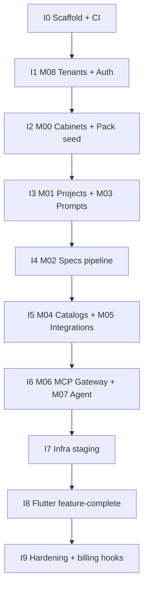

# Implementation roadmap (I0–I9)

План **кода** после док-итерации P0–P9. Не дублирует ADR — только порядок delivery и критерии Impl.

---

## I0 — Scaffold (Impl gate: ≥ 7 avg)

| ID | Deliverable | Acceptance |
|----|-------------|------------|
| I0-T01 | `apps/api/` FastAPI + Alembic + docker-compose.dev | `alembic upgrade head` на пустой PG |
| I0-T02 | `apps/flutter/` `flutter create` + clean arch folders | `flutter analyze` clean |
| I0-T03 | `ci-schemas.yml` — validate pack + v1.json | CI green on PR |
| I0-T04 | OpenAPI codegen hook (optional v0: hand models) | Login + health integration test |

**Не блокирует I0:** Terraform, agent worker, MCP servers.

---

## I1 — M08 Tenants + Auth

- Tables: `tenants`, `users`, `tenant_memberships`, `refresh_tokens`
- RLS baseline + `SET app.tenant_id`
- Endpoints: register, login, refresh, `/tenants/me`
- JWT claims: `tenant_id`, `cabinet_ids[]`
- Tests: NEG-TEN-01 cross-tenant read

**Impl target:** 8

---

## I2 — M00 Cabinets + Pack installer

- CRUD cabinets, switch, manifest API
- Seed pipeline: electronics-procurement → prompts, shops, system DB `s4b`
- JSON Schema validation on profile register
- Trigger `enforce_s4b_profile`
- **Resolve BL-04:** единый registry capabilities (`procurement.*` canonical)

**Impl target:** 8

---

## I3 — M01 Projects + M03 Prompts

- Project CRUD, attachments → object store
- Prompt documents + versioning (If-Match / ETag)
- Seed AGENTS.md → adapt Telegram → Prodavan UI (BL-07)
- Flutter: cabinet shell + NavGate + project list

**Impl target:** 8

---

## I4 — M02 Specs / KP pipeline

- Port Commerce tools → MCP `prodavan-mcp-pipeline` or internal jobs
- Tables: spec_runs, line_items, offers, variants
- Import policy: drop `on_order`
- KP export API (xlsx generation server-side, not agent)

**Impl target:** 8

---

## I5 — M04 Catalogs + M05 Integrations

- Catalog import jobs, SQLite per cabinet or PG JSONB (decision frozen in M04 persistence)
- S4B cred vault, trusted sellers, call log
- Web shop allowlist from pack
- Status: `missing_credentials` / `credentials_valid`

**Impl target:** 8

---

## I6 — M06 MCP Gateway + M07 Agent

- Gateway pod: tool ACL from cabinet profile
- Worker pod: Cursor SDK primary; **Codex/Claude after BL-01 spike**
- SSE stream → Flutter agent chat
- No direct PG in worker (CI grep + integration)

**Impl target:** 7 (8 after spikes)

---

## I7 — Infra staging

- Terraform modules (see `infra/terraform/`)
- k3s manifests + Argo CD app
- Local GH runner job: build + push images
- Secrets: ExternalSecrets / SOPS

**Impl target:** 7

---

## I8 — Flutter feature-complete (electronics v1)

- All `projectTabs` from pack
- Icon-only nav per design system
- MD editor for prompts
- Equipment cards module

**Impl target:** 8

---

## I9 — M09 Operations + billing hooks

- Audit log export, metrics scrape
- Plan limits (starter/pro) — read-only hooks
- Load test spec run (10 line items)

**Impl target:** 7

---

## Commerce migration path

Параллельно I4–I6: импорт одного Commerce `projects/<name>/` в tenant cabinet (см. [`08-migration/commerce-boundary.md`](../08-migration/commerce-boundary.md)).

Commerce Telegram bot **не меняется** до cutover decision.
