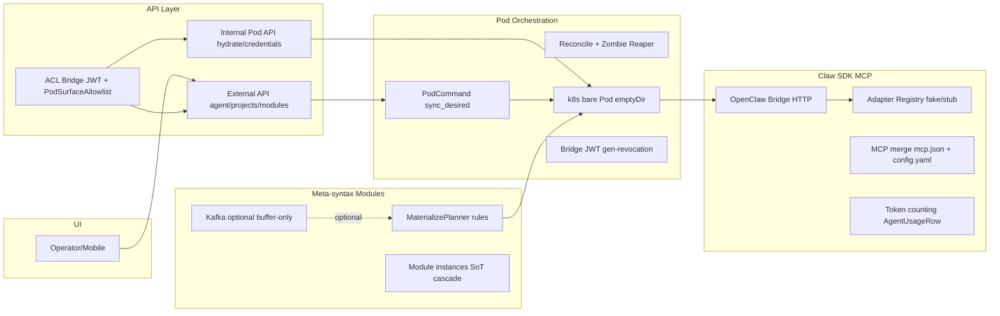

# 00 — Overview: карта слоёв

## Контекст

Prodavan — облачная платформа запуска AI-агентов в изолированных контейнерах (стиль Cursor Cloud): UI кастомизирует внутренности Pod (промпты, файлы, MCP, env) через **модули** и **метасинтаксис**; агент через API/MCP заполняет данные, видимые пользователю в UI.

MVP готов; принципы «модули = in-proc микросервисы через Kafka», жёсткая изоляция и универсальный метасинтаксис заявлены, но местами нарушены костылями.

## Data-flow (as-is)

Цепочка продукта: **UI → API → k8s Pod → agent (файлы, tools, SDK)**. Materialize собирает workspace из модулей → hydrate initContainer → bridge регистрирует сессию → агент стримит события и ходит в platform API через MCP.

## Слои

| # | Документ | Ответственность |
|---|----------|-----------------|
| 1 | [01-meta-syntax-modules](01-meta-syntax-modules.md) | Декларация «что положить в контейнер и какие данные в UI»; SoT инстансов; bindings |
| 2 | [02-pod-orchestration](02-pod-orchestration.md) | Desired/observed lifecycle Pod; reconcile; workspace persistence |
| 3 | [03-claw-sdk-mcp](03-claw-sdk-mcp.md) | Единый agent-control над N SDK; MCP; usage/tokens; HITL |
| 4 | [04-api-infra-access](04-api-infra-access.md) | Внешний/Pod API; ACL; tenant infra (redis/kafka/OS/…); бюджеты |
| 5 | [05-cross-cutting](05-cross-cutting.md) | Event bus, durable ops, defense-in-depth, канон доков |

## Заявленные принципы vs реальность

| Принцип | Заявлено | As-is |
|---------|----------|-------|
| Модули = микросервисы in-proc через Kafka | AGENTS / product intent | Kafka опциональна; buffer-only + in-proc dispatch; модули связаны через shared DB SoT и прямые импорты |
| Изоляция тенантов / проектов | JWT scopes, cabinet secrets, ProjectAccessPolicy | Application-layer only; нет NetworkPolicy / per-project SA / ResourceQuota; `project_ids` empty = all |
| Durable lifecycle | Celery / outbox | Mix: wipe/triggers → Celery; resume/bootstrap → `asyncio.create_task` |
| Единый claw-контракт | `AgentProviderPort` + `AgentEvent` | Порт есть; реальных SDK в репо нет; send path дублирован bridge vs adapter |

## Сводка критичных проблем

### P0 (чинить первым)

| ID | Слой | Суть |
|----|------|------|
| META-P0a | 01 | `project_ids` empty → материализация во **все** bound проекты (soft isolation) |
| META-P0b | 01 | `WRITABLE_GLOBAL_PROJECT_MODULES={mod_equipment}` — запись в parent SoT при global bind |
| POD-P0a | 02 | `_GEN_FALLBACK` in-memory для bridge gen — multi-replica revocation race |
| POD-P0b | 02 | `emptyDir` workspace — потеря данных при reschedule; hydrate на каждый recreate |
| POD-P0c | 02 | Direct pod IP без headless Service — окно `POD_NOT_RUNNING` |
| CLAW-P0a | 03 | Реальных Cursor/Codex/Claude адаптеров в репо нет — нечего ревьюить |
| CLAW-P0b | 03 | Usage Claude: нет cache tokens, риск двойного output, estimate как budget |
| CLAW-P0c | 03 | Rehydrate = text-prefix хак, теряет tool/thinking/subagent state |
| XCUT-P0a | 05 | Event-driven modules не реализованы |
| XCUT-P0b | 05 | Isolation только на app-layer |

### P1 (системный долг)

| ID | Слой | Суть |
|----|------|------|
| META-P1a | 01 | Kafka cutover hole; in-proc auth/metrics dispatch |
| META-P1b | 01 | Два SoT для actions: DB meta vs Python seeds |
| POD-P1a | 02 | Bare Pod `restartPolicy: Never` — нет auto-restart между reconcile |
| POD-P1b | 02 | Resume/bootstrap через `asyncio.create_task` — не durable |
| POD-P1c | 02 | Нет NetworkPolicy / ResourceQuota / per-project SA |
| CLAW-P1a | 03 | Дубли маппинга api_kind и copy-paste send path |
| CLAW-P1b | 03 | MCP allowlist только на mcp.json, не на openclaw config |
| API-P1a | 04 | HS256 Bridge JWT + fallback до `dev-pod-bridge-secret` |
| API-P1b | 04 | Workspace archive 512 MB в память; literal `PRODAVAN_AUTH_TOKEN` в env |
| XCUT-P1a | 05 | Фрагментация канона доков; L07 as-built отстаёт от кода |

Полные списки, цитаты, target-design и шаги — в документах слоёв.

## Ориентиры индустрии

Сравнение с паттернами cloud-agent платформ (Cursor Cloud / E2B / Modal / аналог claw):

- **Workload:** CRD+operator или managed sandbox с stable DNS и auto-restart — у нас bare Pod + app-layer reconcile.
- **Workspace:** PVC / remote FS / snapshot — у нас emptyDir + hydrate tar.
- **Credentials:** short-lived lease без read-back — у нас есть lease в sidecar (сильная сторона) + слабый gen-fallback.
- **Agent SDK:** один порт + реальные адаптеры в одном репо/пакете — у нас порт + fake + код runtime вне репо.
- **MCP:** один merge pipeline — у нас два рендера конфигов.
- **Events:** durable broker cutover — у нас PG outbox SoT + optional Kafka.

## Вне скоупа этого аудита

Реализация кода, миграции схем, e2e/CI, перепись legacy `docs/target/06-modules/meta-syntax/`.
