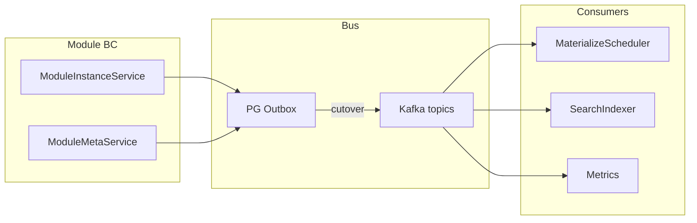

# 05 — Сквозные темы

## Контекст

Сквозные принципы, которые должны связывать слои 01–04: event-driven модули, изоляция defense-in-depth, durable операции, единый канон документации. Именно здесь чаще всего заявленный intent расходится с MVP-кодом.

## Текущая реализация (as-is)

### Event bus / Kafka

- [`kafka_manager.py`](../../../apps/api/src/prodavan/core/infra/kafka_manager.py) — топики platform/project/auth/relation/metrics/document/search/tenant.
- `KAFKA_ENABLED` / buffer-only: in-memory deque + `_local_auth_dispatch` / `_local_metrics_dispatch`.
- Consumers: triggers, auth, relation, platform-jobs (rematerialize) — часто `consumer_enabled=False` по умолчанию.
- PG outbox = claim/drain SoT до cutover (**documented hole**).
- [`core/events/bus.py`](../../../apps/api/src/prodavan/core/events/bus.py) — best-effort publish.
- Module-to-module events **отсутствуют** (см. [01](01-meta-syntax-modules.md)).

### Durable ops

| Операция | Механизм |
|----------|----------|
| Triggers / wipe | Celery / outbox |
| Rematerialize via bus | Opt-in, часто выкл |
| Resume / session bootstrap | `asyncio.create_task` |
| Reconcile pods | Celery beat |

Асимметрия: часть lifecycle «теряется» при рестарте API (см. [02](02-pod-orchestration.md)).

### Изоляция (сквозно)

Слои защиты сегодня:

1. Employee/platform JWT + cabinet/project policies.
2. Bridge JWT scopes + PodSurfaceAllowlist.
3. Key rewrite / secret scope на tenant infra.
4. Soft `project_ids` / session_id на module rows.

Отсутствует на инфра: NetworkPolicy east-west, per-project SA/Quota, жёсткий deny-by-default на row scope.

### Документация / канон

| Канон | Роль | Проблема |
|-------|------|----------|
| [`PRODUCT.md`](../../PRODUCT.md) | Продукт | Не аудит |
| [`target/12-layer-docs`](../../target/12-layer-docs/) | As-built | L07 и др. отстают от кода |
| [`target/06-modules`](../../target/06-modules/) | Legacy meta | Не gospel, но агенты путают |
| [`07-infrastructure`](../../07-infrastructure/) | Ops | Актуально |
| **Этот каталог** | Архитектурный аудит | Новый |

[`LEGACY.md`](../../LEGACY.md) фиксирует политику, но на практике три «истины» живут параллельно.

## Проблемы

### XCUT-P0a — нет event-driven modules

**Приоритет:** P0  
Принцип «in-proc микросервисы через Kafka» нарушен: синхронные импорты BC, shared SoT, optional Kafka. Это корневая причина связанности materialize/modules/metrics.

### XCUT-P0b — isolation только application-layer

**Приоритет:** P0  
При ошибке ACL/баге key rewrite pod может тянуться к чужим IP/данным на L3/L4. Soft `project_ids` усиливает риск на data plane.

### XCUT-P1a — фрагментация канона

**Приоритет:** P1  
Агенты и люди читают legacy meta как закон; 12-layer говорит `not_started` при живом pod_service. Расхождение → повтор костылей.

### XCUT-P1b — durable ops gap

**Приоритет:** P1  
Смешение Celery и fire-and-forget tasks → зависшие `launch_phase`, lost bootstrap.

### XCUT-P2a — observability разрознена

**Приоритет:** P2  
Platform events DB-only / deferred; metrics consumers; pod metrics N+1 — нет единого correlation id project/pod/session across bus.

## Target-design

### Event-driven in-proc modules



Правила:

1. BC **не** импортируют чужие application-сервисы для side effects; только domain ports + publish.
2. Kafka — primary delivery после cutover; PG outbox — reliability fallback, не «единственный SoT навсегда».
3. Явный `sync_fallback` режим (dev/single-node) маркируется в логах/метриках, не прячется как default prod.

Топик-кандидаты: `prodavan.module.events`, уже существующие platform/project; запрет прямых cross-module DB joins вне read-models.

### Defense-in-depth isolation

| Слой | Контроль |
|------|----------|
| Network | NetworkPolicy deny east-west; egress allowlist |
| k8s RBAC | Per-project SA |
| Quota | ResourceQuota / LimitRange |
| AuthN | Employee JWT / Bridge JWT (RS256) |
| AuthZ | ProjectAccessPolicy + scopes |
| Data | deny-by-default project/session scope |
| Secrets | cabinet scope + no literal env |

### Durable ops

Все long-running: enqueue → worker → status в DB. Единый pattern (Celery или Temporal). Запрет `asyncio.create_task` для lifecycle в prod codepaths.

### Документация

```text
PRODUCT.md              — requirements only
12-layer-docs           — as-built synced with code (CI reminder)
ARCHITECTURE/layers     — audit + target (this)
07-infrastructure       — ops
target/06-modules       — legacy reference only (LEGACY.md)
```

Обновить L07/L08 as-built статусы под фактический код; ссылки из ARCHITECTURE не дублируют PRODUCT требования без нужды.

### UX сквозной

- Оператор видит: состояние Pod (desired/observed), materialize freshness, budget, infra quota — в одном project health.
- Агент/MCP ошибки ACL — стабильные коды (`FORBIDDEN_SCOPE`, `QUOTA`, `POD_NOT_RUNNING`), не сырой 500.

## Шаги рефакторинга

1. Завершить Kafka consumer cutover; выключить silent in-proc auth/metrics в prod ([`kafka_manager.py`](../../../apps/api/src/prodavan/core/infra/kafka_manager.py)).
2. Ввести `prodavan.module.events` + publishers из instance/meta; materialize как consumer ([01](01-meta-syntax-modules.md)).
3. Запретить новые cross-BC application imports (lint/arch unit).
4. NetworkPolicy + quotas в GitOps overlays ([02](02-pod-orchestration.md)).
5. Унифицировать durable queue для resume/bootstrap/rematerialize.
6. Синхронизировать [`12-layer-docs`](../../target/12-layer-docs/) с кодом; добавить в README слоёв ссылку «as-built sync needed».
7. Correlation id: `project_id` / `pod_id` / `session_id` / `trigger_id` в bus headers и логах.
8. PRODUCT: явные требования deny-by-default scope + event-driven modules (короткий пункт, детали — здесь).

## Сводка приоритетов по всем слоям

См. таблицу P0/P1 в [00-overview](00-overview.md). Сквозные **XCUT-P0*** блокируют смысл изоляции и модульности даже при локальных фиксах 01–04.

## Ссылки

- Overview: [00-overview.md](00-overview.md)
- LEGACY policy: [`docs/LEGACY.md`](../../LEGACY.md)
- CLUSTER-GAPS: [`docs/09-checklists/CLUSTER-GAPS.md`](../../09-checklists/CLUSTER-GAPS.md)
- LOGICAL-GAPS: [`docs/10-implementation/LOGICAL-GAPS.md`](../../10-implementation/LOGICAL-GAPS.md)
