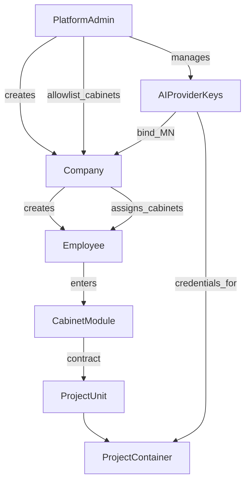

# Принципы целевой архитектуры

Шесть жёстких принципов. Любое отклонение в коде или UI — дефект относительно канона.

---

## 1. Platform Admin

- Отдельный **Admin UI** (не смешивать с UI компании/сотрудника).
- Admin создаёт **компании**, ведёт **AI Provider Keys**, назначает компаниям **список доступных кабинетов**.
- Admin видит **кросс-компанийный мониторинг**: сотрудники, подписка (включая бессрочную), потребление (проекты, токены и др. метрики).

Детали: [01-platform-admin/](01-platform-admin/), [02-ai-provider-keys/](02-ai-provider-keys/).

---

## 2. Mobile-first UI, без модалок

- UI строится **как для телефона** (Flutter Material 3), даже в web.
- **Запрещены:** `AlertDialog`, confirm yes/no, bottom sheets, dropdown/popup menus для выбора сущностей.
- Выбор — только через **страницы**: унифицированный `AppSelectorPage` + `AppListItem`.
- Чекбоксы, radio и list-item — только из `core`; локальный зоопарк виджетов запрещён.
- См. [07 principles](07-ui-mobile-core/principles.md): reuse, EntityCollection, laconic, responsive, buttons.

Детали: [07-ui-mobile-core/](07-ui-mobile-core/).

---

## 3. Company

- **Компания** — вид пользователя со **своим UI**.
- Создаёт сотрудников, включает/отключает, назначает кабинеты из allowlist Admin.
- Мониторинг по сотрудникам и их проектам/потреблению.

Детали: [03-companies/](03-companies/).

---

## 4. Employee

- Основной пользователь продукта.
- После входа: **выбор кабинета** (`AppSelectorPage`); если кабинет один — сразу вход.
- Работа только внутри выбранного кабинета (проекты, чат, инструменты кабинета).

Детали: [04-employees/](04-employees/).

---

## 5. Cabinets as modules

- Каждый кабинет — **изолированный модуль** (свой backend + frontend + БД + промпты + MCP).
- Подключается к платформе по **контракту** (расширение идеи Cabinet SPI / ADR-001).
- Default-набор: **универсальный** (`generic-assistant`) и **Подбор оборудования** (`equipment-procurement`, map от `electronics-procurement`).

Детали: [05-cabinets/](05-cabinets/).

---

## 6. Project unit + container + triggers

- **Project** — унифицированная сущность; кабинеты строят с ней контракт.
- Runtime: изолированное пространство (контейнер/pod в k8s) с AGENTS.md, prompts, rules, skills, MCP, seed-файлами кабинета.
- Агент управляется **триггерами** (чат пользователя + расширения кабинета: Telegram, телефония и т.д.).
- Чат поддерживает файлы/картинки как в ChatGPT-подобных UI.

Детали: [06-projects-runtime/](06-projects-runtime/), [08-agent-providers/](08-agent-providers/).
