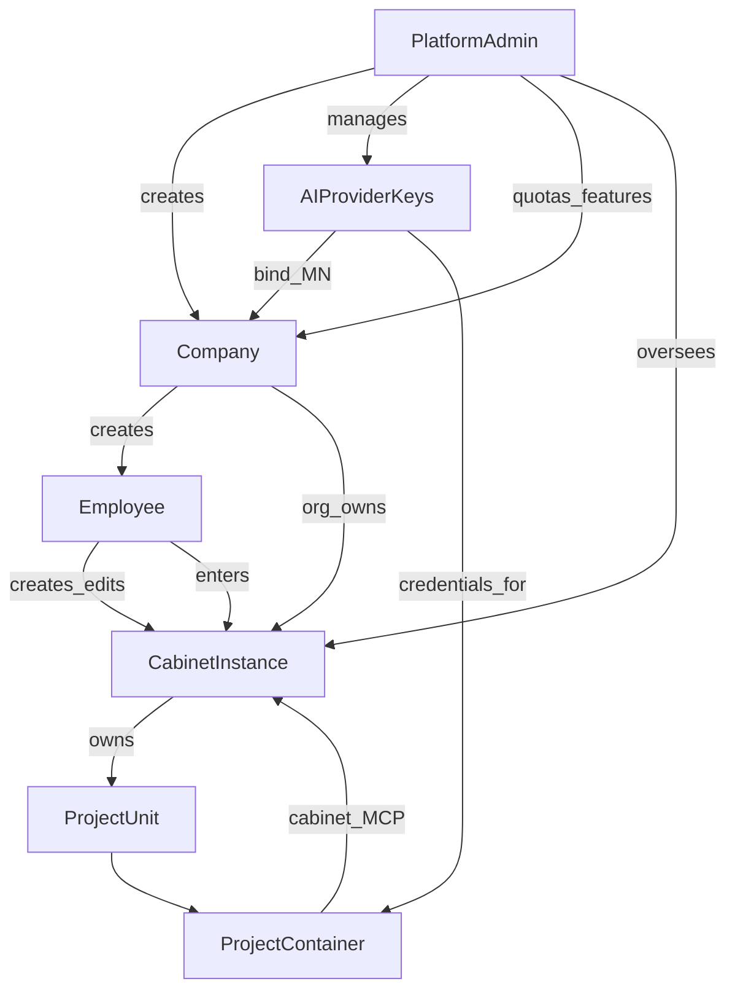

# Принципы целевой архитектуры

## Суть продукта

Prodavan — **универсальный облачный сервис автоматизации задач** агентами (не «только закупки»).

| Слой | Смысл |
|------|--------|
| **Платформа** | Identity, компании, сотрудники, ключи ИИ, каталог кабинетов, project runtime, чат/вложения, мониторинг |
| **Иерархия** | Platform Admin → Company → Employee — модель менеджмента и доступов |
| **Кабинет** | Динамический instance (Employee+Company+Admin ownership; peer-isolated schema); meta→UI; MCP packages; export/import |
| **Проект** | Контейнер агента; platform `cabinet.*` + deployed packages; агент достраивает экосистему кабинета |

Код сейчас stub — [`STUB.md`](../../STUB.md). Реализация — по этому дереву `docs/target/`.

Шесть жёстких принципов ниже. Любое отклонение в коде или UI — дефект относительно канона.

---

## 1. Platform Admin

- Отдельный **Admin UI** (не смешивать с UI компании/сотрудника).
- Admin создаёт **компании**, ведёт **AI Provider Keys**, квоты/feature flags кабинетов, мониторинг.
- Allowlist **статических profile modules** больше не главный путь; опционален catalog **starter bundles**.

Детали: [01-platform-admin/](01-platform-admin/), [02-ai-provider-keys/](02-ai-provider-keys/).

---

## 2. Mobile-first UI, без модалок

- UI строится **как для телефона** (Flutter Material 3), даже в web.
- **Запрещены:** `AlertDialog`, confirm yes/no, bottom sheets, dropdown/popup menus для выбора сущностей.
- Выбор — только через **страницы**: унифицированный `AppSelectorPage` + `AppListItem`.
- Чекбоксы, radio и list-item — только из `core`; локальный зоопарк виджетов запрещён.
- См. [07 principles](07-ui-mobile-core/principles.md): reuse, EntityCollection, laconic, responsive, buttons.

Детали: [07-ui-mobile-core/](07-ui-mobile-core/).

---

## 3. Company

- **Компания** — org со **своим UI-контуром** (`company.admin`).
- Создаёт сотрудников, включает/отключает; **не** раздаёт статические cabinet modules.
- Org ownership кабинетов: метрики/policy; Employee создаёт/импортирует instances.
- Мониторинг по сотрудникам и их проектам/потреблению (не чужой agent chat по умолчанию).

Детали: [03-companies/](03-companies/).

---

## 4. Employee

- Основной пользователь продукта.
- **Создаёт / импортирует кабинеты** (из Base или bundle), именует, редактирует meta через UI или агента.
- Внутри кабинета: проекты, чат, динамические вкладки.

Детали: [04-employees/](04-employees/), [05-cabinets/dynamic-cabinets.md](05-cabinets/dynamic-cabinets.md).

---

## 5. Cabinets (dynamic)

- Кабинет = **CabinetInstance**: своя schema, meta-catalog, data, MCP registry.
- UI = **dynamic shell** из meta (EntityCollection), не code-pack на домен.
- ИИ достраивает через контракты `cabinet.*` ([mcp-contracts](05-cabinets/mcp-contracts.md)).
- Export/import **bundle** между сотрудниками.
- Base template обязателен; starters (напр. оборудование) = файлы bundle, не Flutter modules.
- Runtime в modular monolith; изоляция schema — [packaging](05-cabinets/packaging.md).

Детали: [05-cabinets/](05-cabinets/).

---

## 6. Project unit + container + triggers

- **Project** — унифицированная сущность; кабинеты строят с ней контракт.
- Runtime: изолированный контейнер/pod: `AGENTS.md`, prompts, rules, skills, MCP, seed-файлы — **из настроек кабинета** (БД/UI), не «зашито только в git pack».
- Агент управляется **триггерами** (чат + расширения кабинета).
- Чат: текст + файлы/картинки.
- Паритет контекста по провайдерам: [workspace-context.md](08-agent-providers/workspace-context.md).

Детали: [06-projects-runtime/](06-projects-runtime/), [08-agent-providers/](08-agent-providers/).
