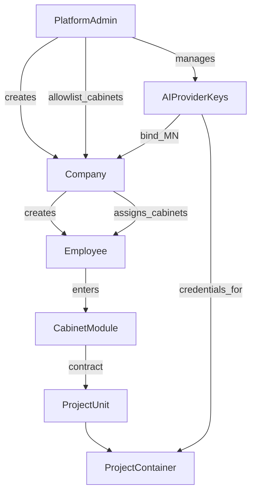

# Принципы целевой архитектуры

## Суть продукта

Prodavan — **универсальный облачный сервис автоматизации задач** агентами (не «только закупки»).

| Слой | Смысл |
|------|--------|
| **Платформа** | Identity, компании, сотрудники, ключи ИИ, каталог кабинетов, project runtime, чат/вложения, мониторинг |
| **Иерархия** | Platform Admin → Company → Employee — модель менеджмента и доступов |
| **Кабинет** | Специализированная вертикаль (BE+FE+данные) под класс задач; подключается к платформе. Базовый кабинет универсален; доменные (напр. подбор оборудования) расширяют его |
| **Проект** | Изолированный контейнер с агентом; контекст (AGENTS.md, prompts, rules, skills, MCP, файлы) материализуется из настроек/БД кабинета |

Код сейчас stub — [`STUB.md`](../../STUB.md). Реализация — по этому дереву `docs/target/`.

Шесть жёстких принципов ниже. Любое отклонение в коде или UI — дефект относительно канона.

---

## 1. Platform Admin

- Отдельный **Admin UI** (не смешивать с UI компании/сотрудника).
- Admin создаёт **компании**, ведёт **AI Provider Keys**, назначает компаниям **список доступных кабинетов**.
- Admin видит **кросс-компанийный мониторинг**: сотрудники, подписка (включая бессрочную), потребление (проекты, токены и др. метрики).

Детали: [01-platform-admin/](01-platform-admin/), [02-ai-provider-keys/](02-ai-provider-keys/).

---

## 2. Mobile-first UI, без модалок

- UI строится **как для телефона** (Flutter Material 3), даже в web.
- **Запрещены:** `AlertDialog`, confirm yes/no, bottom sheets, dropdown/popup menus для выбора сущностей.
- Выбор — только через **страницы**: унифицированный `AppSelectorPage` + `AppListItem`.
- Чекбоксы, radio и list-item — только из `core`; локальный зоопарк виджетов запрещён.
- См. [07 principles](07-ui-mobile-core/principles.md): reuse, EntityCollection, laconic, responsive, buttons.

Детали: [07-ui-mobile-core/](07-ui-mobile-core/).

---

## 3. Company

- **Компания** — org со **своим UI-контуром** (`company.admin`).
- Создаёт сотрудников, включает/отключает, назначает кабинеты из allowlist Admin.
- Мониторинг по сотрудникам и их проектам/потреблению (не чужой agent chat по умолчанию).

Детали: [03-companies/](03-companies/).

---

## 4. Employee

- Основной пользователь продукта.
- После входа: **выбор кабинета**; если кабинет один — сразу вход.
- Работа только внутри выбранного кабинета (проекты, чат, инструменты кабинета).

Детали: [04-employees/](04-employees/).

---

## 5. Cabinets as modules

- Каждый кабинет — **изолированная вертикаль**: свой backend + frontend + schema/таблицы + промпты/skills/rules/MCP + seed workspace.
- **Сейчас:** modular monolith (один API, один Flutter app, один Postgres cluster) — не microservice.
- Изоляция структурная / логическая / файловая; с платформой — **только** SPI + `CabinetUiModule` (контракты как к будущему сервису).
- **Базовый** кабинет (`generic-assistant`) — независимая основа; новые кабинеты **копируют** его и достраивают домен.
- Специализированные (напр. `equipment-procurement`) = base surfaces + доменные tabs/tables.

Детали: [05-cabinets/](05-cabinets/), [packaging.md](05-cabinets/packaging.md).

---

## 6. Project unit + container + triggers

- **Project** — унифицированная сущность; кабинеты строят с ней контракт.
- Runtime: изолированный контейнер/pod: `AGENTS.md`, prompts, rules, skills, MCP, seed-файлы — **из настроек кабинета** (БД/UI), не «зашито только в git pack».
- Агент управляется **триггерами** (чат + расширения кабинета).
- Чат: текст + файлы/картинки.
- Паритет контекста по провайдерам: [workspace-context.md](08-agent-providers/workspace-context.md).

Детали: [06-projects-runtime/](06-projects-runtime/), [08-agent-providers/](08-agent-providers/).
