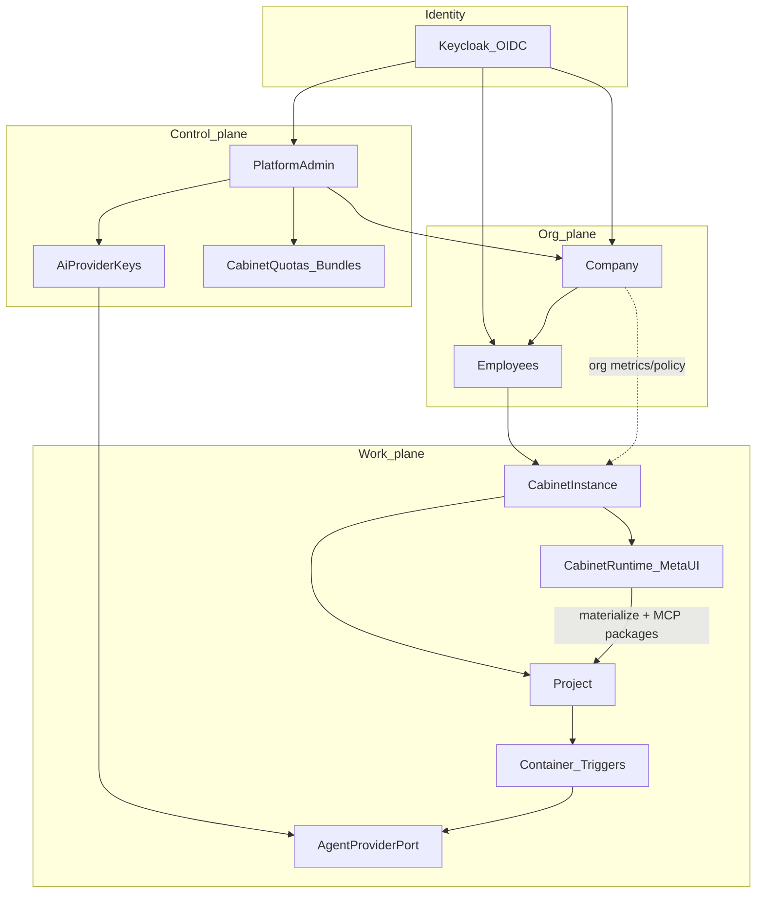

# Gap map — target ↔ legacy ↔ код

> **Код сейчас = STUB** ([STUB.md](../../STUB.md)): API/Flutter/DB без доменной логики. Таблица ниже — карта **целевой** реализации относительно legacy-доков; не копировать удалённый код из git history.

Сводка расхождений. Не backlog задач с оценками — карта для реализации.

## P0 — Platform infra (приоритет, допускается крупный рефакторинг)

Канон: [13-platform-infra/](13-platform-infra/). План: [P0-platform-infra](11-implementation-plan/P0-platform-infra.md).  
Значительный рефакторинг L00 / L03 / L07 / L08 **разрешён**, чтобы закрыть эти gaps.

| Gap | Сейчас в коде | Цель (канон 13) |
|-----|---------------|-----------------|
| Local workspace FS | `data/storage`, `local-ws:{key}`, path как SoT | **MinIO** (S3); DB хранит object refs |
| In-process workers | `TRIGGER_WORKER` / idle asyncio в API lifespan | **Celery** + Redis |
| Нет event bus | PG outbox-lite (`project_triggers`) как шина | **Kafka** для project triggers + platform events |
| Нет Redis / MinIO / Kafka в стеке | только Postgres + local FS | Redis + MinIO + Kafka обязательны |
| Lifespan без register | ad-hoc start/stop в `main.py` | `LifespanManager` + `LifespanResource` + infra managers в `core` |

Связанные строки ниже («Durable bus», «Project container») закрываются этим P0-треком, не отдельным «когда-нибудь».

| Target | Legacy docs | Код сейчас | Gap |
|--------|-------------|------------|-----|
| Platform Admin UI + metrics | M08 / admin screens | **stub** | Реализовать по [ux-contract](01-platform-admin/ux-contract.md) |
| Company / Employee | Tenant / membership | **stub** | Schema + shells по [session](10-identity-keycloak/session.md) |
| AI Provider Keys | env secrets | **stub** | Models/API + resolve policy; UI |
| Mobile UI, no modals | widget-catalog | Theme + core widgets; no feature shells | EntityCollection / screens по [07](07-ui-mobile-core/) |
| Cabinet **dynamic** + bundles | static packs / M00 | **stub** | Runtime + meta-UI + `cabinet.*` MCP по [05](05-cabinets/dynamic-cabinets.md) |
| Starter equipment bundle | electronics-procurement | Pack JSON remnants | Bundle seed, не Flutter module |
| Project container | agent-isolation | **stub** / local-ws FS | Pod lifecycle + idle policy; blobs → MinIO (**P0**) |
| Triggers / attachments | — | PG outbox-lite / local inbox | Durable bus = **Kafka** (**P0**); chat attach UI; object store |
| AgentProviderPort | bot SDK | **stub** | Sidecar + persist + AgentEvent |
| Keycloak OIDC | HS256 login | **stub** (+ infra/keycloak sketches) | Cutover + AppAuth |
| OpenClaw / GLM | mentions | Нет | Не внедрять |

## Решённые противоречия канона

| Было | Решение (зафиксировано) |
|------|-------------------------|
| Static cabinet code-packs vs dynamic | **Dynamic cabinets** (meta+bundle+MCP contracts); code-packs не канон ([05](05-cabinets/dynamic-cabinets.md)) |
| Password в Company create vs Keycloak-only | Invite = email → Keycloak; нет password в Prodavan API |
| `cli_subscription` vs ban personal CLI runtime | Учётная метка биллинга; **не** runtime credential ([02 domain](02-ai-provider-keys/domain.md)) |
| Company = «вид пользователя» vs KC roles | Company = org; Company account = Employee + `company.admin` |
| Admin создаёт «учётку» vs KC provisioning | Admin создаёт Company + KC invite company.admin |
| CompanyApi → Projects на диаграмме | Projects создаёт Employee в cabinet; Company смотрит metrics read-only |
| Admin metrics без usage events | `AgentEvent.usage` обязателен в порте ([adapter-port](08-agent-providers/adapter-port.md)) |
| Project triggers vs platform events | Две шины ([triggers](06-projects-runtime/triggers.md)) |
| AI key preference UI | `CompanyAgentPolicy` / Project override в resolve policy |
| «Отклонение = дефект» vs multi-wave gap | Канон docs finished; код догоняет волнами ниже |

## Декомпозиция BC + контракты

Изолируемые bounded contexts. Слои: `api` → `application` → `domain` ← `infrastructure`.

| BC | Ответственность | Запрещено |
|----|-----------------|-----------|
| Identity | OIDC, JWKS, Principal→Employee | Cabinets, AI keys |
| Admin + Keys | Companies, quotas/bundles, keys, metrics | Workspace files, cabinet data rows |
| Company / Employee | Invite; Employee create/import cabinets | Issue JWT; peer schema access |
| Cabinet Runtime | Meta UI, schema, `cabinet.*`, MCP packages | Container lifecycle, raw AI secrets |
| Projects / Runtime | Project, container_ref, triggers, attachments | Hardcoded domain packs |
| Agent | Port + adapters + usage | GLM, OpenClaw, CLI sub as key |
| UI core | Primitives + UX system | Feature-specific ListTile zoos |

### Волны кода (после канона)

Операционный план со слоями **L00–L09**, жёсткими DoD и реестром контрактов: **[11-implementation-plan/](11-implementation-plan/)**.  
Живые карточки «что/как сделано»: **[12-layer-docs/](12-layer-docs/)**.

1. Identity schema Company/Employee + headers enforcement → **L01** (+ **L00**)  
2. Admin/Company/Employee shells по UX contracts → **L04**, **L05** (+ **L02**)  
3. Key resolve + cabinet quotas/ACL → **L03**, **L04**, ACL в **L06**  
4. Cabinet Runtime + meta UI + `cabinet.*` MCP → **L06**  
5. Agent sidecar + persist + AgentEvent → **L08**  
6. Container/triggers/attachments + MCP packages deploy → **L07**, **L09** (packages в **L06**)  

Параллельный старт: **L00 ∥ L02 ∥ L03 ∥ каркас L06** — см. [sequence.md](11-implementation-plan/sequence.md).

### Явно не делать

- OpenClaw; GLM; personal Max/Pro как tenant runtime credentials  
- Канонизация `POST /auth/login`  
- Static `profile_id` code-pack modules как канон  
- Admin/Company логика внутри Employee screens  
- JWT reissue на switch/open  

## Ссылки

- Identity session: [10-identity-keycloak/session.md](10-identity-keycloak/session.md)
- UX system: [07-ui-mobile-core/ux-system.md](07-ui-mobile-core/ux-system.md)
- Keys policy: [02-ai-provider-keys/domain.md](02-ai-provider-keys/domain.md)
- Cabinet contract: [05-cabinets/module-contract.md](05-cabinets/module-contract.md)
- Agent port: [08-agent-providers/adapter-port.md](08-agent-providers/adapter-port.md)
- Implementation plan: [11-implementation-plan/](11-implementation-plan/)
- Legacy: [../LEGACY.md](../LEGACY.md)
