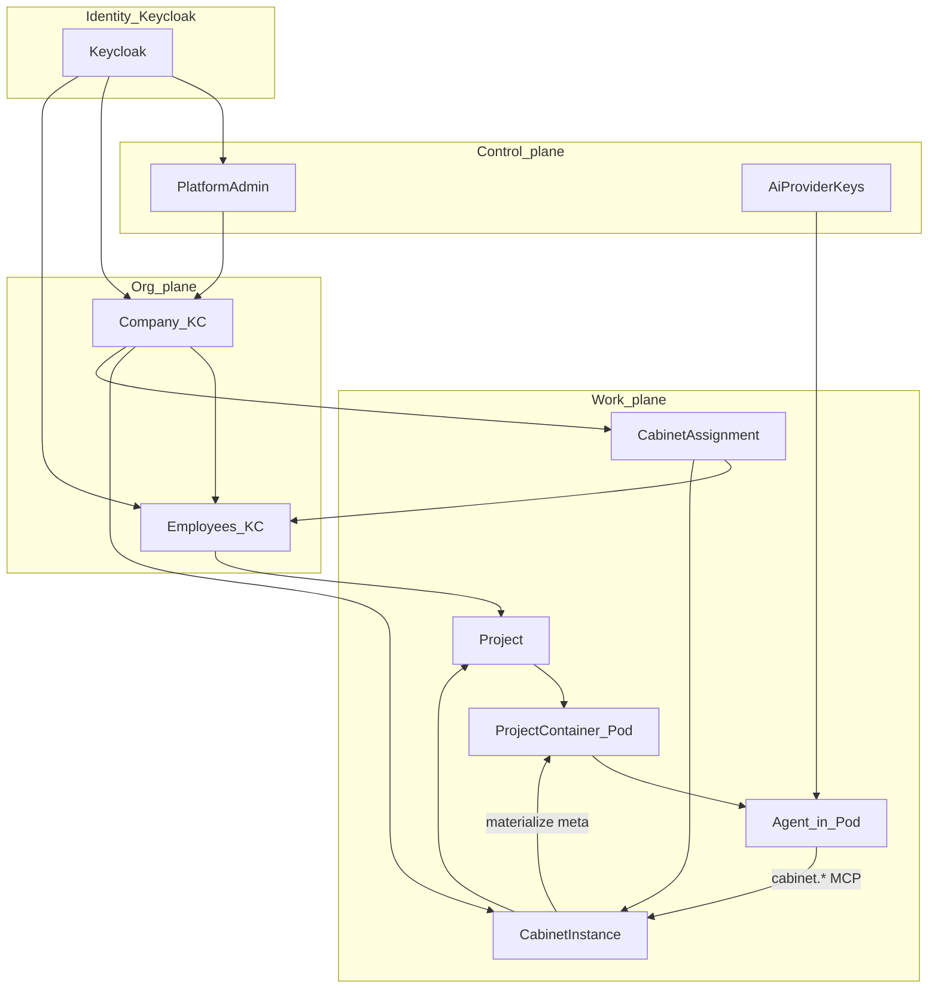

# Gap map — target ↔ код

> **LEGACY.** Продукт: [docs/PRODUCT.md](../PRODUCT.md). Этот файл — архив «AI канон ↔ код», не блокер решений.

> Канон (как должно): **[00-entities.md](00-entities.md)**.  
> Код / as-built: [12-layer-docs](12-layer-docs/), [STUB.md](../../STUB.md).  
> Этот файл — **расхождения = проблемы**, не «канон подстроили под stub».

## Проблемы vs канон сущностей (P0 product / runtime)

Проверка as-built (API + Flutter + docs/12) относительно [00-entities](00-entities.md):

| ID | Канон | Сейчас в коде | Проблема |
|----|-------|---------------|----------|
| **P-CO-01** | Company shell = **локальный Admin** (сотрудники, контейнеры, keys, кабинеты) | **CompanyShell** wide rail: Overview + Employees + AI Keys + Containers + Cabinets + Modules (+ catalog modules); narrow Management hub | **partial** — parity shipped; polish / E2E navigation — hole ([03](03-companies/)) |
| **P-CO-02** | Company **CRUD своих** AI keys (SDK/API) + видит Admin-bound **RO** | API `/companies/{id}/ai-keys` + `owner_scope`; Flutter list/detail/rotate/scope-bindings | **done** |
| **P-CO-03** | Company list/manage containers **своих** сотрудников | API `/companies/{id}/containers` pause/resume/delete; Flutter list + detail | **done** |
| **P-CO-04** | Cabinets от Admin → Company **RO**; later local CRUD | Admin CRUD + grants; Company local cabinet CRUD + employee/module assign UI | **partial** — local CRUD + assign shipped; platform-assigned cabinets RO |
| **P-ID-01** | **Company** имеет **Keycloak-креды** | `companies.keycloak_sub` via Auth Kafka `auth.user.register` + bind; soft-delete `deleted_at` + async cascade | Org principal async; zombies in admin metrics |
| **P-CAS-02** | Company soft-delete → soft children (no wipe) | Soft-delete + Celery cascade; wipe only on purge | Align cascade to [00-lifecycle](00-lifecycle.md) |
| **P-LC-01** | Unified pause / soft_delete / purge + restore | Partial (company deleted_at; project pause/delete wipe) | Recycle API; project soft without wipe |
| **P-REL-01** | Central Relations BC: query + Kafka grant/revoke | Facade `RelationsQuery`/`RelationsCommand` + `prodavan.relation.events`; ACL reads migrated; physical consolidate later | Soft-status unify; AI/module writes via RelationsCommand |
| **P-ID-02** | Admin / Company / Employee — три KC-сущности | Realm roles + `prodavan-keycloak-init` bootstrap; API resolution live | IdP brokers / SMTP invite polish |
| **P-CAB-01** | Company **назначает** Employee ↔ Cabinet | Grants + assignment API + Flutter (`company_cabinet_detail_page`, `company_employee_cabinets_page`) | **done** (Verify Dev E2E — optional) |
| **P-CAB-02** | UI кабинета из module meta | Module template + `module_data_rows` API; cabinet module runtime page + interpreters | Generic meta editor UI — hole |
| **P-MOD-01** | **Module** catalog + cabinet bind + per-cabinet data | **Admin CRUD + meta + materialize + runtime data API + Flutter** | Physical DDL; meta editor UI |
| **P-MOD-02** | Meta-table **syntax** spec + interpreters | **done** (#158–#166, live catalog shell merge) | — |
| **P-MAT-01** | Pod hydrate из meta/MinIO | object-ws; нет Pod; file_ref слаб | Materialize/Pod debt |
| **P-POD-01** | `ProjectPod` → k8s Pod; inert → delete Pod | **Code:** `K8sPodRuntimeAdapter`, hydrate initContainer, reconcile zombies; **GitOps:** sandboxes RBAC + overlay wired | Verify Dev e2e with `POD_RUNTIME_MODE=k8s`; integration test `POD_K8S_INTEGRATION=1` — [P2](11-implementation-plan/P2-k3s-runtime.md) Phase 5 |
| **P-POD-02** | `pod_service` BC isolated | **`application/pod_service/`**; `ProjectCommand` → `PodCommand.sync_desired` | done · [pod-service](14-project-containers/pod-service.md) |
| **P-POD-03** | 1:1 ProjectPod | **`project_pods`** table + backfill; legacy `project_runtime_units` dropped | done |
| **P-POD-04** | `pod.*` lifecycle events | **`PodLifecycleEmitter`** + whitelist | done |
| **P-POD-05** | Relations pod↔project bind | **`RelationsCommand.bind/unbind_pod`** | done |
| **P-POD-06** | Удалить legacy `ProjectRuntimeManager` / `ContainerRuntimePort` / `container_lifecycle` indirection | **`pod_service` canonical**; dead code in `project_service/runtime_manager.py`, duplicate `stub_container_runtime` | Delete after import audit — [P1](11-implementation-plan/P1-pod-service.md) cleanup |
| **P-PRJ-01** | Изолированный BC `project_service`; чужие BC только Command/Query | **Facade live**; residual direct ORM in legacy paths | Lint/import guard later |
| **P-PRJ-02** | `visibility_mode` + project↔employee assignment | **Schema + API + RelationsCommand live** | Flutter filter UI |
| **P-PRJ-03** | 1:1 ProjectPod (lazy create) | **`project_pods` + PodCommand**; runtime-units API removed | done |
| **P-MCP-01** | Агент в Pod ↔ `cabinet.*` | **Out of MVP cabinet entity** (removed typed MCP/packages); future contract | Изоляция + контракт |
| **P-CAS-01** | Cabinet soft_delete → soft projects; purge → DROP | Admin hard `delete_with_cascade` | Soft default DELETE + purge |
| **P-INF-01** | MinIO / Kafka / Celery | Local FS / in-process | [13](13-platform-infra/) |
| **P-KC-01** | Live Keycloak cutover | **Auth Service BFF** + `AUTH_MODE=oidc`; Flutter never → KC | Brokers UI / SMTP invite polish |
| **P-KC-02** | IdP broker live (VK/Yandex) | Auth Service start/callback ready; providers **not** live; secrets вне git | Enable IdP + Flutter social buttons |
| **P-UNI-01** | Универсальная иерархия (Admin→Employee без Company; local cabinets) | Не моделировано | Future после P-CO-* |

### Что уже близко к канону

| Тема | Статус |
|------|--------|
| Invite employees (Company) | full-page invite + list/detail |
| Org cabinets (Company) | local CRUD + employee/module assign; platform-assigned RO |
| Company AI keys + containers | API + Flutter shell tabs (P-CO-02/03) |
| Admin keys + containers | есть |
| Company metrics aggregates | есть |

## P0 — Platform infra

Канон: [13-platform-infra/](13-platform-infra/). План: [P0-platform-infra](11-implementation-plan/P0-platform-infra.md).

| Gap | Сейчас | Цель |
|-----|--------|------|
| Local workspace FS | `data/storage`, `local-ws` | **MinIO** |
| In-process workers | asyncio в API | **Celery** + Redis |
| Нет event bus | PG outbox-lite | **Kafka** |
| Lifespan ad-hoc | `main.py` | `LifespanManager` + infra managers |

## Прочие gaps (модули)

| Target | Код сейчас | Gap |
|--------|------------|-----|
| Platform Admin UI + metrics | partial / stub | [01 ux](01-platform-admin/ux-contract.md) |
| AI Provider Keys | partial | [02](02-ai-provider-keys/) |
| Mobile UI, no modals | Theme + core; feature shells | [07](07-ui-mobile-core/) |
| AgentProviderPort | stub / partial | [08](08-agent-providers/) |
| OpenClaw / GLM | нет | **не внедрять** |

### Meta-syntax: files / env / Vault (spec in [12](06-modules/meta-syntax/12-content-file-pipeline.md) · [13](06-modules/meta-syntax/13-container-env-secrets.md))

| ID | Spec | As-built | Priority |
|----|------|----------|----------|
| **P-META-FILE-01** | FileRef `storage_key` + `asset_id`/`version_id` | **done** (canonical FileRef in code + docs) | — |
| **P-META-FILE-02** | Row write validates FileRef vs Content Service | **done** (#159 row validator) | — |
| **P-META-FILE-03** | `format: template` in MaterializeExecutor | **done** (#160) | — |
| **P-META-FILE-04** | Auto materialize from column `file.materialize` | **done** (auto rules from columns) | — |
| **P-META-ENV-01** | `container_env` + `container_env_secrets` → pod_spec | **done** (#162, #163) | — |
| **P-META-VAULT-01** | `secret_ref` column + masked upload UI → Vault | **done** (cabinet upload API + Flutter) | — |
| **P-META-VAULT-02** | Cabinet-scoped Vault paths + ACL | **done** (scope check on row write + pod env) | — |

## Бывшие «решения канона» → пересмотр

Старые строки, которые **больше не цель** (заменены [00-entities](00-entities.md)):

| Было зафиксировано | Теперь |
|--------------------|--------|
| Company = org без login; UI = Employee + `company.admin` | Company = org **+ KC** + **локальный Admin shell** (**P-CO-01**, **P-ID-01**) |
| CompanyApi не ведёт Projects / Keys | Company **ведёт** containers + **свои** AI keys (**P-CO-02/03**) |
| Employee сам создаёт cabinets; Company только metrics | Admin CRUD + company bind (MVP); Company→Employee assign next (**P-CO-04**, **P-CAB-01**) |
| Keys только Admin inventory + bindings | `owner_scope` platform \| company (**P-CO-02**) |

Остаётся в силе:

| Тема | Решение |
|------|---------|
| Dynamic cabinets (не static code-packs) | да |
| Password только в Keycloak | да |
| `cli_subscription` ≠ runtime credential | да |
| Admin metrics ← `AgentEvent.usage` | да |

## Декомпозиция BC

| BC | Ответственность | Запрещено |
|----|-----------------|-----------|
| Company | Локальный Admin: employees, containers, **company keys**, assign cabinets, policy narrow | Issue JWT; edit platform keys; peer schema без grant |
| Admin + Keys | Companies (+KC), platform keys + bind, quotas, metrics, assign cabinets→company | Workspace files |
| Cabinet Runtime | Registry + module data rows; Admin modules | Typed meta UI / MCP packages / Pod lifecycle |
| Projects / Containers | Project, Pod port, triggers, materialize hydrate | Hardcoded domain packs |
| Agent | Port + adapters in Pod | GLM, OpenClaw |
| UI core | Primitives | Feature ListTile zoos |

### Волны (ориентир) — Company parity largely shipped

1. ~~**P-CO-01..04**~~ → **partial/done** — Company shell Admin-like; E2E navigation polish optional  
2. **P-ID-01 / P-ID-02** — Company KC principal polish (brokers / invite SMTP)  
3. ~~**P-CAB-01**~~ → assign UI shipped  
4. **P-INF-01 / Kafka job cutover** — rematerialize event bus (L07 gap)  
5. **P-POD-01 / P-MAT-01** — k8s Verify Dev + MinIO SoT holes  
6. **P-UNI-01** — универсальная иерархия (после паритета Company)  
7. Остальное — L04–L08 по [11](11-implementation-plan/)

### Явно не делать

- OpenClaw; GLM; personal Max/Pro как tenant runtime credentials  
- Канонизация `POST /auth/login`  
- Static `profile_id` code-packs  
- JWT reissue на switch/open  
- Подгонять канон под object-ws «как контейнер»

## Ссылки

- [00-entities](00-entities.md) · [03 Companies](03-companies/) · [02 Keys](02-ai-provider-keys/)  
- [05 assignment](05-cabinets/assignment.md) · [14 containers](14-project-containers/) · [10 session](10-identity-keycloak/session.md)
