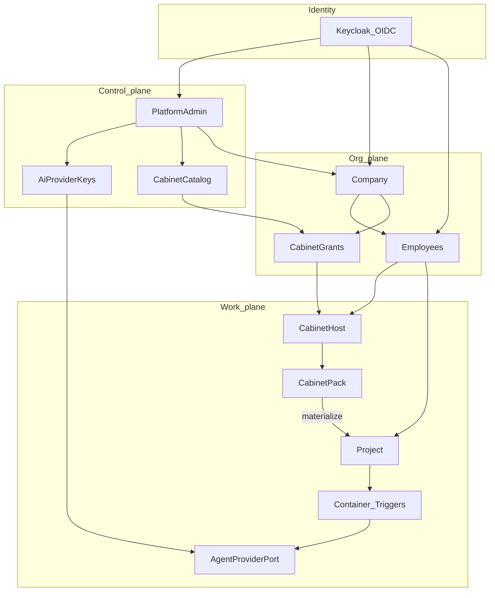

# Gap map — target ↔ legacy ↔ код

> **Код сейчас = STUB** ([STUB.md](../../STUB.md)): API/Flutter/DB без доменной логики. Таблица ниже — карта **целевой** реализации относительно legacy-доков; не копировать удалённый код из git history.

Сводка расхождений. Не backlog задач с оценками — карта для реализации.

| Target | Legacy docs | Код сейчас | Gap |
|--------|-------------|------------|-----|
| Platform Admin UI + metrics | M08 / admin screens | **stub** | Реализовать по [ux-contract](01-platform-admin/ux-contract.md) |
| Company / Employee | Tenant / membership | **stub** | Schema + shells по [session](10-identity-keycloak/session.md) |
| AI Provider Keys | env secrets | **stub** | Models/API + resolve policy; UI |
| Mobile UI, no modals | widget-catalog | Theme + core widgets; no feature shells | EntityCollection / screens по [07](07-ui-mobile-core/) |
| Cabinet SPI + materialize | ADR-001 | **stub** | SPI + packs по [05](05-cabinets/) |
| `equipment-procurement` | electronics-procurement | Pack JSON only (prompts stubbed) | Module + id по target |
| Project container | agent-isolation | **stub** | Pod lifecycle + idle policy |
| Triggers / attachments | — | **stub** | Durable bus; chat attach UI |
| AgentProviderPort | bot SDK | **stub** | Sidecar + persist + AgentEvent |
| Keycloak OIDC | HS256 login | **stub** (+ infra/keycloak sketches) | Cutover + AppAuth |
| OpenClaw / GLM | mentions | Нет | Не внедрять |

## Решённые противоречия канона

| Было | Решение (зафиксировано) |
|------|-------------------------|
| Cabinets/company в JWT vs no reissue | Access token только OIDC; контекст `X-Cabinet-Id` / `X-Project-Id` + DB ([session](10-identity-keycloak/session.md)) |
| Password в Company create vs Keycloak-only | Invite = email → Keycloak; нет password в Prodavan API |
| `cli_subscription` vs ban personal CLI runtime | Учётная метка биллинга; **не** runtime credential ([02 domain](02-ai-provider-keys/domain.md)) |
| Company = «вид пользователя» vs KC roles | Company = org; Company account = Employee + `company.admin` |
| Admin создаёт «учётку» vs KC provisioning | Admin создаёт Company + KC invite company.admin |
| CompanyApi → Projects на диаграмме | Projects создаёт Employee в cabinet; Company смотрит metrics read-only |
| Admin metrics без usage events | `AgentEvent.usage` обязателен в порте ([adapter-port](08-agent-providers/adapter-port.md)) |
| Project triggers vs platform events | Две шины ([triggers](06-projects-runtime/triggers.md)) |
| AI key preference UI | `CompanyAgentPolicy` / Project override в resolve policy |
| «Отклонение = дефект» vs multi-wave gap | Канон docs finished; код догоняет волнами ниже |

## Декомпозиция BC + контракты

Изолируемые bounded contexts. Слои: `api` → `application` → `domain` ← `infrastructure`.

| BC | Ответственность | Запрещено |
|----|-----------------|-----------|
| Identity | OIDC, JWKS, Principal→Employee | Cabinets, AI keys |
| Admin + Keys | Companies, grants catalog, keys, metrics | Workspace files, pack domain |
| Company / Employee | Invite/assign, enter cabinet | Pack SQL, issue JWT |
| Cabinets | SPI + UiModule | Container lifecycle, raw AI secrets |
| Projects / Runtime | Project, container_ref, triggers, attachments | Procurement logic |
| Agent | Port + adapters + usage | GLM, OpenClaw, CLI sub as key |
| UI core | Primitives + UX system | Feature-specific ListTile zoos |

### Волны кода (после канона)

1. Identity schema Company/Employee + headers enforcement  
2. Admin/Company/Employee shells по UX contracts  
3. Key resolve + grants enforce  
4. SPI import ban + equipment id  
5. Agent sidecar + persist + AgentEvent  
6. Container/triggers/attachments productionize  

### Явно не делать

- OpenClaw; GLM; personal Max/Pro как tenant runtime credentials  
- Канонизация `POST /auth/login`  
- Platform `api/v1` → pack service imports  
- Admin/Company логика внутри Employee screens  
- JWT reissue на switch/open  

## Ссылки

- Identity session: [10-identity-keycloak/session.md](10-identity-keycloak/session.md)
- UX system: [07-ui-mobile-core/ux-system.md](07-ui-mobile-core/ux-system.md)
- Keys policy: [02-ai-provider-keys/domain.md](02-ai-provider-keys/domain.md)
- Cabinet contract: [05-cabinets/module-contract.md](05-cabinets/module-contract.md)
- Agent port: [08-agent-providers/adapter-port.md](08-agent-providers/adapter-port.md)
- Legacy: [../LEGACY.md](../LEGACY.md)
