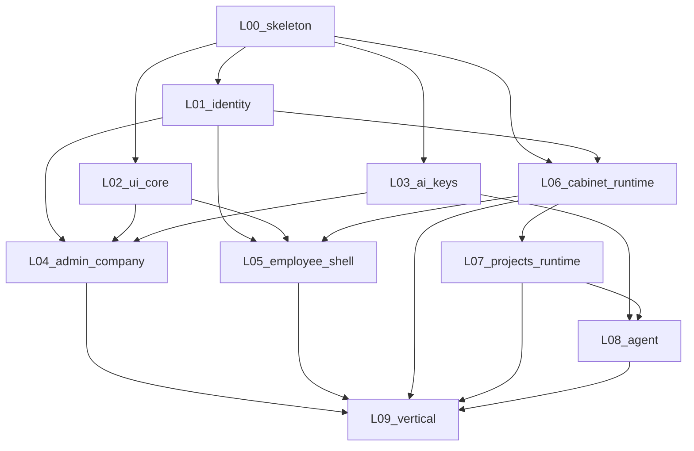

# Последовательность реализации

## Граф зависимостей

Стрелка = «нужен **закрытый контракт** поставщика», не обязательно весь UI поставщика.

---

## Фазы

### Фаза A — фундамент (параллельно)

| Порядок | Слой | Зачем первым |
|---------|------|----------------|
| A1 | **L00** | Чистый bootstrap API/DB/Flutter; запрет копипаста legacy |
| A2∥ | **L02** | Полный UI-core без backend — разблокирует все shells |
| A3∥ | **L01** | OIDC + Principal + Company/Employee schema + headers |
| A4∥ | **L03** | Keys inventory + resolve (company_id как opaque id) |
| A5∥ | **L06** (каркас) | Runtime + schema-per-instance + meta/data API; UI shell позже |

**Критерий выхода фазы A:** контракты L00, L01, L02, L03 и *API-часть* L06 зелёные по DoD (L06 UI interpreters могут быть `doing`).

### Фаза B — control & entry

| Порядок | Слой | Условие старта |
|---------|------|----------------|
| B1 | **L04** | L01+L02+L03 контракты |
| B2 | **L05** | L01+L02 + create/import API из L06 |

### Фаза C — execution

| Порядок | Слой | Условие старта |
|---------|------|----------------|
| C1 | **L07** | L06 materialize hook + instance ACL |
| C2 | **L08** | Можно кодить adapter раньше; **закрытие** после L03 resolve + L07 cwd |
| C3 | **L09** | Все контракты L01…L08 |

---

## Что делать изолированно «в полную силу»

| Слой | Полная реализация без соседей |
|------|-------------------------------|
| L02 | Весь [07](../07-ui-mobile-core/) widget surface + тесты |
| L03 | Domain/API/persistence Keys по [02](../02-ai-provider-keys/) |
| L06 | Runtime без chat: Base seed, meta, rows, bundle, `cabinet.*` |
| L08 | Port + минимум один adapter на fixture workspace + event persistence schema |

| Слой | Нельзя честно закрыть в одиночку |
|------|----------------------------------|
| L04/L05 | Нужны L01 (authz) и L02 (shell primitives) |
| L07 | Нужен L06 materialize |
| L09 | Нужны все |

---

## Волны ↔ gap-map

| Gap-map волна | Слои плана |
|---------------|------------|
| 1 Identity schema + headers | L01 (+ L00) |
| 2 Admin/Company/Employee shells | L04, L05 (+ L02) |
| 3 Key resolve + quotas/ACL | L03, L04 quotas, L06 ACL |
| 4 Cabinet Runtime + meta UI + cabinet.* | L06 |
| 5 Agent sidecar + AgentEvent | L08 |
| 6 Container/triggers/attachments + MCP packages | L07, L09 (packages уже в L06) |

---

## Политика «тонкого вертикального среза»

Допустим **один** demo vertical (Admin создаёт Company → invite → Employee создаёт Base cabinet → Project → agent ping) **только** как интеграционный smoke **после** зелёных контрактов задействованных слоёв.

Demo **не** заменяет DoD слоёв и **не** даёт право ставить слою `done`.
