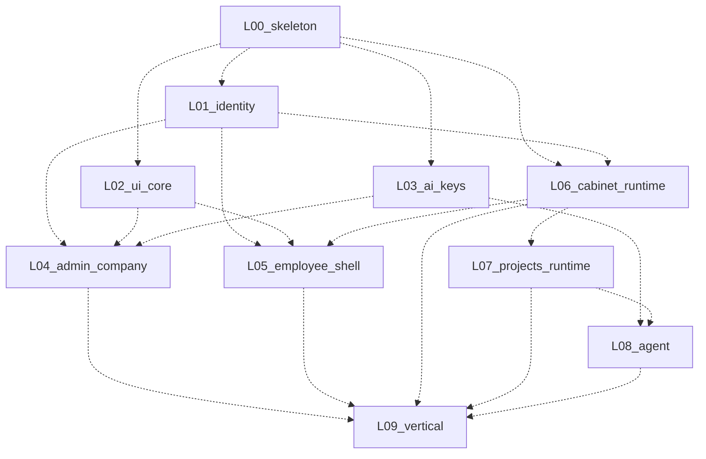

# Карта связей (as-built)

Сводка **по факту кода**. Пока слои `not_started` — граф целевой (как в плане); по мере поставки заменять пунктир на факт и убирать «planned».

Канонический целевой граф: [11 sequence](../11-implementation-plan/sequence.md).  
Реестр контрактов: [contracts-index](../11-implementation-plan/contracts-index.md).

## Статус графа

`Status: planned` — ещё нет живых стрелок в коде.

## Живые контракты (заполнять по мере `live`)

| ID | Поставщик | Потребители | Статус |
|----|-----------|-------------|--------|
| — | — | — | — |

## Заметки по интеграции

- Пока stub: см. [STUB.md](../../../STUB.md).
- После первого live-контракта — перевести соответствующие рёбра с `-.->` на `-->` и обновить таблицу.
