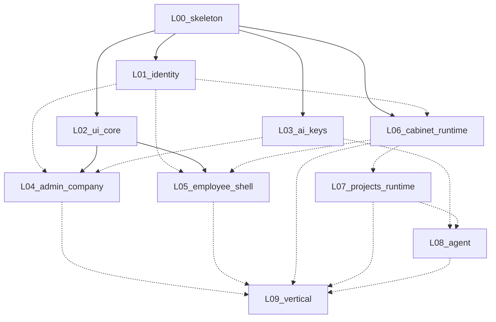

# Карта связей (as-built)

Сводка **по факту кода**. По мере поставки: `-.->` → `-->`.

Канонический целевой граф: [11 sequence](../11-implementation-plan/sequence.md).  
Реестр контрактов: [contracts-index](../11-implementation-plan/contracts-index.md).

## Статус графа

`Status: partial` — L00 live; остальные planned.

## Живые контракты

| ID | Поставщик | Потребители | Статус |
|----|-----------|-------------|--------|
| C-API-HEALTH | L00 | все | live |
| C-PRINCIPAL | L01 | L04–L07 | live |
| C-MEMBERSHIP | L01 | L04–L06 | live |
| C-HEADERS | L01 | L05–L08 | live |
| C-INVITE | L01 | L04 | live |
| C-UI-COLLECTION | L02 | L04–L07 | live |
| C-UI-SELECTOR | L02 | L04, L05 | live |
| C-UI-CONFIRM | L02 | L04–L08 | live |
| C-KEY-ENTITY | L03 | L04, L08 | live |
| C-KEY-RESOLVE | L03 | L08 | live |
| C-ADMIN-COMPANY | L04 | L05, L06, L08 | live (API subset) |
| C-QUOTA | L04 | L06 | live (subset) |
| C-PROJECT | L07 | L08, L09 | live (subset) |
| C-MATERIALIZE | L07 | L08 | live (local-ws) |
| C-TRIGGERS | L07 | L08, L09 | live (subset) |
| C-ATTACH | L07 | L08 | live (subset) |
| C-AGENT-PORT | L08 | L09 | live (fixture) |
| C-AGENT-EVENT | L08 | L04, L09 | live (subset) |
| C-USAGE | L08 | L04 | live (subset) |
| C-INSTANCE | L06 | L05, L07 | live (subset) |
| C-META-DATA | L06 | L05 | live (subset) |
| C-CABINET-MCP | L06 | L08 | live (subset) |
| C-BUNDLE | L06 | L05, L09 | live |
| C-MCP-PKG | L06 | L07, L08 | live (registry) |
| C-MATERIALIZE | L06 | L07, L08 | live (stub) |

## Заметки по интеграции

- L00/L02/L03/L06 закрыты (Q8). L01 partial (Q7). L04/L07/L08 API started. Phase B/C in progress.
- Gaps: L08 Node sidecar; L05 UI; L09 chat stream.
- См. [STUB.md](../../../STUB.md) / [L00 as-built](L00-platform-skeleton.md).
