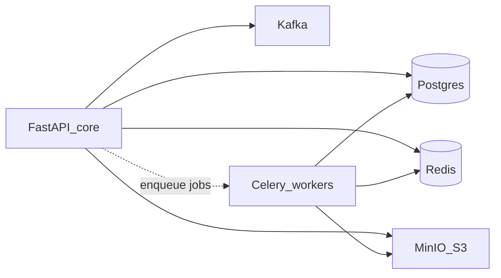

# Platform infra — стек

## Роли

| Роль | Технология | Данные / нагрузка |
|------|------------|-------------------|
| Transactional DB | PostgreSQL | Identity, cabinets meta/rows, projects metadata, agent events/usage, policy |
| Event / command bus | **Kafka** | Project trigger envelopes, platform events, межмодульные контракты |
| Object storage | **MinIO** (S3) | Workspaces, attachments, MCP package zips, export blobs |
| Job runner | **Celery** | Drain, idle-pause, rematerialize, long handlers |
| Cache / broker | **Redis** | Celery broker+result, cache, short locks, rate limits |
| Identity IdP | Keycloak | OIDC (без изменений роли) |
| Secrets | Vault / routing | AI key material (без изменений роли) |

Kafka consumers живут в **API lifespan** (маршрутизация команд/событий → enqueue Celery или Auth handler). Celery **не** поднимает свой Kafka consumer — только исполняет tasks. Политика «не плодить listener Deployments»: [principles.md](principles.md) §3a.

## Почему MinIO (не «просто диск» / не lock-in S3 vendor)

- S3 API → один клиентский контракт (`C-OBJECT-STORE`).
- Удобен на **k3s**; при переходе на полный Kubernetes / managed S3 меняется endpoint/credentials, не доменная модель.
- Локальный path на ноде API **запрещён** как продуктовое хранилище.

## Почему Kafka

- Изоляция BC и контрактов без shared DB queue как публичного API между модулями.
- Готовность к микросервисам: publishers/consumers остаются теми же топиками/схемами.
- PG outbox-lite / `project_triggers` table — transitional implementation detail, не канон шины.

## Почему Celery + Redis

- Единый паттерн для всех background jobs платформы.
- Redis уже обязателен (§ кэш/брокер); не плодить вторую очередь «для удобства».
- Периодические задачи (idle sweep) — Celery beat / эквивалент в том же стеке, не ad-hoc cron-only (CronJob может *триггерить* enqueue, но исполнение — Celery).

## Запреты (канон-дефекты)

| Запрещено как prod-канон | Почему |
|--------------------------|--------|
| `data/storage`, `local-ws:{key}` как source of truth для blobs | Нет общей HA/backup модели; ломает multi-replica |
| In-process `TRIGGER_WORKER` / asyncio loop в API как единственный worker | Нет изоляции, сложнее scale, смешивает HTTP и jobs |
| Сырые клиенты Redis/Kafka/S3/Celery вне `core` managers | Зоопарк конфигурации и lifecycle |
| Ad-hoc `lifespan` без register ресурсов | Нет единого shutdown/startup, сложно тестировать |
| Класть durable межмодульные события только в Postgres queue без Kafka | Скрытая связность монолита |

## k3s → Kubernetes

Манифесты/операторы проектировать portable: MinIO, Kafka, Redis — как workloads или managed services за теми же URL/credentials из settings. Не зашивать node-local paths в домен.
