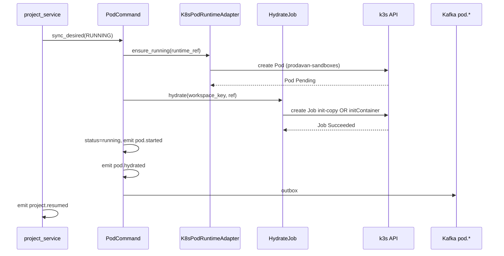

# k3s Runtime — архитектура слоёв

## ADR: не добавлять BC «k3s_service»

**Решение:** логика k3s живёт **внутри** `pod_service` как infrastructure adapters, не как отдельный bounded context.

| Альтернатива | Почему отклонена |
|--------------|------------------|
| Отдельный microservice «pod-operator» | Дублирует SoT (`project_pods`), усложняет транзакции project↔pod, лишний hop |
| Kafka как transport команд (`pod.create`) | Lifecycle уже синхронен с `project_service` в одном API request; outbox для **events** достаточен |
| Прямой k8s client в `project_service` | Нарушает import-rule; два writer → drift |

**Паттерн:** Hexagonal / Ports & Adapters — домен `PodCommand` не знает про k8s API; знает только порты.

```text
┌─────────────────────────────────────────────────────────────┐
│  API / Workers (project_service, admin, Celery reconcile)      │
└───────────────────────────┬─────────────────────────────────┘
                            │ PodCommand / PodQuery (facade)
┌───────────────────────────▼─────────────────────────────────┐
│  application/pod_service/          ← BC (desired state, events)│
│    command.py · query.py · reconcile.py                        │
│    ports/          adapters/                                 │
│      pod_runtime     stub_pod_runtime                        │
│      hydrate         k8s_pod_runtime  ← P2                   │
│      pod_files       k8s_hydrate_job                         │
│      pod_metrics     k8s_files_exec                          │
└───────────────────────────┬─────────────────────────────────┘
                            │ infrastructure ports only
┌───────────────────────────▼─────────────────────────────────┐
│  infrastructure/k8s/              ← client, auth, retries    │
│    sandbox_client.py · label_selector.py                     │
│  core/infra/ (target)             ← K8sManager lifespan      │
└───────────────────────────┬─────────────────────────────────┘
                            │ in-cluster SA token / kubeconfig
┌───────────────────────────▼─────────────────────────────────┐
│  k3s cluster · namespace prodavan-sandboxes                  │
└─────────────────────────────────────────────────────────────┘
```

## Где Kafka и Relations

| Механизм | Роль | Sync / Async |
|----------|------|--------------|
| `PodCommand.sync_desired` | **Команда** — применить desired state | Sync в API/worker process |
| `PodLifecycleEmitter` → PG outbox → Kafka | **Событие** `pod.*` | Async fan-out |
| `RelationsCommand.bind/unbind_pod` | Audit binding pod↔project | Sync + `relation.*` Kafka |
| `PodReconcileService` (Celery beat) | Drift correction | Async periodic |

**Правило:** Kafka **не** заменяет `sync_desired`. Consumer `pod.failed` может алертить, но не создавать Pod без row в PG.

## Control loop (declarative reconcile)

Классический паттерн **level-triggered reconcile** (как Kubernetes controller, но легковесный in-process):

```text
1. Read desired: project.status + project_pods.desired_state
2. Read actual: k8s Pod phase (via PodRuntimePort.get_status)
3. Diff → apply (create / delete / noop)
4. Update project_pods.status + emit pod.*
```

`PodReconcileService` — safety net для drift (admin pause + Pod still Running, zombie Pod без row).

Не нужен full **Operator SDK** на P2: достаточно adapter + periodic reconcile. Operator имеет смысл при >1000 pods и сложных CRD — позже.

## Feature flags

| Env | Значение | Поведение |
|-----|----------|-----------|
| `POD_RUNTIME_MODE` | `stub` (default dev) | `StubPodRuntimeAdapter`, no k8s calls |
| `POD_RUNTIME_MODE` | `k8s` | `K8sPodRuntimeAdapter` + real client |
| `POD_HYDRATE_MODE` | `stub` \| `init_job` \| `exec` | см. [file-sync.md](file-sync.md) |

## Package layout (target)

```text
apps/api/src/prodavan/
  application/pod_service/
    ports/
      pod_runtime.py      # lifecycle (existing)
      hydrate.py          # MinIO → workspace (existing)
      pod_files.py        # P2: copy/exec
      pod_metrics.py      # P2: read metrics
    adapters/
      stub_*.py
      k8s/
        __init__.py
        pod_runtime.py    # implements PodRuntimePort
        hydrate_job.py    # Batch Job init hydrate
        files.py          # exec / tar stream
        metrics.py        # metrics.k8s.io
  infrastructure/k8s/
    sandbox/
      client.py           # Async K8s client wrapper
      models.py           # PodSpec builder from domain
      errors.py           # Transient vs permanent
  core/infra/             # target
    k8s_manager.py        # LifespanResource, shared client
```

Application **импортирует** только adapters; adapters **импортируют** `infrastructure/k8s`, не `kubernetes` напрямую в command.py.

## Sequence: resume with real k8s


