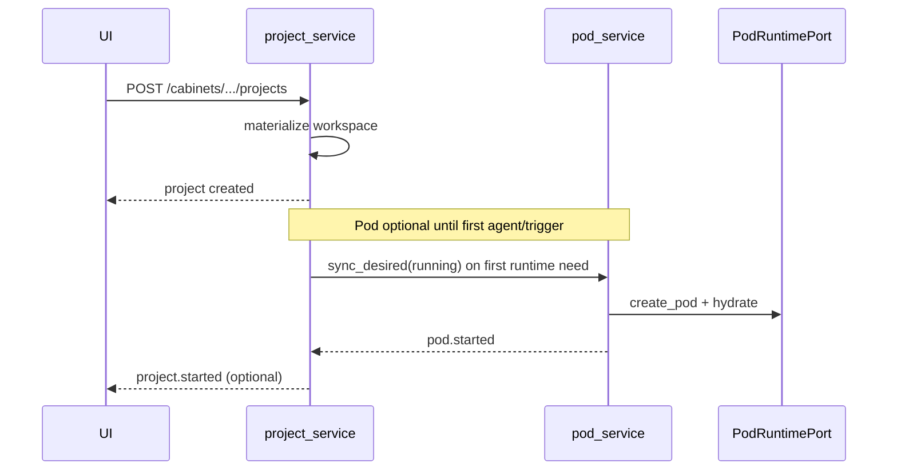
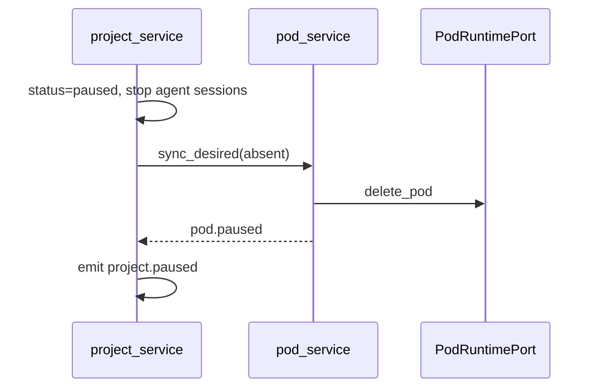

# pod_service — изолированный слой управления Pod (in-process BC)

> **Не** deployable microservice. Пакет `application/pod_service/` в `apps/api`, по образцу [`project_service`](../06-projects-runtime/project-contract.md) и [`relations`](../00-relations.md).

## Зачем отдельный слой

| Проблема as-built | Решение |
|-------------------|---------|
| k8s-логика размазана (`container_lifecycle`, stub в `project_service`) | Единственный writer k8s — `pod_service` |
| `object-ws:{key}` без Pod ([P-POD-01](../09-gap-map.md)) | `PodRuntimePort` + real adapter позже |
| Project orchestrator знает про pause Pod | `project_service` только вызывает `PodCommand.sync_desired` |
| Нет событий жизненного цикла Pod | `pod.*` на platform bus (всегда emit) |

**Канон:** один **Project** → один **Pod** (1:1). Отвязка/привязка Pod к другому Project — **архитектурная возможность** (Relations + nullable FK), не MVP UI.

---

## Границы BC

### Владеет `pod_service`

| Aggregate | Смысл |
|-----------|--------|
| **ProjectPod** | учётная запись isolator: desired/actual runtime, `runtime_ref`, hydrate, ошибки оркестратора |

**Не владеет:** Project metadata, workspace layout (MinIO paths), triggers, agent sessions, cabinet ACL.

### Не владеет (читает через порты / query)

- Project status, `workspace_key`, `company_id`, `cabinet_id` → `ProjectQuery` (read-only)
- MinIO hydrate source → `HydratePort` (workspace materialize уже в projects)
- Company AI key gate на resume → вызывающий `project_service` до `PodCommand.start`

### Правило импорта

```text
Разрешено вызывать pod_service:     project_service, admin ops, reconcile worker
Запрещено:                            cabinets, companies, ai_keys, agent, UI routers (кроме admin read)
Запрещено из pod_service:             прямой import ProjectRow writes; kubectl из API handlers
```

---

## Сущность ProjectPod

| Поле | Смысл |
|------|--------|
| `id` | `pod_*` (канон; transitional `pctr_*` / `pru_*` — migrate) |
| `project_id` | FK → Project, **UNIQUE** when not null; null = detached orphan pool |
| `workspace_key` | denorm from Project (для hydrate без join) |
| `status` | см. ниже |
| `desired_state` | `absent` \| `running` — reconcile target |
| `runtime_ref` | opaque k8s Pod name/uid |
| `last_error` | последняя ошибка Port |
| `hydrate_generation` | bump on rematerialize → force re-hydrate on next start |
| `resource_profile` | optional JSON: cpu/mem requests (future quota) |

### Статусы Pod

| Status | Смысл | k8s |
|--------|--------|-----|
| `pending` | row есть, Pod ещё не создан | — |
| `provisioning` | create Pod + hydrate in flight | Pod Creating |
| `running` | compute up | Pod Running |
| `pausing` | sync → MinIO, delete Pod | Terminating |
| `paused` | compute off, blobs in MinIO | Pod absent |
| `failed` | orchestrator error | Pod Failed/absent |
| `terminating` | hard delete in flight | Terminating |
| `terminated` | tombstone / detached | absent |

### Инвариант 1:1

- Не более **одного** non-terminated Pod row на `project_id`.
- При `attach_to_project(project_id, pod_id)` — проверка: у project нет другого live pod; у pod нет другого project.

---

## Desired state (синхронизация с Project)

`project_service` **не** дергает k8s. На каждый transition Project вызывает:

```text
PodCommand.sync_desired(project_id, desired, principal, reason?)
```

| Project.status | Pod.desired_state | PodCommand effect |
|----------------|-------------------|-------------------|
| `active` | `running` | provision (if missing) → start → hydrate |
| `paused` | `absent` | sync workspace → pause (delete Pod) |
| `completed` | `absent` | same as paused (read-only project) |
| `deleted` | `absent` | terminate Pod; row → paused/terminated |

Idempotent: повторный `sync_desired` при уже matching state — no-op + events optional with `idempotent: true`.

---

## Управление: через Project или напрямую?

### Решение (ADR)

| Контур | Кто управляет Pod | API |
|--------|-------------------|-----|
| **Employee / Company UI** | Только через **Project** lifecycle | `POST /projects/{id}/pause\|resume\|delete` — без `/pods/*` |
| **Platform Admin** | Read + ops | `GET /admin/containers`, force-kill, reconcile, orphans (существующий admin surface) |
| **System** | Workers | reconcile loop, idle_pause, cascade |

**Почему не прямой Pod API для UI:** Pod — infrastructure detail; ACL и quota привязаны к Project/Cabinet; pause/resume уже имеют business rules (AI keys, subscription, idle). Дублирование API = два источника рассинхрона.

**Исключение:** Admin «Контейнеры» — proxy/read/force-kill, не substitute для project CRUD.

### Что дополнить в `project_service`

Чтобы orchestration был достаточным:

| Добавление | Зачем |
|------------|--------|
| `sync_pod_on_transition()` | единая точка после status change |
| `ProjectQuery.runtime_summary(project_id)` | `{ pod_status, desired, last_error }` для GET project |
| Убрать employee-facing `runtime-units` API (deprecate → admin/internal) | 1:1 канон |
| `project.started` emit **после** `pod.started` (или в одной транзакции outbox order) | согласованность событий |

---

## Facade API (in-process)

```text
application/pod_service/
  __init__.py              # PodCommand, PodQuery, PodLifecycleEmitter
  command.py               # sync_desired, provision, start, pause, terminate, attach, detach
  query.py                 # get_for_project, get_by_id, list_orphans, runtime_summary
  lifecycle_emitter.py     # pod.* → PlatformEventService
  reconcile.py             # drift: desired vs actual (worker/admin)
  ports/
    pod_runtime.py         # PodRuntimePort (k8s)
    hydrate.py             # HydratePort (MinIO → pod workspace)
  adapters/
    stub_pod_runtime.py    # object-ws (as-built)
    k8s_pod_runtime.py     # future P-POD-01
```

### PodCommand (writes)

| Method | Когда |
|--------|--------|
| `provision_for_project(project_id)` | lazy create row on first need |
| `sync_desired(project_id, desired, …)` | **главный** entry от project_service |
| `start` / `pause` / `terminate` | internal; prefer sync_desired |
| `attach_to_project(pod_id, project_id)` | Relations + FK; emit binding |
| `detach_from_project(pod_id)` | FK null; pod in orphan pool |
| `force_kill(pod_id)` | admin; grace=0 |

### PodQuery (reads)

| Method | Кто |
|--------|-----|
| `get_for_project(project_id)` | project_service, admin |
| `runtime_summary(project_id)` | Project GET JSON |
| `list_orphans()` | admin reconcile |
| `list_zombies()` | worker (k8s without row) |

### PodRuntimePort

| Method | Эффект |
|--------|--------|
| `create_pod(spec)` | Pod + labels |
| `delete_pod(runtime_ref, grace?)` | delete |
| `get_status(runtime_ref)` | phase, restarts |
| `list_managed_pods()` | reconcile |

Единственный адаптер с k8s client SDK.

---

## Kafka — lifecycle (`prodavan.platform.events`)

Расширить whitelist (`PLATFORM_EVENT_TYPES`):

| Event | Когда |
|-------|--------|
| `pod.provisioned` | row created |
| `pod.started` | Pod Running + hydrate ok |
| `pod.paused` | Pod deleted, desired absent |
| `pod.resumed` | start after pause (optional; или только pod.started) |
| `pod.terminated` | hard terminate |
| `pod.failed` | orchestrator error |
| `pod.hydrated` | hydrate success (optional granular) |
| `pod.reconciled` | worker fixed drift |

Все через `PodLifecycleEmitter` — **PG outbox + Kafka**, payload: `project_id`, `pod_id`, `workspace_key`, `runtime_ref`, `reason`.

**Project events** (`project.paused`, `project.started`) остаются в `project_service`; порядок: сначала `pod.*`, затем `project.*` (или documented compensation).

Consumers (future): metrics, audit UI, alert on `pod.failed`.

---

## Relations — привязка Pod ↔ Project

Detach/reattach — **binding**, не assignment:

| Операция | RelationsCommand | Kafka |
|----------|------------------|-------|
| Attach pod to project | `bind_pod_to_project` | `relation.granted` `binding` subject=pod object=project |
| Detach | `unbind_pod_from_project` | `relation.revoked` |

`RelationsQuery.has_pod_binding(project_id)` / `pod_id` — для ACL admin ops.

Composition FK `project_pods.project_id` — SoT; Relations — audit + fan-out (как cabinet grants).

---

## Потоки (sequence)

### Create project (lazy pod)



### Pause project



---

## Миграция from as-built

| As-built | Target |
|----------|--------|
| `project_runtime_units` (1:N) | `project_pods` 1:1 UNIQUE(project_id) |
| `ProjectRuntimeManager` in project_service | move → `pod_service` |
| `ContainerRuntimePort` stub | `PodRuntimePort` in pod_service |
| `projects.container_ref` | read-only mirror of `runtime_ref` (deprecate) |
| `POST .../runtime-units` | remove from employee API; admin debug only |

Alembic: rename/migrate table; backfill one primary unit → pod row.

---

## Фазы реализации

> **Операционный план** (PR-разрез, DoD, тесты, миграции): [`P1-pod-service.md`](../11-implementation-plan/P1-pod-service.md).

### Phase 0 — Design (этот документ)
Канон 1:1, границы BC, события, Relations binding. **Done.**

### Phase 1 — Skeleton
`pod_service/` package, `ProjectPodRow`, `PodCommand.sync_desired`, stub adapter, перенос логики из `ProjectRuntimeManager`, `project_service` вызывает только PodCommand.

### Phase 2 — Events + Relations
`pod.*` whitelist, `PodLifecycleEmitter`, `RelationsCommand.bind/unbind_pod`, unit tests.

### Phase 3 — Real k8s (P-POD-01)
`k8s_pod_runtime` adapter, NetworkPolicy, hydrate job, reconcile worker, admin force-kill.

### Phase 4 — Cleanup
Drop `runtime-units` API, drop `container_ref` writes, gap map close.

---

## Gaps (новые)

| ID | Канон | As-built |
|----|-------|----------|
| **P-POD-02** | `pod_service` BC isolated | runtime in `project_service` |
| **P-POD-03** | 1:1 ProjectPod | 0..N runtime units |
| **P-POD-04** | `pod.*` lifecycle events | only `project.*` |
| **P-POD-05** | Relations pod↔project bind | FK only |

---

## Критерии готовности

1. **Профессионально:** Port/Adapter, один k8s writer, tests on sync_desired + events.
2. **Изолированно:** только `PodCommand`/`PodQuery` снаружи; no ProjectRow in pod_service except read port.
3. **Kafka:** полный `pod.*` на каждый transition; outbox always.
4. **Relations:** attach/detach через `RelationsCommand` + `relation.*`.
5. **Иерархия:** 1:1 default; detach/reattach documented and tested.
